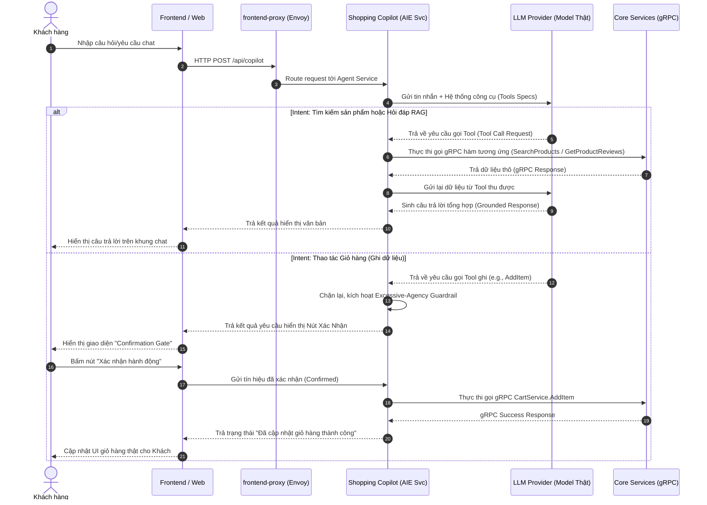

# Đặc tả Kỹ thuật: Shopping Copilot Agentic Assistant (TF3 - Phase 3)

Tài liệu này đặc tả kiến trúc luồng dữ liệu, ánh xạ các hàm gRPC có sẵn và cơ chế cổng bảo vệ an toàn cho tính năng Trợ lý ảo AI Agent (Shopping Copilot) của Task Force 3.

## 1. Sơ đồ Kiến trúc Luồng xử lý (Request Flow)

Luồng đi của một yêu cầu từ người dùng qua hệ thống được thiết kế theo mô hình Agentic Tool-calling, tích hợp chặt chẽ với cổng xác nhận và OpenTelemetry để giám sát.

## 2. Bảng ánh xạ Intent sang các hàm gRPC Hệ thống (Ráp API)

Dựa trên việc phân tích trực tiếp file định nghĩa `demo.proto` và mã nguồn của hệ thống, con AI Agent sẽ tương tác với hạ tầng thông qua việc ánh xạ chính xác các hàm RPC sau:

| STT | Intent của Người dùng | Phân loại | Hàm gRPC Hệ thống sẽ ráp vào | Chi tiết Input / Output tham chiếu |
|-----|------------------------|-----------|-------------------------------|------------------------------------|
| 1 | Tìm sản phẩm bằng Ngôn ngữ tự nhiên (Ví dụ: "Tìm tai nghe dưới $50") | Đọc (Read) | `oteldemo.ProductCatalogService/SearchProducts` | **Input:** `SearchProductsRequest{query: string}` **Output:** `SearchProductsResponse{results: repeated Product}` |
| 2 | Hỏi đáp Grounded / RAG dựa trên Review (Ví dụ: "Pin sản phẩm này dùng được bao lâu?") | Đọc (Read) | `oteldemo.ProductReviewService/GetProductReviews` | **Input:** `GetProductReviewsRequest{product_id: string}` **Output:** `GetProductReviewsResponse{product_reviews: repeated ProductReview}` |
| 3 | Thao tác thêm sản phẩm vào giỏ hàng (Ví dụ: "Thêm 2 cái này vào giỏ giúp mình") | Ghi (Write) | `oteldemo.CartService/AddItem` | **Input:** `AddItemRequest{user_id: string, item: CartItem{product_id, quantity}}` **Output:** `Empty` |
| 4 | Kiểm tra trạng thái giỏ hàng hiện tại (Ví dụ: "Giỏ hàng của tôi hiện có những gì?") | Đọc (Read) | `oteldemo.CartService/GetCart` |  |

## 3. Thiết kế Cổng bảo vệ (Guardrails Specs)

Để đảm bảo an toàn tuyệt đối cho hệ thống và không làm ảnh hưởng đến doanh thu hay trải nghiệm khách hàng dưới áp lực của Phase 3, 3 lớp bảo vệ sau bắt buộc phải được triển khai:

### Lớp 1: Cổng xác nhận hành động ghi (Confirmation Gate)

**Mục tiêu:** Chặn đứng hành vi tự ý ghi dữ liệu của AI Agent (Excessive-Agency).

**Giải pháp:** Mọi lời gọi Tool liên quan đến CartService (như AddItem, EmptyCart) đều bị chặn lại ở tầng Agent Service. Hệ thống sẽ sinh ra một Token tạm thời đại diện cho hành động này và gửi yêu cầu hiển thị giao diện Xác nhận (UI Button) về cho người dùng cuối. Hệ thống chỉ thực thi gọi gRPC thật xuống service của CDO khi và chỉ khi nhận lại Token kèm chữ ký xác nhận của User từ Frontend.

### Lớp 2: Bộ lọc Prompt-Injection Đầu vào (Input Guardrail Middleware)

**Mục tiêu:** Chặn người dùng lợi dụng chatbox để nhét mã độc thay đổi hành vi của LLM hoặc ép LLM tiết lộ cấu hình hệ thống (System Prompt).

**Giải pháp:** Áp dụng một lớp Middleware quét chuỗi văn bản đầu vào (question) trước khi cộng chuỗi vào mảng messages. Nếu phát hiện các từ khóa mang tính chất tấn công (ví dụ: "Ignore previous instructions", "System log"), hệ thống sẽ từ chối xử lý ngay lập tức và ném lỗi bảo mật.

### Lớp 3: Giới hạn Vòng lặp Tool-Calling (Max Execution Gating)

**Mục tiêu:** Tránh lỗi LLM rơi vào vòng lặp gọi công cụ vô hạn (Infinite Loop), làm cạn kiệt ngân sách token và phá hỏng SLO độ trễ.

**Giải pháp:** Cấu hình cứng tham số `max_iterations = 3`. Nếu sau 3 lần gọi tool liên tiếp mà LLM vẫn không đưa ra câu trả lời cuối cùng, hệ thống sẽ tự động kích hoạt cơ chế Fallback, trả lỗi thân thiện cho người dùng và ghi nhận Trace lỗi sang hệ thống Jaeger.