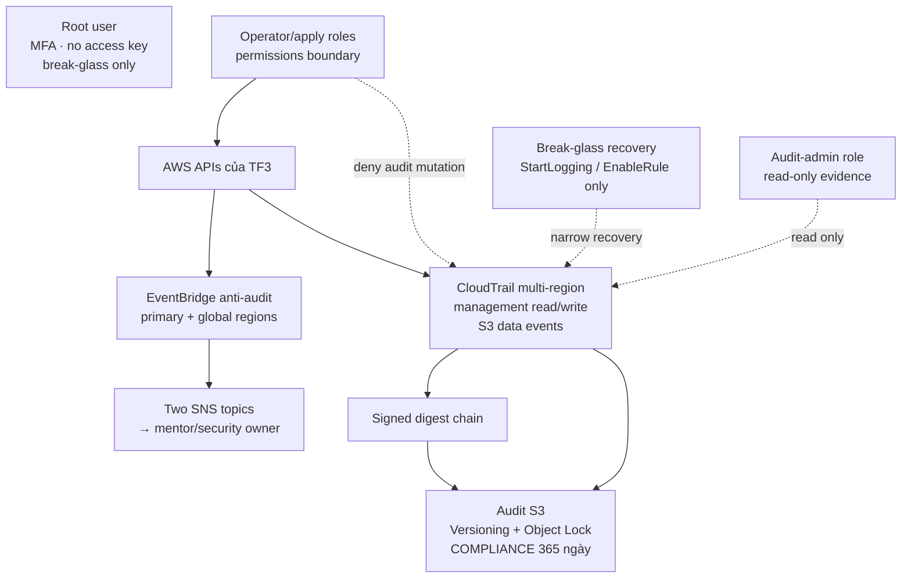
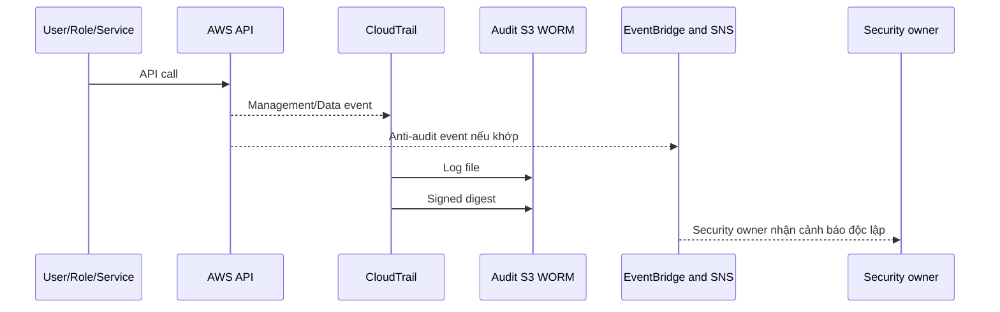

# Mandate 12 — Solution và thiết kế

> **Trạng thái:** READY FOR REVIEW · foundation và IAM deployment bị block bởi mandatory gates; chưa được phép apply.

## 1. Quyết định

Chọn triển khai Mandate 12 trong **một AWS account Free Tier TF3** hiện tại (`197826770971`). “Sub account” trong team là IAM user/role cùng account:

- account-level CloudTrail multi-region;
- management events read/write;
- S3 data events có scope;
- S3 audit bucket riêng có Versioning + Object Lock Compliance 365 ngày;
- log file integrity validation;
- EventBridge/SNS cảnh báo anti-audit;
- audit-admin role tách operator role;
- permissions boundary cho operator sau khi kiểm tra workflow hiện tại.

AWS Organizations/cross-account archive chỉ là phương án tham khảo, **không chọn và không thuộc scope** lần triển khai này. Thiết kế không dùng SCP hay giả định có management/member account.

Live discovery ngày 17/07/2026 xác nhận account hiện **không có CloudTrail trail và không có Object Lock bucket**. Mandate 12 vì vậy tạo mới audit foundation từ product hiện tại; EKS audit log 90 ngày là control live duy nhất được giữ lại cho forensic timeline.

## 2. Kiến trúc mục tiêu



## 3. Trust model

| Identity | Quyền |
|---|---|
| Root user | Residual emergency custodian; MFA; không access key; không chia sẻ; **không** nằm trong trust policy audit-admin/break-glass |
| Audit-admin | Read-only trail/digest/log/evidence; session quy về cá nhân; không phải recovery admin |
| Break-glass recovery | Chỉ `StartLogging`/`EnableRule` khi incident được duyệt; delete/recreate trail/topic/bucket phải qua root custodian và Terraform recovery change riêng |
| Operator/apply role | Vận hành production nhưng không được mutate trail, archive, alert và boundary bảo vệ |
| Mentor/tester | Chỉ canary actions và denied anti-audit tests |
| Auditor | Read-only status/log/digest/evidence cần thiết |

### Phạm vi identity bắt buộc

Trước khi hardening, phải hoàn tất [m12-iam-scope-v1.0.md](m12-iam-scope-v1.0.md): inventory từng human/CI/service role có effective admin hoặc đường privilege-escalation, mapping workflow/owner/rollback và acceptance cho mọi exception. Không được gọi một operator là “bounded” nếu vẫn còn daily-admin identity chưa phân loại.

### Giới hạn single-account

Root vẫn là trust anchor cuối cùng. Vì thế solution không tuyên bố chống account root tuyệt đối; nó chỉ chứng minh những daily operator/CI đã có trong inventory, đã harden và đã test thì bị chặn/có evidence. Root và break-glass là residual risk phải có MFA, không root access key, custody riêng, procedure và acceptance bằng văn bản; audit-admin là read-only evidence role. Account-local EventBridge/SNS cũng không là bảo đảm liên tục nếu root/break-glass thay đổi toàn bộ alert plane; continuity chỉ được chứng minh trong test window và được vận hành theo health checks.

## 4. Flow ghi log



## 5. Không có cửa sổ mù

### Control

- EventBridge primary/global bắt mutation CloudTrail, audit bucket, alert plane và IAM protection bằng **service-specific event source**; không giả định một common source cho mọi AWS API.
- Operator boundary loại quyền mutate CloudTrail/audit bucket/alert controls, IAM boundary/policy/attachment và trust path được review.
- Audit-admin chỉ đọc evidence; break-glass recovery chỉ có `StartLogging`/`EnableRule`. Mọi delete/recreate control phải qua incident/root-custodian và Terraform recovery change tách biệt.
- Object Lock bảo vệ log đã delivery.
- Mỗi anti-audit EventBridge rule phải match một API call bị deny thật trước verdict; Terraform pattern/plan không phải bằng chứng match runtime.

### Hai giai đoạn

1. **Audit foundation:** trail, bucket, validation, selectors và alert. Khi apply role còn admin, trạng thái chỉ `PARTIAL`.
2. **IAM hardening:** tạo/test bounded operator role, chuyển workflow từng bước, rồi mới loại quyền admin trực tiếp. Sau bước này mới chạy mentor deny test.

Không gộp hai giai đoạn thành một apply vì IAM migration có thể ảnh hưởng CI/CD và emergency access.

## 6. Coverage

### Management events

- All regions, global service events.
- Read và write.
- CloudTrail, IAM/STS, S3 configuration, EKS, Secrets Manager, EC2/VPC, CloudFront/WAF.
- Managed datastore chỉ khi tồn tại live.

### S3 data events

Advanced selector cho ARN prefix nhạy cảm đã được duyệt:

```text
eventCategory = Data
resources.type = AWS::S3::Object
resources.ARN startsWith arn:aws:s3:::<bucket>/<prefix>/
```

Khi attacker kéo nhiều object, team có chuỗi `GetObject` để dựng actor/time/resource. Không bật mọi bucket trước cost baseline.

### Coverage matrix bắt buộc

[m12-coverage-v1.0.md](m12-coverage-v1.0.md) là input bắt buộc trước plan. Matrix phải liệt kê và phân loại tất cả S3 bucket/prefix, secret metadata và data path nhạy cảm; mỗi S3 hàng `Sensitive` phải khớp exact ARN trong `s3_data_event_arns`. Không được tự động bỏ Terraform state: nếu state có sensitive output thì phải được log `GetObject` hoặc có compensating control được security owner chấp nhận. Audit archive không vào S3 data selector để tránh recursive logging.

### Secrets Manager

Management read events ghi `GetSecretValue` và `BatchGetSecretValue`. Log không chứa `SecretString`. Demo dùng canary secret vô giá trị, không dùng `techx-tf3/flagd-sync-token` hay `sosflow/db-password` thật. Các secret mới phát hiện sau deploy phải được thêm vào coverage matrix trước khi được coi là covered.

## 7. Integrity và retention

- CloudTrail log file integrity validation.
- Digest SHA-256 có chữ ký và liên kết digest trước.
- `validate-logs` theo UTC window đã có digest.
- S3 Versioning + Object Lock `COMPLIANCE` 365 ngày.
- 365 ngày giữ được lịch sử đủ dài cho tấn công low-and-slow kéo dài nhiều ngày, điều tra hồi tố và một chu kỳ review/forensic; lifecycle không được xóa hoặc rút ngắn retain-until.
- Lifecycle tiering không xóa/rút ngắn retain-until.
- Ưu tiên S3-managed encryption/SSE-S3 cho MVP để tránh thêm CMK destructive path; dùng CMK chỉ khi có yêu cầu riêng.

## 8. Cảnh báo

| Nhóm | Event cần cảnh báo |
|---|---|
| CloudTrail | `StopLogging`, `DeleteTrail`, `UpdateTrail`, `PutEventSelectors` |
| Audit S3 | đổi bucket policy, lifecycle, encryption, Object Lock |
| Alert plane | disable/delete EventBridge rule/target, SNS topic/subscription |
| IAM | detach/sửa boundary, role hoặc policy bảo vệ audit |
| KMS | disable/schedule deletion/policy change nếu dùng CMK |

Hai SNS email subscription (primary và global) phải được xác nhận trước mentor demo. `PendingConfirmation` hoặc chỉ một alert plane hoạt động là `DEPLOYED/PARTIAL`, không phải `VERIFIED`.

EventBridge và SNS hoạt động theo region. Với IAM/global-service tamper, không được giả định rule ở `ap-southeast-1` sẽ nhận event: CloudTrail global service event thường được ghi tại `us-east-1`, còn EventBridge matching/target là regional. Mentor test phải capture `awsRegion`, EventBridge invocation và SNS receipt; nếu denied IAM action chỉ xuất hiện ở `us-east-1` mà không có route/alert đã chứng minh, claim IAM alert vẫn `VERIFY-LIVE`, không phải pass.

## 9. Phạm vi ảnh hưởng

Không thay đổi:

- EKS workload/Helm;
- network, CloudFront, Cloudflare, SSM;
- application source/image pipeline;
- datastore;
- flagd.

Thay đổi account-level:

- CloudTrail;
- audit S3;
- EventBridge/SNS;
- IAM roles/boundary trong change riêng.

## 10. Trade-off

| Phương án | Đánh giá | Quyết định |
|---|---|---|
| Single-account alert-only | Nhanh nhưng admin có thể tự sửa control | Chỉ bootstrap |
| Single-account + bounded operator | Bám dự án hiện tại, không cần account mới; cần migration IAM cẩn thận | **Chọn** |
| Organization trail/cross-account archive | Ranh giới mạnh hơn nhưng cần nhiều account/Organizations | Không thuộc scope account Free Tier đơn lẻ |
| CloudTrail Lake/Insights | Query tốt, thêm chi phí, không thay digest/WORM | Không chọn MVP |

## 11. Cost

- Không bật Lake/Insights.
- Dùng S3 archive làm source of truth.
- EventBridge trực tiếp cho alert nhanh.
- Scope S3 data events theo resource nhạy cảm.
- Đo volume và đặt budget alarm trước khi mở rộng coverage.

## 12. Tiêu chí phê duyệt solution

- Chấp nhận single-account và residual risk root/break-glass.
- Chấp nhận hai change độc lập: audit foundation và IAM hardening.
- Xác nhận retention 365 ngày.
- Xác nhận bucket/prefix nhạy cảm và security alert owner.
- Phê duyệt coverage matrix đầy đủ và IAM scope/attachment mapping; chấp nhận residual risk root/break-glass bằng văn bản.
- Chỉ chấp nhận verdict sau khi tất cả anti-audit rules match API call bị deny thật và alert regional evidence pass.
- Cho phép live discovery chỉ đọc trước plan.
- Không cho phép apply nếu plan có change/delete workload, edge, network, datastore hoặc flagd.

## 13. Quyết định tích hợp từ static review

Giải pháp đã chọn vẫn khả thi với repository hiện tại, theo hướng **Terraform root audit riêng** (dự kiến `infra/live/audit`) dùng state key riêng. Root này chỉ sở hữu audit bucket, CloudTrail, EventBridge/SNS và policy audit; không đưa các resource đó vào `infra/live/production` đang quản lý EKS/network/edge.

Lý do: production root có nhiều module và provider Cloudflare; gộp audit vào đó tạo blast radius plan không cần thiết. Root audit riêng vẫn tạo được CloudTrail account-level cho cùng account nên coverage không phụ thuộc việc sửa workload EKS hay ứng dụng.

Chưa chốt tên bucket, selector S3, KMS key hay SNS subscriber từ static repo. Các giá trị này là input được phê duyệt ở Phase 0, không hard-code theo suy đoán. IAM operator boundary cũng chưa được coi là hoàn tất vì static code cho thấy apply role vẫn có `AdministratorAccess`.

## 14. Input đã xác nhận từ AWS CLI

- Account mục tiêu là `197826770971`, region chính `ap-southeast-1`; chưa có CloudTrail để import/tái sử dụng.
- Không bucket nào trong 7 bucket hiện có dùng Object Lock. Audit archive phải là bucket mới, tạo Object Lock ngay khi tạo bucket.
- Hai secret hiện có là `sosflow/db-password` và `techx-corp-tf3/flagd-sync-token`. Chúng bắt buộc thuộc management-event coverage, nhưng **không** được dùng làm canary hoặc đọc value để test.
- Chưa có bucket/prefix S3 production nào được owner phê duyệt làm data-event scope. Dùng selector giới hạn, không bật all-S3 data events.
- EKS audit log 90 ngày được giữ làm nguồn timeline Kubernetes; CloudTrail archive Object Lock 365 ngày là nguồn audit AWS độc lập cần tạo mới.

## 15. Ranh giới compliance trước và sau IAM hardening

Audit foundation chỉ đạt `DEPLOYED/PARTIAL`: có CloudTrail, Object Lock, coverage S3 đã duyệt, digest và alert. Nó chưa chứng minh “không có cửa sổ mù” với current `AdministratorAccess` hoặc root, vì các identity đó vẫn có thể sửa audit controls trong cùng account.

Chỉ sau PR IAM riêng (bounded operator, audit-admin/break-glass design), test deny/alert và mentor evidence thì T01/T02 mới được ghi `VERIFIED`. EKS audit log 90 ngày chỉ hỗ trợ dựng timeline Kubernetes; nó không thay thế CloudTrail integrity validation hoặc archive WORM của Mandate 12.

## 16. Giới hạn của verdict `VERIFIED`

`VERIFIED` chỉ có nghĩa là từ lúc trail delivery/digest healthy, với asset trong coverage matrix và daily identities đã harden, team đã chứng minh log/alert/integrity/retention theo evidence window. Nó không tạo coverage hồi tố trước deployment, không chứng minh root/break-glass bị chặn tuyệt đối, và không chứng minh liên tục alert delivery khi toàn bộ same-account alert plane bị thay đổi. Những giới hạn này phải xuất hiện trong mentor sign-off và residual-risk acceptance, không được ẩn sau từ “append-only”.

---

**Phiên bản:** v1.7  
**Cập nhật:** 18/07/2026  
**Trạng thái:** READY FOR REVIEW — foundation deployment blocked pending gates
