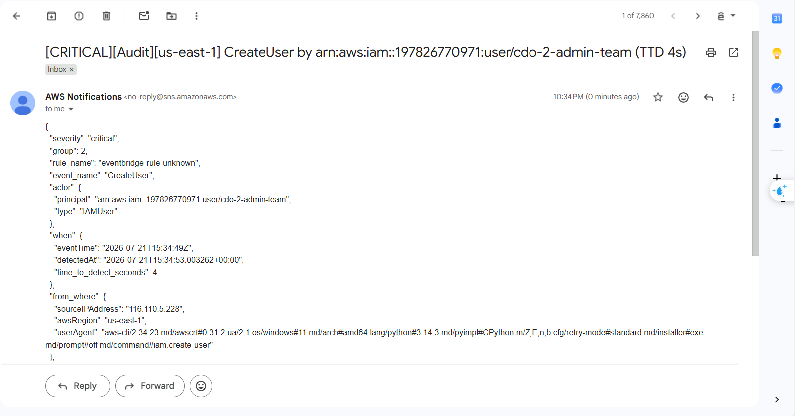
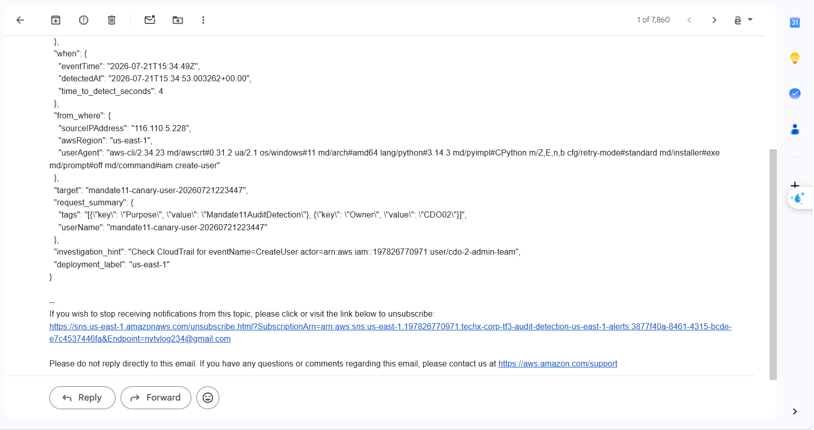
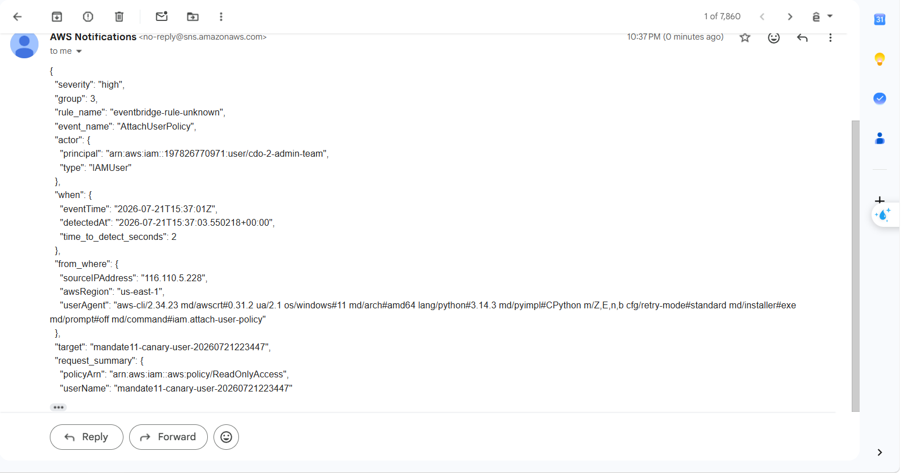
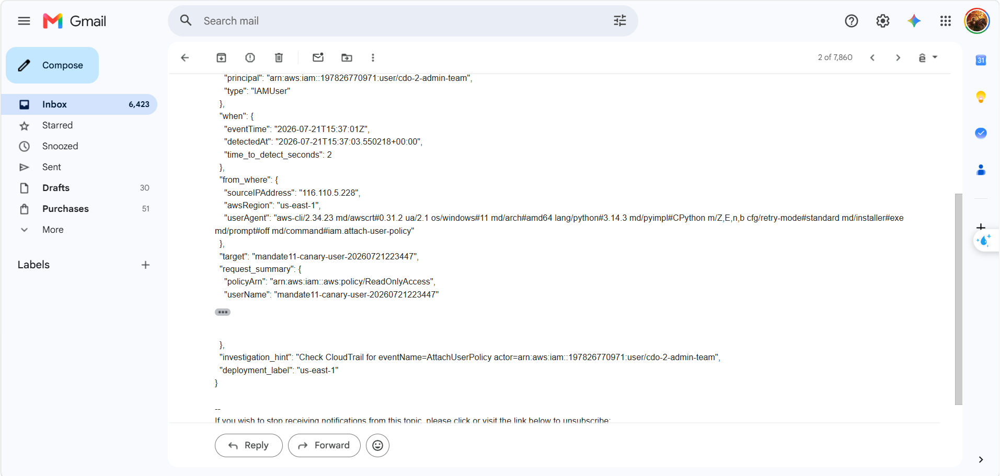
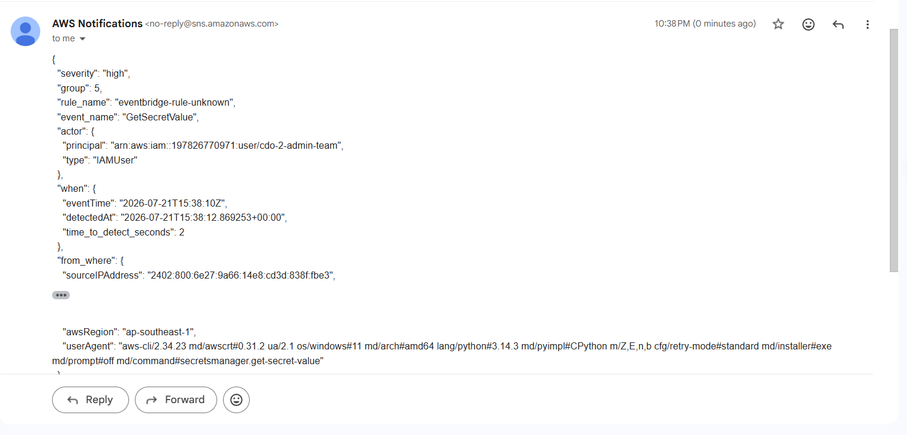
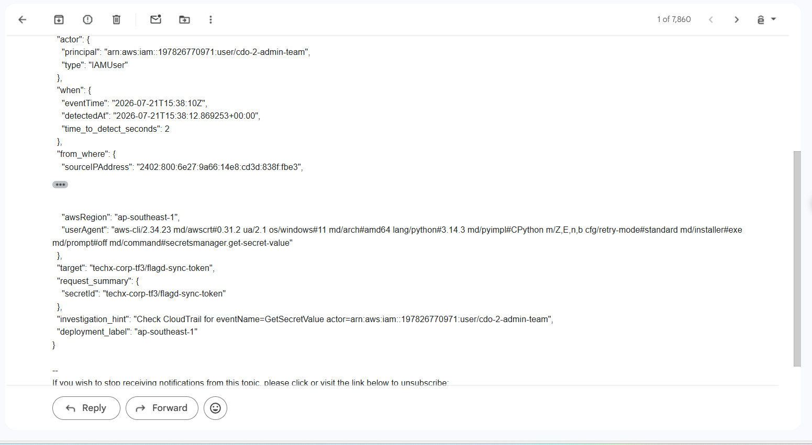

# MANDATE-11-audit-detection-evidence

**Ngày viết:** 21/07/2026  
**Owner:** CDO02  
**Mục tiêu:** chứng minh hệ thống phát hiện chủ động cho audit trail: có cảnh báo thật tới email, có đủ ngữ cảnh điều tra, và đo được time-to-detect.

---

## 1. Kết luận ngắn

Mandate 11 đã được triển khai theo hướng biến audit trail từ dữ liệu điều tra thụ động thành tín hiệu phát hiện chủ động. Khi một hành động nguy hiểm xảy ra, hệ thống không chờ người vận hành mở log thủ công, mà tự phát cảnh báo qua email.

Hệ thống đã có:

- danh mục 6 nhóm hành động nguy hiểm cần phát hiện;
- EventBridge rule để match các AWS API rủi ro cao;
- Lambda router để chuẩn hóa event, lọc nhiễu, tính severity và time-to-detect;
- SNS email gửi tới người nhận thật;
- payload cảnh báo có đủ `ai - làm gì - khi nào - từ đâu - target - investigation_hint`;
- số đo `time_to_detect_seconds` trong từng email.

Ngưỡng cam kết với mentor: cảnh báo tới email trong vòng **<= 5 phút**. Kết quả demo đo được: Group 2 phát hiện trong 4 giây, Group 3 trong 2 giây, Group 5 trong 2 giây.

---

## 2. Đối chiếu với Directive #11

| Yêu cầu của directive | Bằng chứng trong tài liệu này |
|---|---|
| Danh mục hành động nguy hiểm cần bắt | Mục 5 liệt kê 6 group nguy hiểm và API/rule được match |
| Cảnh báo chạy thật, tới tay người | Ảnh email SNS ở Group 2, Group 3, Group 5 chứng minh alert đã tới inbox người nhận |
| Đủ ngữ cảnh ai - gì - khi - từ đâu | Payload trong email có `actor.principal`, `event_name`, `eventTime`, `sourceIPAddress`, `awsRegion`, `target`, `request_summary` |
| Có hướng điều tra ngay | Payload có `investigation_hint`, ví dụ chỉ thẳng CloudTrail query theo `eventName` và `actor` |
| Đo được time-to-detect | Bảng kết quả ghi `eventTime`, `detectedAt`, `TTD giây`; ảnh email có `time_to_detect_seconds` |
| Đáng tin, không nhiễu | Mục 4 mô tả allowlist automation, watched secrets, secret reader principal và suppression có hạn |
| Mentor tự bấm nút kiểm | Mục 7, 8, 9 có lệnh Git Bash để mentor tự tạo event vô hại và quan sát email |

---

## 3. Luồng cảnh báo đã chứng minh

Luồng cảnh báo đi qua:

```text
AWS API nguy hiểm được gọi thật
-> CloudTrail ghi management event
-> EventBridge match rule tương ứng
-> Lambda audit-alert-router xử lý event
-> SNS gửi email AWS Notifications tới người nhận
```

Email alert có các trường quan trọng:

| Trường trong email | Ý nghĩa |
|---|---|
| `severity` | Mức độ cảnh báo, ví dụ `critical` hoặc `high` |
| `group` | Nhóm phát hiện, ví dụ Group 2, 3, 5 |
| `event_name` | API nguy hiểm đã xảy ra, ví dụ `CreateUser`, `AttachUserPolicy`, `GetSecretValue` |
| `actor.principal` | Ai thực hiện hành động |
| `when.eventTime` | Thời điểm CloudTrail ghi nhận hành động |
| `when.detectedAt` | Thời điểm Lambda xử lý và gửi alert |
| `when.time_to_detect_seconds` | Số giây từ lúc event xảy ra tới khi phát hiện |
| `from_where.sourceIPAddress` | IP nguồn của actor |
| `from_where.awsRegion` | Region nơi event được ghi nhận |
| `target` | Tài nguyên bị tác động |
| `request_summary` | Tóm tắt tham số quan trọng của request |
| `investigation_hint` | Gợi ý điều tra tiếp theo trong CloudTrail |

`investigation_hint` giúp người nhận bắt đầu điều tra ngay mà không cần đoán nên tìm gì. Ví dụ trong email Group 2, hint có dạng:

```text
Check CloudTrail for eventName=CreateUser actor=arn:aws:iam::197826770971:user/cdo-2-admin-team
```

Nhờ vậy người nhận biết ngay cần mở CloudTrail, lọc theo `eventName` và `actor`, rồi đối chiếu IP nguồn, user agent, target và thời gian.

---

## 4. Giảm nhiễu và ràng buộc đã tôn trọng

Để cảnh báo đủ tin và không bị tắt tiếng vì quá nhiễu, Lambda router áp dụng các nguyên tắc:

- automation principal đã biết như Terraform/GitHub Actions và External Secrets được allowlist để tránh báo động cho thay đổi vận hành hợp lệ;
- Group 5 chỉ cảnh báo khi secret nằm trong danh sách nhạy cảm cần theo dõi, ví dụ `techx-corp-tf3/flagd-sync-token`, secret RDS, ElastiCache hoặc MSK;
- automation đọc secret hợp lệ qua `secret_reader_principals` không gửi alert, còn human IAM user đọc watched secret thì vẫn alert;
- suppression nếu có phải có `actor`, `resource`, `start`, `end`, `reason` và tự hết hạn theo thời gian;
- severity được phân tầng: Group 1, 2, 4 là `critical`, Group 3 và 5 là `high`, Group 6 lên `critical` khi target là bằng chứng audit, KMS, secret, datastore hoặc S3 quan trọng.

Ràng buộc của directive đã được giữ:

- không thêm SIEM, CloudTrail Lake, Security Hub hoặc dịch vụ đắt tiền;
- không thay đổi luồng public/private của storefront và cổng vận hành;
- không vô hiệu hóa hoặc thay đổi `flagd`;
- demo Group 5 chỉ đọc secret bằng `GetSecretValue` và query `ARN`, không in hoặc sửa nội dung secret;
- không chạy hành động phá hủy trên production để lấy ảnh.

---

## 5. Danh mục group và rule đã cover

| Group | Hành vi nguy hiểm | Rule/API được match |
|---|---|---|
| Group 1 | Làm mù audit hoặc làm yếu đường giữ log | `cloudtrail:StopLogging`, `cloudtrail:DeleteTrail`, `cloudtrail:UpdateTrail`, `cloudtrail:PutEventSelectors`, `cloudtrail:StartLogging`, `logs:DeleteLogGroup`, `logs:PutRetentionPolicy` |
| Group 2 | Tạo đường truy cập mới vào tài khoản | `iam:CreateAccessKey`, `iam:CreateUser`, `iam:CreateRole`, `iam:CreateLoginProfile` |
| Group 3 | Mở rộng quyền IAM hoặc làm thay đổi trust/permission | `iam:UpdateAssumeRolePolicy`, `iam:AttachUserPolicy`, `iam:AttachRolePolicy`, `iam:PutUserPolicy`, `iam:PutRolePolicy`, `iam:CreatePolicyVersion`, `iam:SetDefaultPolicyVersion`, `iam:AddUserToGroup`, `iam:UpdateUser` |
| Group 4 | Mở hoặc sửa quyền truy cập vào EKS/runtime | `eks:CreateAccessEntry`, `eks:UpdateAccessEntry`, `eks:DeleteAccessEntry`, `eks:AssociateAccessPolicy`, `eks:DisassociateAccessPolicy` |
| Group 5 | Đọc secret nhạy cảm | `secretsmanager:GetSecretValue`, `secretsmanager:BatchGetSecretValue` |
| Group 6 | Phá hủy tài nguyên hoặc đường khôi phục | `eks:DeleteCluster`, `eks:DeleteNodegroup`, `rds:DeleteDBInstance`, `rds:DeleteDBCluster`, `elasticache:DeleteReplicationGroup`, `elasticache:DeleteCacheCluster`, `kms:ScheduleKeyDeletion`, `secretsmanager:DeleteSecret`, `s3:DeleteBucket` |

Group 1, 4 và 6 không được dùng làm demo chính vì các thao tác tương ứng dễ chạm logging, EKS access entry hoặc tài nguyên phá hủy. Việc không demo chúng không có nghĩa là không cover; các rule/API của chúng vẫn nằm trong danh mục phát hiện.

---

## 6. Vì sao chọn demo Group 2, Group 3 và Group 5

Ba group này an toàn để mentor tự chạy nhưng vẫn đại diện đúng cho các rủi ro cốt lõi của Mandate 11:

- Group 2 chứng minh hệ thống bắt được hành vi tạo thêm đường vào tài khoản AWS;
- Group 3 chứng minh hệ thống bắt được hành vi mở rộng quyền IAM trên một identity đã tồn tại;
- Group 5 chứng minh hệ thống bắt được secret read event, tức là không chỉ phát hiện các write event.

Kế hoạch demo:

- chạy Group 2 bằng `CreateUser`;
- chạy Group 3 bằng `AttachUserPolicy` với `ReadOnlyAccess`;
- chạy Group 5 bằng `GetSecretValue` trên `flagd-sync-token` nhưng chỉ query `ARN`.

---

## 7. Demo Group 2 - tạo IAM user canary

Mục tiêu: chứng minh hệ thống bắt hành động tạo đường truy cập mới.

Lệnh Git Bash:

```bash
CanaryUser="mandate11-canary-user-$(date +%Y%m%d%H%M%S)"

aws iam create-user \
  --user-name "$CanaryUser" \
  --tags Key=Purpose,Value=Mandate11AuditDetection Key=Owner,Value=CDO02
```

Kiểm tra CloudTrail:

```bash
aws cloudtrail lookup-events \
  --region us-east-1 \
  --lookup-attributes AttributeKey=EventName,AttributeValue=CreateUser \
  --max-results 5 \
  --output table
```

Kết quả cần thấy trong email:

- subject có `[CRITICAL]`;
- `event_name` là `CreateUser`;
- `group` là `2`;
- `actor.principal` là IAM user đang chạy lệnh;
- `target` là tên `$CanaryUser`;
- `investigation_hint` chỉ cách lọc CloudTrail theo `eventName=CreateUser` và actor;
- `when.time_to_detect_seconds` <= 300.

Ảnh bằng chứng đã chụp:





Không cleanup user ở bước này, vì Group 3 dùng lại chính `$CanaryUser`.

---

## 8. Demo Group 3 - attach ReadOnlyAccess vào canary user

Mục tiêu: chứng minh hệ thống bắt hành động mở rộng quyền IAM trên identity đang tồn tại.

Dùng lại `$CanaryUser` đã tạo ở Group 2.

Lệnh Git Bash:

```bash
aws iam attach-user-policy \
  --user-name "$CanaryUser" \
  --policy-arn arn:aws:iam::aws:policy/ReadOnlyAccess
```

Kiểm tra CloudTrail:

```bash
aws cloudtrail lookup-events \
  --region us-east-1 \
  --lookup-attributes AttributeKey=EventName,AttributeValue=AttachUserPolicy \
  --max-results 5 \
  --output table
```

Kết quả cần thấy trong email:

- subject có `[HIGH]`;
- `event_name` là `AttachUserPolicy`;
- `group` là `3`;
- `actor.principal` là IAM user đang chạy lệnh;
- `target` là tên `$CanaryUser`;
- `request_summary.policyArn` là `arn:aws:iam::aws:policy/ReadOnlyAccess`;
- `investigation_hint` chỉ cách lọc CloudTrail theo `eventName=AttachUserPolicy` và actor;
- `when.time_to_detect_seconds` <= 300.

Ảnh bằng chứng đã chụp:





Lý do chọn `ReadOnlyAccess`: đủ để chứng minh hành vi mở rộng quyền, nhưng không cấp quyền ghi/xóa nên an toàn hơn `AdministratorAccess`.

---

## 9. Demo Group 5 - đọc secret flagd

Mục tiêu: chứng minh hệ thống bắt được read event của Secrets Manager, không chỉ các write event.

Lệnh này gọi `GetSecretValue` nhưng chỉ in `ARN`, không in nội dung secret:

```bash
aws secretsmanager get-secret-value \
  --region ap-southeast-1 \
  --secret-id "techx-corp-tf3/flagd-sync-token" \
  --query "ARN" \
  --output text
```

Kiểm tra CloudTrail:

```bash
aws cloudtrail lookup-events \
  --region ap-southeast-1 \
  --lookup-attributes AttributeKey=EventName,AttributeValue=GetSecretValue \
  --max-results 5 \
  --output table
```

Kết quả cần thấy trong email:

- subject có `[HIGH]`;
- `event_name` là `GetSecretValue`;
- `group` là `5`;
- `actor.principal` là IAM user đang chạy lệnh;
- `target` có `techx-corp-tf3/flagd-sync-token`;
- `from_where.awsRegion` là `ap-southeast-1`;
- `investigation_hint` chỉ cách lọc CloudTrail theo `eventName=GetSecretValue` và actor;
- `when.time_to_detect_seconds` <= 300.

Ảnh bằng chứng đã chụp:





Không chụp hoặc paste `SecretString` vào tài liệu.

---

## 10. Cleanup sau demo

Sau khi đã chụp đủ ảnh Group 2 và Group 3, xóa quyền và xóa canary user.

```bash
aws iam detach-user-policy \
  --user-name "$CanaryUser" \
  --policy-arn arn:aws:iam::aws:policy/ReadOnlyAccess

aws iam delete-user --user-name "$CanaryUser"
```

Kiểm tra user đã bị xóa:

```bash
aws iam get-user --user-name "$CanaryUser"
```

Kỳ vọng: AWS trả lỗi `NoSuchEntity`. Đây là kết quả cleanup đúng.

---

## 11. Kết quả demo

| Group | Event test | Event time | Detected at | TTD giây | Email nhận lúc | Pass/Fail | Ảnh bằng chứng |
|---|---|---|---|---:|---|---|---|
| Group 2 | `CreateUser` | `2026-07-21T15:34:49Z` | `2026-07-21T15:34:53.003262+00:00` | 4 | 22:34 ICT | Pass | `image_Mandate11/g2.png`, `image_Mandate11/g21.png` |
| Group 3 | `AttachUserPolicy` | `2026-07-21T15:37:01Z` | `2026-07-21T15:37:03.550218+00:00` | 2 | 22:37 ICT | Pass | `image_Mandate11/g3.png`, `image_Mandate11/g31.png` |
| Group 5 | `GetSecretValue` | `2026-07-21T15:38:10Z` | `2026-07-21T15:38:12.869253+00:00` | 2 | 22:38 ICT | Pass | `image_Mandate11/g5.png`, `image_Mandate11/g51.png` |

Điều kiện pass đã đạt:

- cả 3 group đều có email;
- cả 3 email có đủ actor, event, source IP, region, target;
- cả 3 payload có `investigation_hint`;
- cả 3 payload có `time_to_detect_seconds`;
- tất cả TTD <= 300 giây;
- cleanup canary user đã hoàn tất.

---

## 12. Kết luận hoàn tất Mandate 11

Mandate 11 đã hoàn tất theo hướng phát hiện chủ động thay vì chỉ lưu log để điều tra sau sự cố. Hệ thống đã có danh mục 6 nhóm hành vi nguy hiểm, có EventBridge rule để match các API rủi ro cao, có Lambda xử lý ngữ cảnh, có SNS email gửi tới người nhận thật và có trường `time_to_detect_seconds` trong payload cảnh báo.

Phần demo đã chạy 3 hành động thật nhưng an toàn đại diện cho các rủi ro quan trọng nhất: tạo IAM user mới, mở rộng quyền IAM bằng `ReadOnlyAccess`, và đọc secret `flagd-sync-token` bằng `GetSecretValue` nhưng chỉ query `ARN`. Cả 3 cảnh báo đều tới email, có đủ actor, event, thời điểm, source IP, region, target, request summary, investigation hint và TTD.

Kết quả đo được: Group 2 phát hiện trong 4 giây, Group 3 phát hiện trong 2 giây, Group 5 phát hiện trong 2 giây. Tất cả đều nằm dưới ngưỡng cam kết <= 5 phút, nên hệ thống đáp ứng yêu cầu của Mandate 11: khi có hành động nguy hiểm đang diễn ra, hệ thống kêu đúng lúc, đúng người và có đủ dữ liệu để bắt đầu điều tra ngay.
