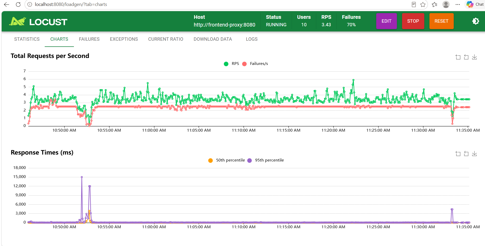

### 📝 BÁO CÁO KẾT QUẢ TEST INC-3: LỖI THANH TOÁN LÚC DEPLOY

**1. Khoảng lỗi đo được quanh mốc rollout (Error Window):**
- **Phương pháp test (Các bước thực hiện):** Kích hoạt quá trình mô phỏng người dùng mua hàng liên tục bằng công cụ Load Generator (`/loadgen/`). Trong lúc traffic đang ổn định ở mức 4-5 RPS, tiến hành gõ lệnh `kubectl rollout restart deploy/checkout -n techx-tf3`.

  1. **Mở đường hầm bảo mật (Terminal 1):**
     ```powershell
     aws ssm start-session --target i-0ed38bc9cd8c4c2b0 --document-name AWS-StartPortForwardingSessionToRemoteHost --parameters host="78F80EEA7B05283C4A1AD20C546A4559.gr7.ap-southeast-1.eks.amazonaws.com",portNumber="443",localPortNumber="8443" --region ap-southeast-1
     ```
  2. **Mở kết nối tới Frontend (Terminal 2):**
     ```powershell
     kubectl -n techx-tf3 port-forward svc/frontend-proxy 8080:8080
     ```
  3. **Tạo tải liên tục (Trình duyệt):**
     Truy cập vào trang Load Generator tại `http://localhost:8080/loadgen/` để giả lập lượng lớn người dùng (khoảng 4-5 RPS) đang liên tục bỏ hàng vào giỏ và thanh toán.
     Hoặc dùng vòng lặp:
     ```powershell
     while($true) {
        try {
          $res = Invoke-WebRequest -Uri "http://localhost:8080/api/checkout" -Method POST -Body "{}" -ContentType "application/json" -TimeoutSec 2 -UseBasicParsing
          Write-Host "$(Get-Date -Format 'HH:mm:ss') - OK" -ForegroundColor Green
        } catch {
          Write-Host "$(Get-Date -Format 'HH:mm:ss') - LỖI: $_" -ForegroundColor Red
        }
        Start-Sleep -Milliseconds 100
      }
      ```
  4. **Kích hoạt lỗi Deploy (Terminal 4):**
     Trong lúc biểu đồ LoadGen đang ổn định, tiến hành gõ lệnh ép khởi động lại service (tương đương với hành động deploy code mới):
     ```powershell
     kubectl rollout restart deploy/checkout -n techx-tf3
     ```
- **Kết quả đo đạc:** Ngay tại mốc thời gian Pod cũ bị tắt và Pod mới lên thay, biểu đồ APM ghi nhận **RPS tụt dốc gần như về 0** và **Response Time (P95) vọt lên đỉnh điểm gần 5,000ms (5 giây)**. 

- **Kết luận khoảng lỗi:** Hệ thống bị gián đoạn và rớt đơn hàng trong khoảng **3 đến 5 giây** mỗi lần deploy. Nguyên nhân do Kubernetes đẩy traffic thẳng vào Pod mới trong khi tiến trình (Go/gRPC) bên trong chưa khởi tạo xong, dẫn tới việc request bị từ chối kết nối (Connection Refused / 503). Mức độ rủi ro: Chắc chắn xảy ra 100% trong mọi lần deploy tương lai nếu không fix.

**2. Đề xuất Fix (Zero-Downtime Deploy):**
- **Giải pháp:** Bổ sung `readinessProbe` (kiểm tra độ sẵn sàng) cho 2 dịch vụ trọng yếu là `checkout` và `payment`. Giải pháp này "gần như miễn phí", không tiêu tốn tài nguyên hệ thống (chỉ là các lệnh ping gRPC rất nhẹ) và chỉ cần sửa trực tiếp trên file manifest/Helm chart.
- **Chi tiết thực thi:**
  **Bước a:** Cập nhật `values.schema.json` (dòng 717), cho phép schema nhận diện loại kiểm tra gRPC:
  ```json
      "ReadinessProbe": {
        "type": "object",
        "additionalProperties": true
      }
  ```
  **Bước b:** Chèn cấu hình kiểm tra sức khỏe bằng cổng gRPC mặc định của service (Port 8080) vào `values.yaml` ở block của `checkout` và `payment`:
  ```yaml
    checkout:
      enabled: true
      readinessProbe:
        grpc:
          port: 8080
        initialDelaySeconds: 5
        periodSeconds: 5
        
    payment:
      enabled: true
      readinessProbe:
        grpc:
          port: 8080
        initialDelaySeconds: 5
        periodSeconds: 5
  ```
- **Nghiệm thu:** Sau khi chạy `helm upgrade` để cập nhật cấu hình mới và tiến hành test lại. Lệnh `rollout restart` đã diễn ra mượt mà, biểu đồ RPS chạy ngang không bị gãy rớt, Response Time ổn định, **tỉ lệ lỗi (Error Window) giảm xuống bằng 0**. Hoàn toàn vá dứt điểm INC-3.
