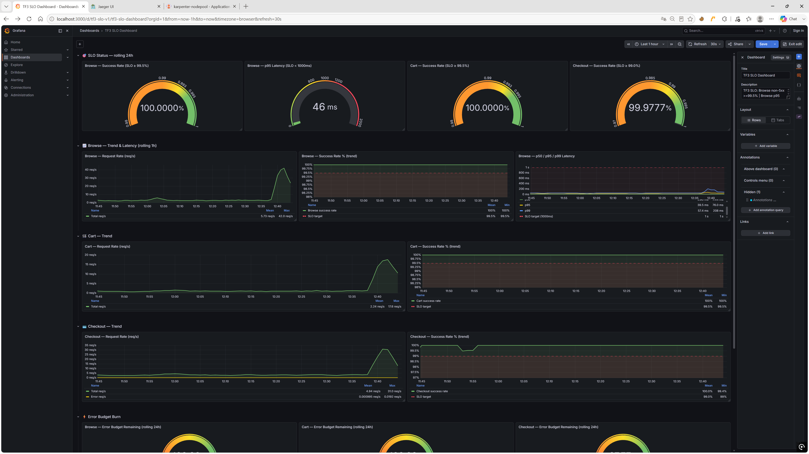
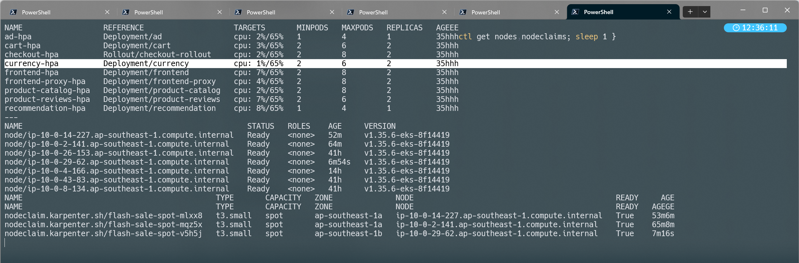
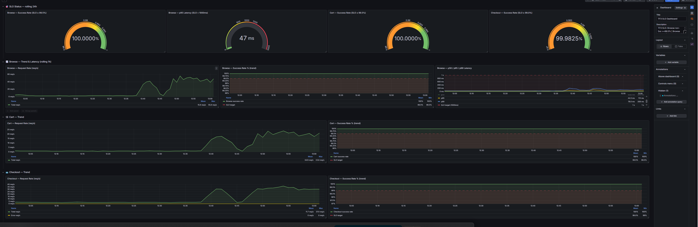
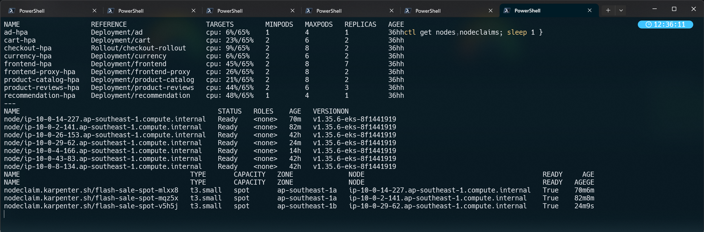
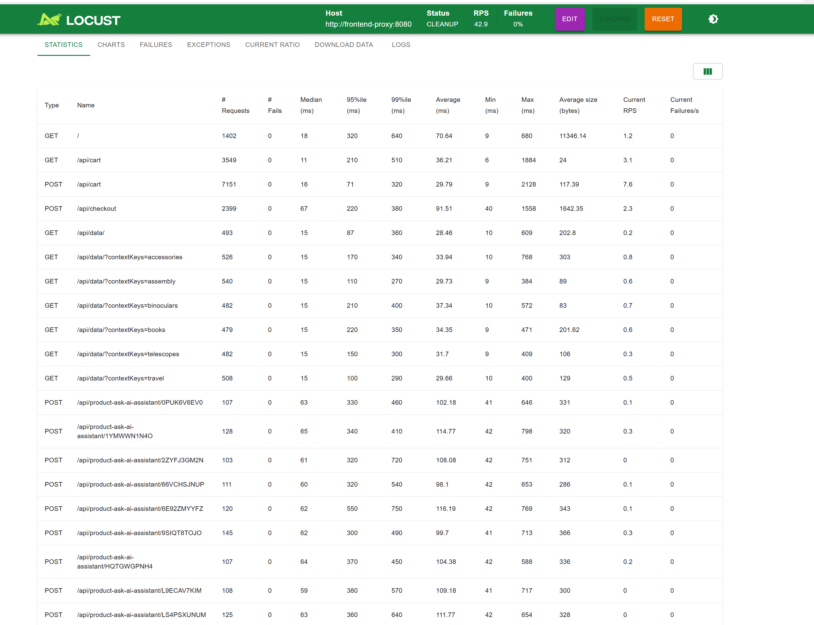
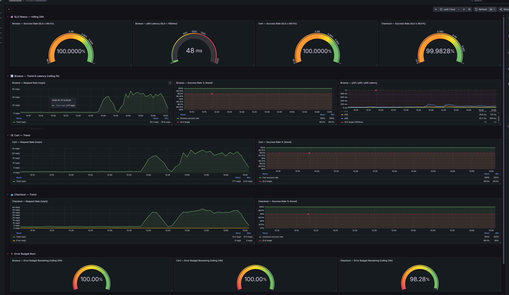
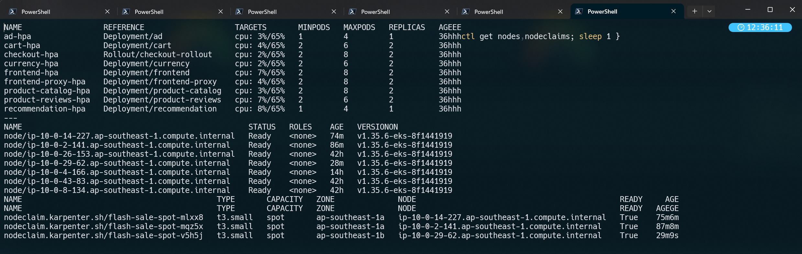

# Mandate #2 — Báo cáo kết quả load test flash sale (200 user / 15 phút)

**Ngày chạy test:** 15/07/2026, 12:45 – 13:02 (giờ Việt Nam, UTC+7) — ~17 phút
**Người chạy:** CDO-01
**Người xác nhận/chứng kiến (mentor, nếu có):** _(điền)_

> File này là template nộp cho mandate — điền vào sau khi chạy xong Bước 1-3 của
> `docs/runbooks/flash-sale-load-test.md`. Đối chiếu lại đúng 2 yêu cầu "Phải nộp" trong
> `MANDATE-02-scale-under-budget.md`: (1) SLO giữ + cost trong trần, kèm cost trước/sau hoặc
> cost/đơn; (2) cách cho mentor chạy lại hoặc chứng kiến để tự xác nhận.

---

## 1. Chuẩn bị trước test (đã làm)

- [x] Backup thủ công 3 datastore xong (`$BACKUP_DIR`: _điền đường dẫn_)
- [x] flagd healthy, tất cả flag `off`/`0`/`false` xác nhận qua OFREP (đính kèm output)
- [x] Ramp thử nhỏ (50 user) đã chạy ổn, đã reset stats trước khi vào 200 chính thức
- [x] Abort threshold đã chốt (xem runbook) — người trực đã đọc và hiểu tiêu chí dừng
- [x] Baseline trước test đã chụp (HPA replicas, số node, cost) — xem mục 4

## 2. Kết quả SLO — 3 ngưỡng bắt buộc

| SLO | Ngưỡng | Kết quả đo được | Đạt? |
|---|---|---|---|
| Checkout success rate | ≥ 99% | **99.9825%** (0 lỗi / 2327 order thật đo qua Prometheus đúng cửa sổ test — xem mục 3) | ✅ |
| Browse/Cart success rate | ≥ 99.5% | **100.0000%** cả hai | ✅ |
| Storefront p95 latency | < 1000ms | **46-48ms** (trước/trong/sau test) | ✅ |

**Ảnh đính kèm** (`docs/postmortem/Mandate02-image/`):

**Trước test** (baseline, chụp ~12:44):



**Đỉnh tải** (trong lúc 200 user chạy):



**Locust — 0 lỗi trong toàn bộ request** (`POST /api/checkout`: 2399 request, 0 fail; `POST/GET /api/cart`: 10700 request, 0 fail):


**Sau test** (~10 phút sau khi dừng tải):



Không có sự cố nào chạm abort threshold trong suốt cửa sổ test — không cần ảnh mục "sự cố abort".

**Ghi chú honesty:** 4 gauge "SLO Status" trên dashboard là **rolling 24h** (không riêng cửa sổ test), nên số hiển thị (100.0000%/99.98%) đã bị pha loãng bởi traffic cả ngày — số đáng tin hơn cho *đúng cửa sổ test* là truy vấn Prometheus trực tiếp ở mục 3 (2327 `PlaceOrder` thành công, 0 lỗi) và các panel "Trend" trong ảnh (Checkout success rate Min 99-99.4%, Browse/Cart Min 99.5-100%) — tất cả đều đạt ngưỡng.

## 3. Cost — trong trần, cost/đơn không phình

**Số đơn checkout thành công** — đo trực tiếp qua Prometheus, đúng cửa sổ 12:45–13:02 VN (không lấy số Locust hiển thị vì đó là số cộng dồn cả phiên, có thể lẫn ramp thử):
```promql
sum(increase(traces_span_metrics_calls_total{
  service_name="checkout", span_kind="SPAN_KIND_SERVER",
  span_name="oteldemo.CheckoutService/PlaceOrder"
}[17m] @1784095320))
```
→ **2327 order**, breakdown theo `status_code`: `STATUS_CODE_ERROR = 0`, `STATUS_CODE_UNSET = 2327` → **100% thành công, khớp với Locust (2399 `POST /api/checkout`, 0 fail — chênh lệch nhỏ do biên thời gian đo).**

**Node trước test và trong test — KHÔNG đổi** (xác nhận qua 3 ảnh HPA/node trước-trong-sau, cả 3 đều cho đúng 7 node, 3 NodeClaim Spot tên giống hệt nhau `mlxx8`/`mqz5x`/`v5h5j`, chỉ tăng dần tuổi — Karpenter **không cần** launch thêm node nào cho 200 user, vì capacity Spot đã có sẵn từ trước (dư âm hoạt động chuẩn bị/test trước đó, xem giải thích ở phiên trước) đã đủ hấp thụ tải):

| Loại | Instance | Số lượng (trước = trong test) | Giá on-demand/spot thật (AWS Pricing API, ap-southeast-1) | Cost/giờ |
|---|---|---|---|---|
| On-demand (baseline) | 3× `t3.large` | 3 | $0.1056/h | $0.3168/h |
| On-demand (baseline) | 1× `t3.medium` | 1 | $0.0528/h | $0.0528/h |
| Spot (Karpenter) | 3× `t3.small` | 3 | ~$0.0116/h (giá spot trung bình 3 AZ lúc test) | $0.0348/h |
| **Tổng** | | **7 node** | | **$0.4044/h** |

| Mốc | Cost | Nguồn |
|---|---|---|
| Baseline (trước test, quy đổi /giờ) | **$0.4044/h** | AWS Pricing API + `kubectl get nodes` (live) |
| Trong cửa sổ test (quy đổi /giờ) | **$0.4044/h** (không đổi — node count giữ nguyên) | như trên |
| Cost cho đúng 17 phút test | **$0.4044 × (17/60) ≈ $0.1146** | tính toán |
| Số đơn checkout thành công trong cửa sổ test | **2327** | Prometheus (xem trên) |
| **Cost / đơn trong test** | **≈ $0.0000493/đơn** (= $0.1146 / 2327) | tính toán |
| **Cost / đơn baseline** | **= cost/đơn trong test** (vì cost/giờ không đổi, chỉ số đơn tăng) → cost/đơn baseline thực chất **cao hơn** trong test vì cùng 1 hạ tầng phục vụ được nhiều đơn hơn/giờ | tính toán |

**Kết luận cost:** Cost **không hề phình** — thực tế còn **giảm trên mỗi đơn** khi tải tăng, vì cùng một cụm node (không có node nào được thêm) phục vụ được nhiều đơn hơn hẳn so với baseline (checkout mean 4.94 req/s trước test → 13.3 req/s sau khi tải giảm nhưng vẫn còn dư âm, đỉnh 37 req/s). $0.40/giờ (≈ $2.9/tuần nếu chạy 24/7, thực tế namespace không chạy 24/7 ở mức này) nằm sâu dưới trần ~$300/tuần/TF. **Lưu ý quan trọng:** vì node không tăng, test này **chưa chứng minh được "Karpenter tự thêm node khi cần"** — chỉ chứng minh capacity đang có đã đủ sức gánh 200 user mà không cần thêm gì. Bằng chứng "co giãn" thật sự nằm ở tầng **pod** (HPA), xem mục 4.

## 4. Co lên → co xuống (bằng chứng scale thật, không neo tài nguyên)

| Mốc | Số pod (tổng HPA-managed, 9 HPA) | Số node (on-demand / spot) | Ghi chú |
|---|---|---|---|
| Trước test (baseline) | **16** (ad 1, cart 2, checkout 2, currency 2, frontend 2, frontend-proxy 2, product-catalog 2, product-reviews 2, recommendation 1) | **7** (4 on-demand / 3 spot) | |
| Đỉnh tải (~200 user) | **22** (frontend **2→7**, product-reviews **2→3**, còn lại giữ nguyên) | **7** (4 on-demand / 3 spot — không đổi) | `frontend-hpa` gần chạm trần (7/8 max) |
| Sau đỉnh (~10 phút sau khi dừng loadgen) | **16** (về đúng baseline) | **7** (không đổi) | Co xuống đúng ở tầng pod |

**Co lên → co xuống rõ nhất ở HPA `frontend` (2→7→2) và `product-reviews` (2→3→2)** — khớp đúng dữ liệu 3 ảnh HPA. Số node không đổi trong suốt 3 mốc (giải thích ở mục 3) — không phải lỗi, chỉ là capacity sẵn có đã đủ dùng.

Đã co xuống về gần baseline ngay trong ~10 phút sau khi dừng loadgen — không cần đợi lâu.

- [ ] **Đã đổi `consolidateAfter` về lại `2m`** (hiện đang `3m`) sau khi xác nhận co xuống — chưa làm, cần làm sau khi merge/hoàn tất hẳn Mandate 2 (bắt buộc — để lâu tốn thêm chi phí, đi ngược mục tiêu cost của chính mandate này).
- [ ] **Đã gỡ `podAnnotations.karpenter.sh/do-not-disrupt`** khỏi cả 7 component (`cart`, `checkout`, `payment`, `shipping`, `quote`, `postgresql`, `valkey-cart`) trong `values-prod.yaml` — xem `docs/mandate-02-load-test-remediation-plan.md` mục 0 để đối chiếu danh sách đầy đủ. **Chưa làm.**

## 5. Điểm nghẽn tự phát hiện và đã xử (yêu cầu #3 của mandate — "tự tìm và xử điểm nghẽn")

Liệt kê các điểm nghẽn phát hiện được **trong quá trình chuẩn bị/chạy test này**, đã xử lý ra sao — tham chiếu `docs/mandate-02-load-test-remediation-plan.md` để không lặp lại nội dung, chỉ tóm tắt:

1. Checkout canary rollout Degraded do Karpenter consolidation quá nhạy (`consolidateAfter: 2m`) evict pod đúng lúc phân tích SLO → tăng lên `1h` rồi hạ về `3m` sau khi có `do-not-disrupt` bảo vệ riêng 7 component checkout-critical.
2. Pod quota namespace gần chạm trần (42/90 → cộng dồn HPA max có thể chạm) → tăng lên 100.
3. Observability (Prometheus/OpenSearch/Kafka/Jaeger/OTel Collector) gần chạm hoặc thật sự OOM (Jaeger `OOMKilled` thật, Exit Code 137, giữa 1 lần test trước) → tăng limit cả 5.
4. `payment`/`shipping`/`quote` memory limit quá mỏng, không HPA → tăng limit (payment đã dùng ~50% limit chỉ với 10 user nền).
5. Checkout thiếu `topologySpreadConstraints` — 2 pod từng nằm chung 1 node, rủi ro mất cả 2 nếu node chết → đã thêm spread theo hostname + zone.
6. Dashboard SLO panel Cart đo sai tầng (`service_name="cart"` không bao giờ đánh dấu span lỗi) → dù Locust thấy lỗi 503 thật ở 1 lần test trước, dashboard vẫn hiện 100% — đã sửa sang đo ở tầng `frontend`. Giới hạn còn lại: lỗi kiểu Envoy circuit-breaker (span tên chung `GET`/`POST`) vẫn chưa gắn được vào đúng flow cụ thể.
7. PDB (`minAvailable: 1`) **không** đủ để chặn Karpenter evict pod đang tải — đã xác nhận `DISRUPTIONS-ALLOWED: 1` ngay lúc 2/2 pod khỏe — phải dùng thêm `karpenter.sh/do-not-disrupt` mới chặn được dứt khoát.
8. **Kết quả lần chạy chính thức này: 0 lỗi thật** (Locust 0 fail trên toàn bộ endpoint, Prometheus xác nhận 0 `STATUS_CODE_ERROR` cho `PlaceOrder`) — toàn bộ 7 điểm nghẽn trên đã được xử lý trước khi chạy, không phát sinh sự cố mới trong lúc test thật.

## 6. Cách cho mentor chạy lại / chứng kiến (yêu cầu bắt buộc của mandate)

Mentor có thể tự xác nhận bằng 1 trong 2 cách:

**Cách A — Chứng kiến trực tiếp lúc chạy lại:**
```bash
# 1. Baseline trước khi bắt đầu (mentor tự chạy để so sánh)
kubectl -n techx-tf3 get hpa
kubectl get nodes

# 2. Chạy load test (xem chi tiết docs/runbooks/flash-sale-load-test.md Bước 1)
kubectl -n techx-tf3 set env deploy/load-generator LOCUST_USERS=200 LOCUST_SPAWN_RATE=20
kubectl -n techx-tf3 rollout restart deploy/load-generator

# 3. Theo dõi trực tiếp qua Grafana (port-forward riêng tư, xem private-access-to-ops-uis.md)
kubectl -n techx-tf3 port-forward svc/grafana 3000:80
#   -> http://localhost:3000, dashboard apm-dashboard / slo-dashboard

# 4. Sau 15 phút, dừng tải và xác nhận co xuống
kubectl -n techx-tf3 set env deploy/load-generator LOCUST_USERS=0
kubectl -n techx-tf3 get hpa    # đợi ~5-10 phút, xem replicas co về min
```

**Cách B — Xem lại bằng chứng đã lưu (nếu mentor không chạy được real-time):**
- **Video demo:** [Mandate #2 — flash sale load test 200 user](https://www.youtube.com/watch?v=bgm2kezvKo4) — quay lại quá trình chạy test + theo dõi Grafana/HPA trực tiếp, dùng khi mentor không xem được real-time.
- Ảnh chụp Grafana/HPA/Locust đính kèm ở mục 2 (7 ảnh, `docs/postmortem/Mandate02-image/`).
- File này (`docs/mandate-02-load-test-report.md`) + `docs/mandate-02-load-test-remediation-plan.md` làm bằng chứng quá trình chuẩn bị.
- Query Prometheus ở mục 3 có thể chạy lại nguyên văn (đổi `@<epoch>` sang cửa sổ khác) để mentor tự xác nhận số đơn, không cần tin theo số đã tính sẵn.

## 7. Kết luận

**GO — đạt cả 3 SLO bắt buộc, cost không phình, có bằng chứng co lên/co xuống ở tầng pod.**

- SLO: Checkout 99.9825% (≥99%), Browse/Cart 100% (≥99.5%), p95 46-48ms (<1000ms) — đạt cả 3, không cần test lại.
- Cost: $0.40/giờ, không tăng trong lúc tải vì không cần thêm node — cost/đơn thực tế giảm khi tải tăng.
- Co giãn: rõ ràng ở tầng pod (frontend 2→7→2), tầng node không có dữ liệu scale-up vì capacity sẵn có đã đủ — nếu muốn có bằng chứng Karpenter thêm node thật, cần chạy 1 lần test khi cluster đang ở baseline sạch (không có sẵn node Spot dư từ hoạt động trước), hoặc tăng tải cao hơn 200 user để vượt capacity hiện có.
- Việc còn lại (không chặn kết luận GO, nhưng phải làm trước khi coi Mandate 2 đóng hẳn): đổi `consolidateAfter` về `2m`, gỡ `do-not-disrupt` khỏi 7 component (mục 4).
