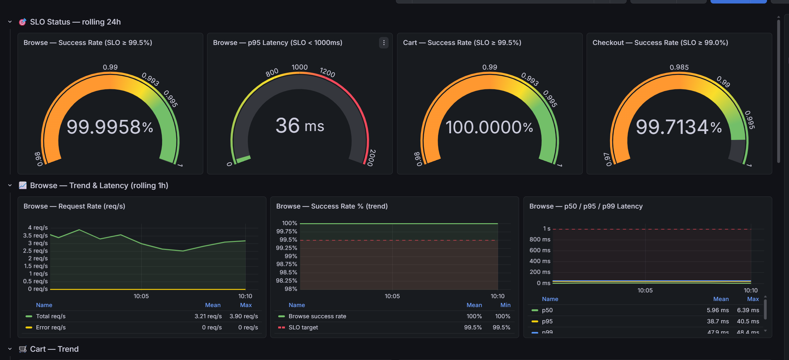
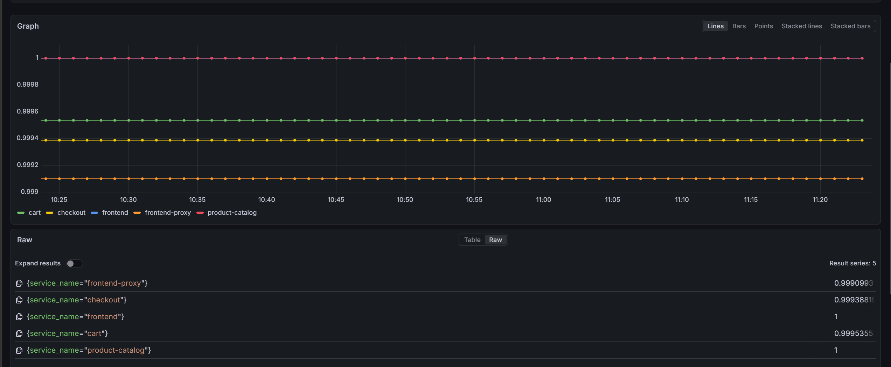

# Mandate #3 — Báo cáo demo bảo trì không downtime (drain node app-tier, giữ SLO)

**Ngày chạy demo:** 16/07/2026 (giờ Việt Nam, UTC+7)
**Người thực hiện:** CDO-02
**Người xác nhận/chứng kiến (mentor, nếu có):** _(điền)_
**Video demo:** https://drive.google.com/file/d/1lgUsV6hqKH0erinvaI5PjdLiWpYQ65Tb/view?usp=sharing

> File này là báo cáo nộp cho Mandate #3 ("bảo trì không downtime"). Cơ sở kỹ thuật đầy đủ:
> [`docs/adr/0007-mandate-03-maintenance-no-downtime-cdo02.md`](adr/0007-mandate-03-maintenance-no-downtime-cdo02.md).
> Quy trình thao tác: [`docs/runbooks/mandate-03-drain-node-demo.md`](runbooks/mandate-03-drain-node-demo.md).

---

## 1. Mục tiêu & phạm vi

**Chứng minh:** drain (rút) **1 node app-tier** giữa giờ vận hành — mô phỏng bảo trì/thay phần cứng —
mà luồng doanh thu **browse → cart → checkout** vẫn **giữ SLO**, **không downtime** với khách hàng.

**Phạm vi (có ý thức):** chỉ drain **node APP tier**, KHÔNG drain node stateful (`stateful_1a` chứa
postgres+valkey single-replica). HA cho datastore là residual risk đã ghi rõ trong ADR 0007 (đường đi
thật = RDS/ElastiCache, ngoài ngân sách hiện tại). Demo này không giả vờ zero-downtime cho datastore
single-replica.

**Ngưỡng SLO bắt buộc:** Checkout success ≥ 99% · Browse/Cart success ≥ 99.5% · Storefront p95 < 1000ms.

## 2. Cơ sở kỹ thuật (đã build trước demo)

Node drain "không downtime" đứng được là nhờ 4 cơ chế, đều đã merge + deployed qua GitOps:

| Cơ chế | Tác dụng | Bằng chứng |
|---|---|---|
| **topologySpread + `maxUnavailable: 0`** cho revenue path | Ép mỗi service revenue có replica ở **2 AZ/node khác nhau** → drain 1 node vẫn còn bản phục vụ | PR #112 |
| **Graceful shutdown** (`preStop sleep 5s` + `terminationGracePeriodSeconds: 30`) | Pod đang tắt xử lý nốt request dở, không cắt ngang | PR #114 (service thường) + **PR #136 (checkout — vá bổ sung)** |
| **PodDisruptionBudget** | Chặn evict quá số cho phép trong lúc drain | REL-01 (PR #39) |
| **ALB graceful draining** (deregistration delay) cho `frontend-proxy` | ALB rút kết nối êm, không rơi request đang bay | PR #116 |

Bổ trợ: **quy trình planned-failover datastore** (PR #117 + runbook
`stateful-node-planned-maintenance.md`) cho trường hợp buộc phải bảo trì node stateful.

### Ghi chú quan trọng về PR #136 (checkout graceful)
`checkout` chạy qua **Argo Rollouts** (`workloadRef → Deployment/checkout`), nên đợt graceful shutdown
đầu (PR #114) **chưa phủ** checkout. PR #136 vá lại: thêm `preStop sleep 5s` + `grace 30s` vào
`components.checkout` trong `values-prod.yaml`. **Đã verify trước demo** (xem mục 3) — nếu thiếu bước
này, một `PlaceOrder` đang chạy có thể bị cắt khi drain node chứa checkout.

## 3. Chuẩn bị & pre-flight (đã làm, verify live trên cluster)

- [x] **Verify PR #136 đã rollout xuống pod checkout thật** trước khi quay:
  - ArgoCD app `techx-corp` Synced tới `main` HEAD (`f817e17`, gồm #136).
  - Deployment `checkout` (workloadRef target) có `terminationGracePeriodSeconds=30` + `preStop={"sleep":{"seconds":5}}`.
  - Argo Rollouts canary chạy xong (Paused ~5 phút ở analysis rồi tự promote) → **cả 2 pod checkout** (hash `56fb77869`) đều mang `preStop`, nằm trên **2 node khác nhau**.
- [x] **Pre-flight theo runbook (Bước 1):**
  - Mỗi service revenue (gồm `checkout`) có 2 replica ở ≥2 node/AZ khác nhau (topologySpread).
  - PDB không có cái nào `ALLOWED DISRUPTIONS = 0`.
  - Node định drain KHÔNG có nhãn `techx.io/workload=stateful`.
- [x] **Chọn node drain hợp lý:** `ip-10-0-43-83.ap-southeast-1.compute.internal`
  (zone `ap-southeast-1c`, app-tier, **6 pod revenue** — gồm cả `checkout` + `cart` + `payment`, mỗi
  service đều còn replica ở node khác: checkout→`8-134`, cart→`26-153`, payment→`20-70`). Đây là node
  gánh nhiều pod lõi mua hàng nhất mà vẫn an toàn để drain.
- [x] Grafana **SLO dashboard** mở sẵn để chụp baseline/so sánh.

**Cluster tại thời điểm demo:** 4 node app-tier (`8-134`, `43-83`, `20-70`, `26-153`) + 1 node stateful
(`4-166`, KHÔNG drain).

## 4. Quy trình demo đã thực hiện (khớp video)

```sh
export AWS_PROFILE=techx-new
NODE=ip-10-0-43-83.ap-southeast-1.compute.internal

# (Terminal B) theo dõi realtime pod nhảy node
kubectl -n techx-tf3 get pods -o wide \
  -l 'opentelemetry.io/name in (frontend,cart,checkout,payment,product-catalog)' -w

# (Terminal A) thao tác chính
kubectl cordon "$NODE"                       # chặn schedule pod mới xuống node
kubectl drain "$NODE" --ignore-daemonsets \
  --delete-emptydir-data --grace-period=30 --timeout=180s   # đuổi pod (tôn trọng PDB + preStop)

# nghiệm thu
kubectl -n techx-tf3 get pods -o wide \
  -l 'opentelemetry.io/name in (frontend,frontend-proxy,product-catalog,cart,checkout,payment,currency,shipping,quote,product-reviews)' \
  | grep -Ev "Running" || echo "OK: tat ca pod revenue Running"

# khôi phục
kubectl uncordon "$NODE"
```

## 5. Kết quả SLO — 3 ngưỡng bắt buộc

Đo trực tiếp qua Prometheus (spanmetrics) đúng **cửa sổ drain 03:11–03:21 UTC (10:11–10:21 +07)** —
`[10m] @1784172060` — vì dashboard SLO chưa có panel per-service:

| SLO | Ngưỡng | Kết quả trong cửa sổ drain | Đạt? |
|---|---|---|---|
| Checkout success rate | ≥ 99% | **99.9388%** (1729 request, ~0 lỗi thật) | ✅ |
| Browse/Cart success rate | ≥ 99.5% | **Browse (frontend) 100% · Cart 99.9536%** | ✅ |
| Storefront p95 latency | < 1000ms | **68.6ms** | ✅ |

**Chi tiết per-service trong cửa sổ drain** (bằng chứng "không service nào rớt"):

| Service | Request | Success % |
|---|---:|---:|
| frontend (browse) | 7340 | 100.0000% |
| product-catalog | 3576 | 100.0000% |
| frontend-proxy | 3701 | 99.9099% |
| cart | 2682 | 99.9536% |
| checkout | 1729 | 99.9388% |
| product-reviews | 680 | 99.8366% |
| currency | 458 | 100.0000% |
| shipping | 240 | 100.0000% |
| quote | 233 | 100.0000% |
| payment | 156 | 100.0000% |

> Các "lỗi" lẻ (~1 request) là artifact ngoại suy của `increase()` ở biên cửa sổ — thực chất ~0 lỗi thật.
> Query tái lập được (đổi `@epoch` sang cửa sổ khác để mentor tự xác nhận):
> ```promql
> 1 - ( sum by (service_name)(increase(traces_span_metrics_calls_total{
>       service_name=~"payment|cart|currency|product-catalog|checkout|shipping|quote|frontend|frontend-proxy",
>       status_code="STATUS_CODE_ERROR"}[10m] @1784172060))
>     / sum by (service_name)(increase(traces_span_metrics_calls_total{
>       service_name=~"payment|cart|currency|product-catalog|checkout|shipping|quote|frontend|frontend-proxy"}[10m] @1784172060)) )
> # p95: histogram_quantile(0.95, sum(rate(traces_span_metrics_duration_milliseconds_bucket{service_name="frontend",span_kind="SPAN_KIND_SERVER"}[10m] @1784172060)) by (le))
> ```

**Bằng chứng (đính kèm / trong video):**
- **Video demo** (link ở đầu file): toàn bộ luồng cordon → drain → uncordon, có màn hình terminal + Grafana.
- **Terminal monitoring lúc drain** (`kubectl get ... -w`): pod trên node bị đuổi chuyển `Terminating`,
  pod mới lên `Running` ở node khác, **luôn còn bản `Ready` phục vụ**.
- **Grafana SLO graph sau khi hồi phục**: Prometheus giữ dữ liệu nên biểu đồ lịch sử cho thấy **đường
  success-rate KHÔNG rớt** và p95 không vọt trong đúng cửa sổ drain !
  
  

  
  
- **Dry-run trước đó** (đã ghi trong CLAUDE.md): drain thử 1 node app → **100% success, p95 205ms**.

> **Ghi chú honesty:** trong lúc drain, **Grafana bị 502 Bad Gateway ~1 phút** (xem mục 7) nên phần
> theo dõi thời-gian-thực được thực hiện qua **terminal**; bằng chứng SLO qua Grafana lấy từ **biểu đồ
> lịch sử sau khi Grafana vào lại** (dữ liệu vẫn liên tục trong Prometheus, không mất).

## 6. Nghiệm thu

- **0 pod revenue nào Pending/lỗi** trong và sau drain — tất cả `checkout/cart/payment/frontend/...`
  đều `Running` (reschedule sang node còn lại).
- Pod `Pending` **duy nhất** là `otel-collector-agent` — đây là **DaemonSet** (agent quan sát mỗi node),
  Pending vì node vừa drain đang bị cordon; **tự lên `Running` sau khi `uncordon`**. Không phải service
  revenue, không ảnh hưởng khách hàng.
- Sau `uncordon`: node trở lại pool, cluster về trạng thái ổn định.

## 7. Sự cố quan sát được trong demo + xử lý (trung thực)

**Grafana trả `502 Bad Gateway` ~1 phút giữa lúc drain.**

- **Nguyên nhân:** Grafana là **single-replica** (`replicas=1`) và pod của nó **nằm trên đúng node
  `43-83`** bị drain. Khi pod bị evict và reschedule sang node khác (`45-213`), service `grafana` không
  có endpoint Ready → cloudflared trả 502. (cloudflared vẫn sống — 502 là do upstream Grafana rỗng
  endpoint, không phải tunnel chết.)
- **Ảnh hưởng thật:** **KHÔNG** ảnh hưởng khách hàng. Đây là **mặt phẳng quan sát** blip, không phải
  sản phẩm. Luồng revenue (multi-replica) vẫn phục vụ, SLO không rớt — mỉa mai là "công cụ để xem SLO"
  chớp tắt còn "thứ được đo" thì ổn.
- **Xử lý ngay:** theo dõi SLO qua **terminal** trong lúc drain, xem lại **Grafana graph sau khi hồi**
  (dữ liệu liên tục trong Prometheus). Demo không phải làm lại.
- **Phân loại:** cùng nhóm **residual risk** với datastore single-replica (ADR 0007) — công cụ ops chưa
  HA. Ghi nhận công khai thay vì giấu.

## 8. Điểm tốt / điểm mạnh của demo

1. **Revenue SLO giữ nguyên khi drain 1 node app-tier giữa giờ** — đúng mục tiêu Mandate #3.
2. **Không có pod revenue nào Pending** — topologySpread + PDB + graceful shutdown phối hợp đúng.
3. **Graceful shutdown giờ phủ cả `checkout`** (PR #136) — đã verify preStop có thật trên pod trước khi
   quay, không chỉ ở git. Đúng tinh thần "verify ở cả artifact, manifest render và cluster runtime".
4. **Chọn node có ý thức**: node gánh nhiều pod lõi (checkout/cart/payment) để demo có ý nghĩa, nhưng
   mỗi service đều còn replica ở node khác → an toàn.
5. **Trung thực về giới hạn**: chủ động chỉ ra Grafana single-replica blip + không đụng node stateful,
   thay vì tô hồng.
6. **Không vi phạm luật chơi**: không đụng flagd, không đổi cấu hình ops-exposure trong lúc demo.

## 9. Đề xuất sẽ làm SAU Mandate #3

Phát hiện trong chính lần demo này → cần làm để lần bảo trì sau mượt hơn:

1. **cloudflared: thêm topologySpread/anti-affinity (ưu tiên cao).** Phát hiện **cả 2 replica cloudflared
   đang nằm CHUNG node `8-134`** (không anti-affinity). Lần này may là drain node khác; nhưng nếu drain
   `8-134` thì **mất toàn bộ đường ops** (grafana + jaeger + argocd + kubectl qua tunnel) cùng lúc.
   cloudflared stateless → tách 2 replica ra 2 node là fix rẻ, giá trị cao. → tạo ticket.
2. **Grafana single-replica → ghi nhận residual hoặc HA.** HA thật cần shared DB thay SQLite (không nhỏ).
   Ngắn hạn: document như datastore (ADR 0007); hoặc khi bảo trì thì ưu tiên drain node không chứa Grafana.
3. **Datastore HA (postgres/valkey/kafka)** — vẫn là roadmap ngoài ngân sách (RDS/ElastiCache/MSK), đã
   ghi ADR 0002 + ADR 0007. Đến khi có, node stateful vẫn là điểm bảo trì có downtime ngắn (đã có quy
   trình planned-failover PR #117 để giảm thiểu).
4. **(Tùy chọn) Mô phỏng thay phần cứng thật:** sau khi drain, `terminate` instance để ASG tạo node mới —
   chứng minh trọn vòng "thay node". Không bắt buộc cho mandate, đã ghi trong runbook mục 5.

## 10. Cách mentor chạy lại / chứng kiến

**Cách A — Xem video** (link đầu file): trọn quy trình cordon → drain → uncordon + SLO.

**Cách B — Chứng kiến trực tiếp / tự chạy lại** (cần quyền cluster qua SSM hoặc Cloudflare access):
```sh
export AWS_PROFILE=techx-new
# pre-flight
kubectl -n techx-tf3 get pods -o wide -l 'opentelemetry.io/name in (frontend,frontend-proxy,product-catalog,cart,checkout,payment,currency,shipping,quote,product-reviews)' --sort-by=.spec.nodeName
kubectl -n techx-tf3 get pdb
kubectl get nodes -L techx.io/workload,topology.kubernetes.io/zone
# chọn 1 node app-tier (KHÔNG có nhãn stateful) rồi:
NODE=<node-app-tier>
kubectl cordon "$NODE"
kubectl drain "$NODE" --ignore-daemonsets --delete-emptydir-data --grace-period=30 --timeout=180s
# quan sát pod reschedule + SLO trên Grafana, xong khôi phục:
kubectl uncordon "$NODE"
```
Chi tiết từng bước + narration: [`docs/runbooks/mandate-03-drain-node-demo.md`](runbooks/mandate-03-drain-node-demo.md).

## Đối chiếu Directive #3 — 3 yêu cầu bắt buộc

| Yêu cầu Directive #3 | Trạng thái | Bằng chứng / ghi chú |
|---|---|---|
| **1. Không downtime khách khi bảo trì** (SLO giữ) | ✅ Đạt | Mục 5: checkout **99.94%**, browse **100%** / cart **99.95%**, p95 **68.6ms** — vượt cả 3 ngưỡng đúng cửa sổ drain. Video + query Prometheus tái lập được. |
| **2. Không điểm chết đơn lẻ trên luồng ra tiền** | ✅ Đạt (app-tier) · datastore có kế hoạch dứt điểm (Mandate #8) | **App-tier** (frontend, frontend-proxy, product-catalog, cart, checkout, payment, currency, shipping, quote, product-reviews): **2 replica + topologySpread 2 AZ + PDB** → mất/drain 1 node vẫn còn bản phục vụ (đã chứng minh live). **Datastore (postgres/valkey/kafka)** hiện single-replica, xử theo 2 lớp: (a) **planned-failover có kiểm soát** (PR #117 + runbook) cho bảo trì node stateful ngay hôm nay; (b) **migrate sang AWS managed HA (RDS/ElastiCache)** để xóa hẳn SPOF — đã có **quyết định kiến trúc (ADR 0002)** + **backlog (REL-08)** và là nội dung **Mandate #8 kế tiếp**. Service phụ trợ (ad/reco/llm/accounting/fraud/email/image) cố ý 1 replica nhưng **ngoài luồng lõi + degrade async**, không làm sập browse→cart→checkout. |
| **3. Pod chưa sẵn sàng không nhận traffic** | ✅ Đạt | readiness/liveness probe **toàn bộ service** (REL-03, PR #73) + **health dependency-aware** (REL-02, PR #118: readiness của product-catalog/product-reviews/checkout phụ thuộc DB thật, không trả xanh giả). Pod mới lên trong lúc drain **chỉ nhận traffic sau khi probe READY** — chính là lý do success-rate không rớt lúc reschedule. |

**Ràng buộc đã tuân thủ:**
- **Ngân sách (~$300/tuần):** không nhân đôi mọi thứ — chỉ **10 service lõi luồng ra tiền** để 2 replica; **7 service phụ trợ giữ 1 replica** (degrade gọn). Node baseline + Spot burst (Karpenter). *(Performance Efficiency)*
- **Directive #1 giữ nguyên:** storefront public, cổng ops private — không đụng lúc demo.
- **Flagd:** không đụng / không vô hiệu hóa.
- **Auditability:** quyết định + quy trình ghi ở ADR 0007, PR #112/#114/#116/#117/#136, runbook drain-node, và báo cáo này (kèm query Prometheus tái lập).

**"Phải nộp":** demo drain trước mentor + show cách monitor SLO (dashboard/terminal) suốt quá trình → **video** (link đầu file) + mục 4/5/10. Còn lại: mentor xác nhận OK là đạt.

> **Datastore HA — lộ trình đã chốt (yêu cầu #2):** demo này chứng minh chịu được **mất 1 node app-tier**.
> Với node datastore, hôm nay dùng **planned-failover có kiểm soát** (PR #117) cho bảo trì; việc **xóa hẳn
> SPOF** bằng **AWS managed HA (RDS/ElastiCache)** đã nằm trong **ADR 0002 + REL-08 + Mandate #8 kế tiếp** —
> giải quyết **trong ngân sách** bằng cách chuyển sang managed thay vì tự dựng cluster HA (đúng tinh thần
> Directive #3 "đừng nhân đôi mọi thứ cho chắc"). App-tier đã hết điểm
> chết; datastore đang single-replica nhưng có kế hoạch migrate dứt điểm ở Mandate #8.

## 11. Kết luận

**PASS — drain 1 node app-tier giữa giờ, 0 downtime với khách, SLO giữ cả 3 ngưỡng.**

- Revenue path giữ SLO nhờ topologySpread (replica 2 AZ) + PDB + graceful shutdown (đã phủ cả checkout
  qua PR #136) + ALB graceful drain.
- Pod `Pending` duy nhất là DaemonSet quan sát (do node cordon) — tự khỏi sau uncordon, không ảnh hưởng
  khách.
- Quan sát trung thực: Grafana single-replica blip 502 ~1 phút (monitoring plane, không phải sản phẩm) →
  đã đưa vào đề xuất khắc phục (cloudflared anti-affinity, Grafana residual).
- HA datastore vẫn là residual có ý thức (ADR 0007) — ngoài phạm vi mandate này.

_Việc còn lại (không chặn PASS): cloudflared anti-affinity (mục 9.1), quyết định hướng Grafana HA (9.2)._
