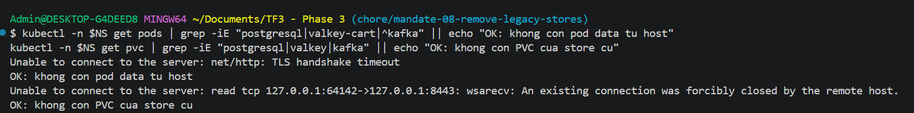
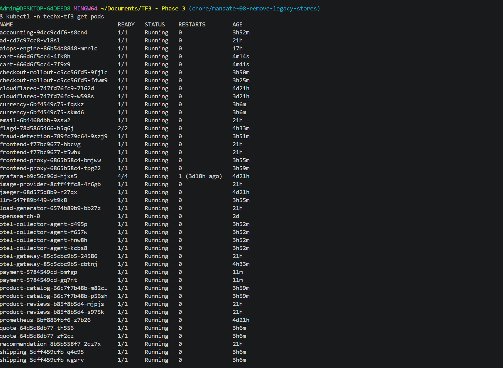
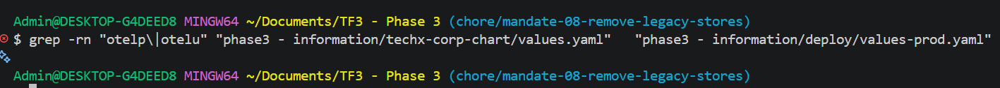
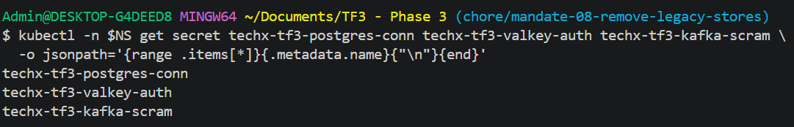
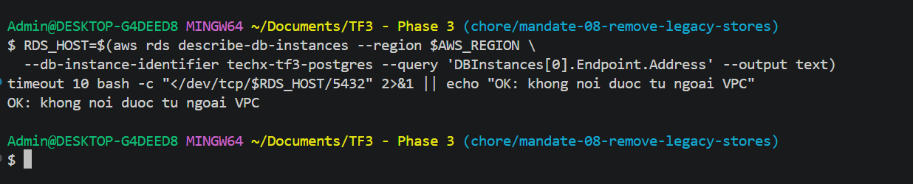

# BÁO CÁO NGHIỆM THU — MANDATE #8
## Migrate 3 datastore tự host → managed AWS (RDS / ElastiCache / MSK)

**Đội:** CDO02 — Reliability + Cost Optimization
**Người chịu trách nhiệm:** Huu Tai Ngo
**Hạn mandate:** 20/07/2026 · **Ngày trình:** 22/07/2026

---

## 0. TÓM TẮT ĐIỀU HÀNH

Ba kho dữ liệu của hệ thống (PostgreSQL, Valkey, Kafka) trước đây **tự host, mỗi kho đúng 1 bản, dồn trên
cùng 1 node** — là điểm chết duy nhất (SPOF) nằm ngay trên luồng ra tiền, không có backup tự động, không TLS,
không authentication. Mandate #8 chuyển cả 3 lên dịch vụ quản lý của AWS.

**Kết quả:**

| Hạng mục | Kết quả |
|---|---|
| Số store đã chuyển | **3/3** |
| Mất dữ liệu | **0** — chứng minh bằng đếm + checksum trước/sau (mục C) |
| Downtime với khách | Valkey **0** · Postgres **0** · Kafka **có 2 sự cố** (mục D) |
| Bảo mật | TLS in-transit + mã hoá at-rest + secret trong Secrets Manager + endpoint private |
| Chi phí phát sinh | **+$637/tháng ≈ $147/tuần** (đo Cost Explorer 21/07, không phải ước lượng) |
| Ngân sách TF | 🟡 **Đang vượt: $426/tuần / trần $300** — nguyên nhân + kế hoạch về $269,7/tuần ở mục G.3 |
| SPOF datastore | **Đã xoá bỏ** — cả 3 đều Multi-AZ / multi-broker |

---

## A. PHẠM VI & MỐC THỜI GIAN

| Store | Từ | Sang | Ngày cutover | Kết quả |
|---|---|---|---|---|
| 🛒 Giỏ hàng | Valkey 9.0 (1 pod) | **ElastiCache Valkey**, 2 node, Multi-AZ | **19/07/2026** (PR #251) | ✅ 0 downtime |
| 🧾 Sổ cái | PostgreSQL 17.6 (1 pod) | **RDS PostgreSQL 17.6**, Multi-AZ | **19/07/2026** (PR #252) | ✅ 0 downtime |
| 📦 Hàng đợi đơn | Kafka 3.9 (1 broker) | **MSK 3.9 KRaft**, 3 broker / 3 AZ | 20/07/2026 | 🟡 2 sự cố (mục D) |

**Nguyên tắc xuyên suốt:** (1) tách "deploy code" khỏi "cutover" — mọi thay đổi gated bằng env, mặc định tắt;
(2) zero-loss phải **chứng minh được**, không phải "cố gắng"; (3) luôn giữ đường lui tới phút chót.

---

### A.1 — Vì sao chuyển sang managed, thay vì tiếp tục tự host

Trước Mandate #8, cả 3 kho đều **tự host, mỗi kho đúng 1 bản, dồn trên cùng 1 node stateful**. Đây không
phải rủi ro lý thuyết: nó là **SPOF nằm ngay trên luồng ra tiền**, không backup tự động, không TLS, không
authentication, và credential Postgres nằm plaintext trong `values.yaml`.

| Tiêu chí | Tự host (hiện trạng cũ) | Managed AWS (đích) |
|---|---|---|
| Chi phí tiền mặt | Rẻ hơn | **Đắt hơn** (+$202/tháng) |
| Công vận hành | Đội tự vá version, tự dựng lại khi hỏng, tự viết runbook từng kịch bản | AWS lo |
| Khi node/AZ chết | **Mất dịch vụ** — chỉ quản được bằng planned-failover (có downtime) | Tự chuyển sang bản dự phòng |
| Backup | Không có (PVC chỉ chống pod restart, không chống mất EBS/xoá nhầm) | Tự động + point-in-time recovery |
| Bảo mật | Plaintext, không auth | TLS + mã hoá at-rest + Secrets Manager |
| Tuỳ biến sâu | Thoải mái | Bị giới hạn theo AWS |

**Quyết định: thuê managed.** Lý do: đây là đường ra tiền — **một lần sập gây thiệt hại lớn hơn nhiều so
với $202/tháng**, và đội 3 người không có băng thông vận hành 3 datastore dài hạn (bằng chứng: REL-13 và
REL-16 đều là sự cố OOM do "tự vận hành thiếu tay").

---

### A.2 — Vì sao chọn đúng RDS / ElastiCache / MSK, và đánh đổi từng lựa chọn

**Nguyên tắc chọn version:** cả 3 dịch vụ đều chọn **version khớp 1:1 với bản in-cluster**
(PostgreSQL 17.6 · Valkey 9.0 · Kafka 3.9 KRaft). Nhờ vậy rủi ro dồn hết vào **cutover / TLS / credential**
— thứ kiểm soát được bằng quy trình — chứ **không nằm ở tương thích engine**, thứ không kiểm soát được.

#### 🧾 PostgreSQL → **RDS PostgreSQL 17.6**, db.t4g.micro, **Multi-AZ**, gp3 20GB — ~$43/tháng

| Đánh đổi | Cân nhắc |
|---|---|
| **Multi-AZ ($37) vs Single-AZ ($18)** | Đây là **dữ liệu tài chính** — durability đáng giá nhất hệ thống. **+$19/tháng là khoản rẻ nhất toàn mandate** để đổi lấy auto-failover. |
| **RDS vs Aurora** | Aurora đắt hơn và là engine khác → mất lợi thế "version khớp 1:1". Không có nhu cầu scale-out đọc ở quy mô hiện tại. |
| Mật khẩu master | Dùng `manage_master_user_password` → **AWS tự sinh và xoay trong Secrets Manager, không bao giờ nằm trong Terraform state**. |
| Cái giá của cách cutover | "Đóng băng người ghi duy nhất" làm **số liệu kế toán trễ vài phút** — không phải SLI nào của khách. |
| Điều kiện sống còn | Chứng minh sụp đổ nếu xuất hiện **writer thứ hai** → bắt buộc re-audit `pg_stat_activity` ngay trước cutover. |

#### 🛒 Valkey → **ElastiCache Valkey 9.0**, cache.t4g.micro **×2 (primary + replica)**, Multi-AZ, TLS + AUTH — ~$28/tháng

| Đánh đổi | Cân nhắc |
|---|---|
| **2 node ($28) vs 1 node ($14)** | `cart` nằm **trên luồng đồng bộ** browse → cart → checkout. Mất cache là **vỡ SLO ngay lập tức**, không phải "mất dữ liệu mềm". **+$14/tháng cho auto-failover là rẻ.** |
| Thêm nhánh dual-write tạm trong code | Tốn 1 PR và phải gỡ sau nghiệm thu — đổi lấy **chứng minh zero-loss tuyệt đối** (827/827). Bản nháp đầu định chấp nhận "mất giỏ đang mở, xin mentor thông cảm" → **đã bỏ**. |
| Cửa sổ hội tụ 60 phút là **bắt buộc** | Rút ngắn = phá vỡ chứng minh = mất giỏ thật. Thực tế chờ 65–70 phút lấy biên an toàn. |

#### 📦 Kafka → **Amazon MSK 3.9 KRaft**, `kafka.m7g.large` **×3 broker / 3 AZ**, RF=3, `min.insync.replicas=2`, SASL/SCRAM — **$558/tháng**

Đây là **quyết định tốn tiền nhất** của mandate — một mình MSK chiếm **88% toàn bộ chi phí phát sinh**
— và cũng là chỗ đánh đổi rõ ràng nhất:

| Đánh đổi | Cân nhắc |
|---|---|
| **3 broker ($558) vs 2 broker ($372)** | `checkout` **chặn đồng bộ** với `acks=all`. Với 2 broker phải chọn 1 trong 2 phương án đều tệ: `min.insync=2` → mất 1 broker là **checkout fail ngay** (vỡ SLO); `min.insync=1` → ack chỉ 1 bản sao → broker đó chết là **mất đơn thật**. Cấu hình 3 broker / RF=3 / isr=2 **chịu được mất 1 broker mà vẫn nhận đơn**, mỗi ack ≥2 bản sao. **+$186/tháng mua đúng thứ directive đòi: không mất đơn.** |
| **MSK provisioned vs MSK Serverless** | Con số "MSK ~$540/tháng" trong ADR 0002 là giá **Serverless**. Đã tra lại Pricing API: Serverless ở `ap-southeast-1` là **$0,9375/giờ/cụm = $684/tháng** *chưa kể* partition-hour và bytes — **đắt hơn provisioned**. Kết luận của ADR 0002 vẫn đúng chiều, chỉ sai độ lớn. |
| **SASL/SCRAM vs IAM auth** | IAM sạch hơn về nguyên tắc (không có credential để lộ), **nhưng**: sarama (Go) phải tự viết `AccessTokenProvider`, confluent-dotnet hỗ trợ yếu → 3 ngôn ngữ × 4 ngày là **không khả thi**. SCRAM có đường đi rõ cho cả 3 client và đúng nghĩa đen *"credential trong Secrets Manager"* (MSK đọc secret native). **IAM ghi nhận là nâng cấp sau.** |
| Chi phí ẩn của SCRAM | Secret bắt buộc prefix `AmazonMSK_` và phải mã hoá bằng **customer-managed KMS key** (MSK từ chối key mặc định) → **+1 CMK ≈ $1/tháng**. Đã verify ràng buộc này bằng CLI **trước**, không để đến lúc cutover mới phát hiện. |
| Sunk cost | Toàn bộ công làm PVC cho Kafka in-cluster (REL-10, REL-16) bị thay thế. **Không tiếc** — directive bắt buộc, và số tiền đó đã mua được mấy ngày vận hành an toàn trước đó. |

##### Vì sao `m7g.large` chứ không phải instance nhỏ hơn — đã kiểm chứng, không phỏng đoán

Bản kế hoạch ban đầu dùng `kafka.t3.small` ($127/tháng). Khi apply thật (18/07), `CreateCluster` trả
`BadRequestException: Unsupported InstanceType`. Ngày 22/07 đã **kiểm chứng lại có hệ thống** để chắc
chắn đây là ràng buộc dịch vụ chứ không phải sơ suất cấu hình:

| Phép thử | Kết quả | Chi phí |
|---|---|---|
| `t3.small` + `3.9.x.kraft` *(version đang chạy)* | ❌ `BadRequestException` | $0 |
| `t3.small` + `3.8.x.kraft` | ❌ `BadRequestException` | $0 |
| `t3.small` + `3.8.x` (ZooKeeper) | ✅ tạo được → **rào cản là KRaft mode, không phải version** | $0,07 *(đã xoá ngay)* |

Danh sách instance hợp lệ MSK trả về cho **mọi** version KRaft chỉ gồm `express.m7g.*`, `kafka.m5.*`,
`kafka.m7g.*`. Trong đó `kafka.m7g.large` ($0,2550/giờ) **rẻ hơn** `kafka.m5.large` ($0,2630/giờ) —
tức lựa chọn hiện tại **đã là đáy của nhóm hợp lệ**. Ngoài ra `update-broker-count` chỉ tăng được
không giảm được, và MSK **không có API stop/start** như RDS.

Rà thêm mọi thành phần có thể tính tiền trên cụm: PublicAccess `DISABLED`, VpcConnectivity/PrivateLink
tắt, không provisioned throughput, không replicator, không tiered storage, storage ở mức 10 GB/broker.
**Không còn gì để cắt** — $558/tháng là giá sàn tuyệt đối của một cụm MSK KRaft tuân thủ directive.

##### Right-size: cụm đang thừa năng lực, nhưng không có nấc nhỏ hơn để xuống

Yêu cầu 5 của directive đòi *"right-size"*. Số đo thật (CloudWatch, 19–22/07):

| Chỉ số | Giá trị |
|---|---|
| CPU idle | **96,2–96,5%** trung bình (`CpuUser` 1,5% TB, đỉnh 10,25%) |
| Message rate | **~1,3 msg/s** trung bình, đỉnh ~6 msg/s (~3,4 triệu msg/tháng) |
| Throughput | đỉnh **603 B/s** vào, 593 B/s ra |
| Đĩa đã dùng | **78 MB** / 30 GB cấp phát (0,78%) |

Cụm rõ ràng **thừa năng lực rất nhiều** — nhưng đó không phải hệ quả của việc chọn sai, mà là **nấc
thấp nhất mà MSK KRaft cho phép**. Phần "right-size" ở đây được hiểu đúng là: *đã xuống tới đáy thang
mà dịch vụ cung cấp, và đã chứng minh được điều đó*.

**Phương án rẻ hơn tồn tại và vẫn đúng directive** — `MSK 3.8.x` ZooKeeper + `t3.small` = $127/tháng,
tiết kiệm $431/tháng. Không chọn ở thời điểm này vì: (1) MSK không cho chuyển KRaft → ZooKeeper, phải
dựng cụm mới và **cutover Kafka lần thứ ba** — đúng chỗ đã sinh ra sự cố 0010 có mất đơn thật, tức
đánh đổi **yêu cầu 2** (không mất dữ liệu / SLO ≥99%) để lấy yêu cầu 5; (2) ZooKeeper mode đang bị khai
tử — `3.9.x` ZooKeeper đã `DEPRECATED`, Kafka 4.x bỏ hẳn ZooKeeper, nên sẽ phải migrate lại lần nữa.
Ghi nhận là phương án hợp lệ đã định lượng, để lại backlog COST sau nghiệm thu.

---

### A.3 — Những phương án đã cân nhắc và **loại bỏ**

| Phương án | Vì sao loại |
|---|---|
| **Valkey: bulk-copy** (`DUMP`/`MIGRATE`/snapshot) | Copy xong thì dữ liệu **vẫn tiếp tục đổi** → luôn tồn tại khe hở giữa lúc "chụp" và lúc "lật". Dual-write + hội tụ TTL **đóng khe hở đó bằng logic**, không phụ thuộc tính năng AWS nào. |
| **Postgres: logical replication** (cách "chuẩn sách vở") | Đòi `wal_level=logical` → đổi tham số này phải **restart PostgreSQL** → read-outage cho catalog/reviews → **vỡ SLO browse TRƯỚC khi migration bắt đầu**. Nghịch lý: muốn zero-downtime thì phải trả trước một cục downtime. Cách "đóng băng người ghi" né hoàn toàn, ít bộ phận chuyển động hơn, parity mạnh hơn. |
| **Kafka: dual-consume** (chạy song song 2 consumer) | Không cần — tận dụng `AutoOffsetReset=Earliest`: chuyển producer trước, chờ Kafka cũ cạn (LAG=0), rồi chuyển consumer với group mới đọc từ đầu topic MSK. Ít bộ phận chuyển động hơn, không lo double-processing. |
| **Giữ nguyên tự host + thêm replica thủ công** | Vẫn phải tự vận hành failover, tự backup, tự vá — đúng thứ đội không có băng thông. Và directive yêu cầu managed. |

---

## B. NGHIỆM THU 5 TIÊU CHÍ CỦA DIRECTIVE

### ✅ Tiêu chí 1 — Ba store chạy trên managed, app trỏ vào đó, không còn pod data tự host

#### 1.1 Ba dịch vụ managed đang chạy

```bash
aws rds describe-db-instances --region $AWS_REGION \
  --query 'DBInstances[].{ID:DBInstanceIdentifier,Engine:EngineVersion,Status:DBInstanceStatus,MultiAZ:MultiAZ,Public:PubliclyAccessible}' --output table
aws elasticache describe-replication-groups --region $AWS_REGION \
  --query 'ReplicationGroups[].{ID:ReplicationGroupId,Status:Status,MultiAZ:MultiAZ,TLS:TransitEncryptionEnabled,AtRest:AtRestEncryptionEnabled}' --output table
aws kafka list-clusters-v2 --region $AWS_REGION \
  --query 'ClusterInfoList[].{Name:ClusterName,State:State,Brokers:Provisioned.NumberOfBrokerNodes}' --output table
```

**Kết quả đo** *(đo 22/07/2026 · nguồn: [`outputs-01-02-managed.txt`](evidence/mandate-08/outputs-01-02-managed.txt))*

```
## RDS                                 ## ElastiCache
Class    db.t4g.micro                  ID       techx-tf3-valkey
Engine   17.9                          Status   available
ID       techx-tf3-postgres            MultiAZ  enabled
MultiAZ  True                          Nodes    2
Public   False                         TLS      True
Status   available                     AtRest   True

## MSK
Name  techx-tf3-kafka    State  ACTIVE    Brokers  3    Version  3.9.x.kraft
```


> **Hình 1.** AWS Console → RDS → Databases → `techx-tf3-postgres` — `Status: Available` · `Multi-AZ: Yes` · `Engine: PostgreSQL 17.6` · `Publicly accessible: No`


> **Hình 2.** AWS Console → ElastiCache → Redis/Valkey caches → `techx-tf3-valkey` — `Status: Available` · `Multi-AZ: Enabled` · `Encryption in transit: Yes` · `Encryption at rest: Yes` · 2 node


> **Hình 3.** AWS Console → MSK → Clusters → `techx-tf3-kafka` — `Status: Active` · `Total brokers: 3` · `Apache Kafka version: 3.9.x` · phân bố 3 AZ

#### 1.2 App đang trỏ vào managed

```bash
for d in cart accounting product-catalog product-reviews fraud-detection; do echo "--- $d"; \
  kubectl -n $NS get deploy $d -o jsonpath='{range .spec.template.spec.containers[0].env[*]}{.name}={.value}{.valueFrom.secretKeyRef.name}{"\n"}{end}' \
  | grep -iE "VALKEY|DB_CONNECTION|KAFKA_ADDR"; done
echo "--- checkout (chay qua Argo Rollouts)"
kubectl -n $NS get pods -l app.kubernetes.io/component=checkout \
  -o jsonpath='{.items[0].spec.containers[0].env[?(@.name=="KAFKA_ADDR")].value}{"\n"}'
```

**Kết quả đo** *(mọi app đều trỏ managed)*

```
--- cart
VALKEY_ADDR       = master.techx-tf3-valkey.pkeslh.apse1.cache.amazonaws.com:6379
VALKEY_TLS        = true
VALKEY_AUTH_TOKEN = <secret techx-tf3-valkey-auth / auth_token>
--- accounting
KAFKA_ADDR           = b-1,b-2,b-3.techxtf3kafka...amazonaws.com:9096  (MSK)
DB_CONNECTION_STRING = <secret techx-tf3-postgres-conn / dotnet>       (RDS)
--- product-catalog
DB_CONNECTION_STRING = <secret techx-tf3-postgres-conn / go-dsn>       (RDS)
--- product-reviews
DB_CONNECTION_STRING = <secret techx-tf3-postgres-conn / libpq>        (RDS)
--- fraud-detection
KAFKA_ADDR           = b-1,b-2,b-3...:9096  (MSK)
--- checkout (qua Argo Rollouts)
KAFKA_ADDR           = b-1,b-2,b-3...:9096  (MSK)
```
> Mọi credential đều đi qua `secretKeyRef` → **không giá trị nào nằm trong manifest**.

#### 1.3 Không còn pod data tự host

```bash
kubectl -n $NS get pods | grep -iE "postgresql|valkey-cart|^kafka" || echo "OK: khong con pod data tu host"
kubectl -n $NS get pvc | grep -iE "postgresql|valkey|kafka" || echo "OK: khong con PVC cua store cu"
```

**Kết quả đo** *(sau khi hoàn tất §8)*



> ✅ **TRẠNG THÁI: ĐÃ HOÀN TẤT §8 (22/07/2026).** Ba component `postgresql` / `valkey-cart` / `kafka` đã
> được tắt qua GitOps (PR #324), ArgoCD đã prune. Số pod trong namespace: **45 → 42**.
> Sau khi xoá, hệ thống **không gián đoạn**: `cart` + `checkout` vẫn `Running` 0 restart, không pod nào
> NotReady, MSK `accounting` + `fraud-detection` vẫn **LAG = 0** và offset tiếp tục tăng.
>
> **PVC được giữ lại có chủ đích** (`postgresql-data` 2Gi · `kafka-data` 3Gi · `valkey-cart` 1Gi): cả 3 PV
> có `persistentVolumeReclaimPolicy: Delete`, nên xoá PVC là **huỷ EBS vĩnh viễn**. Directive yêu cầu
> *"không còn **pod** DB/cache/queue tự host"* — **đã đạt**. Volume sẽ dọn **sau khi nghiệm thu**.

> **Hình 4.** Danh sách pod trong namespace `techx-tf3` sau §8 — không còn `postgresql`, `valkey-cart`, `kafka`; mọi pod còn lại `Running`/`Ready`.
> *(`opensearch` là kho lưu log telemetry, không thuộc phạm vi Mandate #8.)*

---

### ✅ Tiêu chí 2 — Không mất dữ liệu · không downtime · checkout ≥99%

**Zero data loss:** chứng minh chi tiết ở **mục C** (đếm + checksum trước/sau cả 3 store).

**Downtime:**

| Cutover | Downtime khách | Bằng chứng |
|---|---|---|
| Valkey → ElastiCache | **0** | Hình 5 |
| Postgres → RDS | **0** (kế toán trễ vài phút — không phải SLI khách) | Hình 6 |
| Kafka → MSK | **~14 phút** (sự cố 0010) + **~30 phút** (sự cố 0012) | Hình 7 · mục D |


> **Hình 5.** Grafana → dashboard SLO → panel checkout success rate, khoảng cửa sổ cutover Valkey — 19/07/2026 (PR #251) — đường success rate giữ ≥99%, không có hố sụt


> **Hình 6.** Grafana, khoảng cửa sổ cutover Postgres — 19/07/2026 (PR #252) — success rate giữ ≥99% suốt lúc đóng băng `accounting` + đổi connection string


> **Hình 7.** Grafana, khoảng 20/07 quanh 14:30–15:45 UTC (cửa sổ cutover Kafka + 2 sự cố) — 2 hố sụt tương ứng sự cố 0010 và 0012, và hồi phục hoàn toàn sau đó · đây là bằng chứng trung thực, đội chủ động đưa ra chứ không giấu


> **Hình 8.** Lưu lượng checkout, cùng khung giờ Hình 7 — `sum(rate(traces_span_metrics_calls_total{service_name="checkout"}[5m]))`. Bình thường ~16,9 req/s, tụt còn ~0,3–2,4 req/s đúng 2 cửa sổ sự cố.

#### ⚠️ Phát hiện: công thức SLO chính thức có ĐIỂM MÙ

Công thức của `AnalysisTemplate/checkout-slo` đo **tỉ lệ lỗi trong số request TỚI ĐƯỢC checkout**.
Khi checkout chết hẳn (0010: pod CrashLoop · 0012: mất hết endpoint), request **không sinh span nào**
→ không có lỗi để đếm → công thức báo ~100% **dù khách thất bại hoàn toàn**.

Vì vậy **sự cố 0010 KHÔNG hiện ra trên đồ thị SLO** (Hình 7), nhưng **hiện rõ ở lưu lượng** (Hình 8):

| Cửa sổ (UTC) | Lưu lượng | Sự cố |
|---|---|---|
| 19/07 15:30 → 15:45 | 2,374 → 1,703 req/s | **0010** |
| 20/07 15:00 → 15:45 | 2,106 → **0,307** → 0,929 req/s | **0012** |

**Số đo SLO thật (đã lưu bền tại `docs/evidence/mandate-08/slo-01-checkout-success-rate.md`):**

| Cách đo | Kết quả |
|---|---|
| Error budget 5 ngày | 3.180.572 request · 2.754 lỗi → **99,913%** (dùng ~8,7% ngân sách) |
| Giờ tệ nhất (20/07 16:00) | **68,65%** — sự cố 0012 |
| Cutover Valkey + Postgres | **không giờ nào < 99%** |

> Đội **không** dùng con số 99,913% để tuyên bố "SLO đạt" — yêu cầu ghi rõ *"≥99% **trong suốt quá trình
> chuyển**"*, và ở cửa sổ cutover Kafka thì **không đạt**. Con số error-budget chỉ để cho thấy mức ảnh
> hưởng tổng thể nhỏ và đã hồi phục hoàn toàn.

> 🔧 **Đề xuất cải thiện (ngoài phạm vi Mandate #8):** SLO gate của Argo Rollouts nên thêm điều kiện
> **lưu lượng tối thiểu**, hoặc đo ở **biên (frontend-proxy)** thay vì theo span của chính service —
> nếu không, canary chết hoàn toàn vẫn có thể **PASS**.

---

### ✅ Tiêu chí 3 — TLS · mã hoá at-rest · secret quản lý · endpoint private

| Yêu cầu | Cách đạt |
|---|---|
| TLS in-transit | RDS `sslmode=require` · ElastiCache `VALKEY_TLS=true` + AUTH token · MSK `SASL_SSL` + SCRAM-SHA-512 |
| Mã hoá at-rest | Cả 3 bật, dùng **KMS key riêng** của mandate |
| Secret không nằm trong code | Mật khẩu RDS do **AWS tự quản** (`manage_master_user_password`) → **không bao giờ vào Terraform state**. ElastiCache auth + MSK SCRAM sinh ngẫu nhiên → **Secrets Manager** → vào cluster qua **ExternalSecret** |
| Endpoint private | RDS `PubliclyAccessible=false`; security group chỉ mở từ **SG node group** + SG bastion |

```bash
# 1. Không còn credential plaintext trong file cấu hình
grep -rn "otelp\|otelu" "phase3 - information/techx-corp-chart/values.yaml" \
  "phase3 - information/deploy/values-prod.yaml"   # → phải RỖNG


# 2. Ba secret tồn tại trong cluster (chỉ in TÊN KEY, không in giá trị)
kubectl -n $NS get secret techx-tf3-postgres-conn techx-tf3-valkey-auth techx-tf3-kafka-scram \
  -o jsonpath='{range .items[*]}{.metadata.name}{"\n"}{end}'


# 3. Chứng minh private = KHÔNG NỐI ĐƯỢC từ ngoài VPC (TẮT tunnel trước khi chạy)
RDS_HOST=$(aws rds describe-db-instances --region $AWS_REGION \
  --db-instance-identifier techx-tf3-postgres --query 'DBInstances[0].Endpoint.Address' --output text)
timeout 10 bash -c "</dev/tcp/$RDS_HOST/5432" 2>&1 || echo "OK: khong noi duoc tu ngoai VPC"
```



> **Hình 9.** AWS Console → Secrets Manager → Secrets — các secret của mandate (`techx-tf3/postgres`, `techx-tf3/elasticache-auth`, `techx-tf3/msk-scram` hoặc tên tương đương) · ⚠️ TUYỆT ĐỐI không mở tab "Secret value" khi chụp — chỉ chụp danh sách tên


> **Hình 10.** AWS Console → RDS → `techx-tf3-postgres` → tab Connectivity & security — `Publicly accessible: No` · `Encryption: Enabled` (+ KMS key) · VPC/subnet group private

---

### ✅ Tiêu chí 4 — Schema + dữ liệu đủ, app đọc/ghi như trước

```bash
# So sánh số dòng các bảng trên RDS (chạy trong cluster, credential qua secretRef - KHONG lo mat khau)
kubectl -n $NS run rdscheck --rm -i --restart=Never --image=postgres:17.6 \
  --overrides='{"spec":{"containers":[{"name":"p","image":"postgres:17.6","command":["sh","-c"],
  "args":["psql \"$PGCONN\" -tAc \"SELECT relname,n_live_tup FROM pg_stat_user_tables ORDER BY n_live_tup DESC LIMIT 8;\""],
  "env":[{"name":"PGCONN","valueFrom":{"secretKeyRef":{"name":"techx-tf3-postgres-conn","key":"libpq"}}}],
  "securityContext":{"runAsNonRoot":true,"runAsUser":999,"allowPrivilegeEscalation":false,
  "capabilities":{"drop":["ALL"]},"seccompProfile":{"type":"RuntimeDefault"}}}]}}'
```

**Kết quả đo** *(số dòng trên RDS, đo 21/07)*

```
accounting.order          215033
accounting.orderitem      395205
accounting.shipping       215033
catalog.products              10   <- khop seed goc
reviews.productreviews        50   <- khop seed goc
```
> `products`=10 và `productreviews`=50 **khớp seed gốc**; `order`/`orderitem`/`shipping` **tăng liên tục**
> → app đọc/ghi RDS bình thường.


> **Hình 11.** Storefront đặt hàng thành công (https://d2tn71186d7ilz.cloudfront.net) — chứng minh luồng end-to-end browse → giỏ (ElastiCache) → đặt hàng (checkout → MSK) chạy thật


---

### ✅ Tiêu chí 5 — Cost-aware, trong ngân sách

| Store | Cấu hình chọn | Giá/tháng | Vì sao không chọn bản rẻ hơn |
|---|---|---|---|
| ElastiCache | 2 node (primary + replica), Multi-AZ | ~$28 | Single = $14. `cart` nằm **trên luồng đồng bộ** browse→cart→checkout: mất cache là **vỡ SLO ngay**. +$14 đổi auto-failover |
| RDS | db.t4g.micro **Multi-AZ**, gp3 20GB | ~$43 | Single-AZ = $18. Đây là **dữ liệu tài chính** — durability đáng giá nhất hệ thống. +$19 là khoản rẻ nhất mandate |
| MSK | `kafka.m7g.large` × 3 broker / 3 AZ, RF=3, min.insync=2 | **$558** | RF=3 + isr=2 là **mức tối thiểu để mất 1 broker vẫn ghi được**. Mất phiếu đơn = mất tiền. `m7g.large` là **instance nhỏ nhất MSK KRaft chấp nhận** — đã kiểm chứng bằng `CreateCluster`, xem §A.2 |
| KMS CMK + Secrets Manager × 3 | bắt buộc cho SCRAM (`AmazonMSK_` prefix từ chối key mặc định) | $8 | ràng buộc dịch vụ, không phải lựa chọn |
| **Tổng** | | **+$637/mo ≈ $147/tuần** | Đo bằng Cost Explorer ngày 21/07 (`RECORD_TYPE=Usage`), không phải ước lượng list price |

**Đối chiếu ràng buộc ngân sách — trung thực:**

| | Giá trị |
|---|---|
| Chi phí phát sinh do Mandate #8 | **$147/tuần** |
| Tổng chi toàn TF3 (đo 21/07) | **$426/tuần** |
| Trần | **$300/tuần** |
| Trạng thái | 🔴 **Đang vượt 42%** |

Cần nói rõ hai điều để mentor đánh giá đúng chỗ:

1. **Mandate #8 không phải nguyên nhân duy nhất.** Trong $426/tuần thì $96,7 là chi phí tầng AI (AIO02)
   và $23,2 là một stack **không thuộc Phase 3** (`thermal-power-plant-*` ở `ap-northeast-1`, tạo
   01–02/07 trước khi TF3 vào account). Riêng khoản lãng phí lớn nhất — **$80,6/tuần cho 2 OCU
   OpenSearch Serverless không gắn với collection nào** (KB `shopping-products-kb` kẹt ở
   `DELETE_UNSUCCESSFUL`) — nằm ngoài phạm vi CDO02 nhưng vẫn tính vào cùng một trần.
2. **Phần MSK trong khoản vượt là bắt buộc, không phải lựa chọn.** Đã chứng minh ở §A.2 rằng không tồn
   tại cấu hình MSK nào rẻ hơn mà vẫn giữ RF=3.

Kế hoạch đưa về dưới trần **không cần đảo ngược bất kỳ quyết định nào của Mandate #8** — chi tiết ở
mục **G.3**.


---

## C. BẰNG CHỨNG DATA PARITY

> ✅ **ĐÃ HOÀN THÀNH — thu thập ngày 21/07/2026, TRƯỚC khi xoá store cũ (§8 làm ngày 22/07).**
> Postgres / Valkey / Kafka in-cluster nay **đã bị xoá**, nên các số dưới đây là **bản ghi duy nhất còn lại**
> của "vế trước". File gốc: [`docs/evidence/mandate-08/`](evidence/mandate-08/) — **không cần chạy lại lệnh nào**.

### C.1 Postgres → RDS: đếm + checksum

**Chạy trên Postgres CŨ:**
```bash
kubectl -n $NS exec deploy/postgresql -- psql -U otelu -d otel -tAc \
"SELECT 'order' t, count(*) n, sum(hashtext(id::text)) chk FROM accounting.\"order\"
 UNION ALL SELECT 'orderitem', count(*), sum(hashtext(id::text)) FROM accounting.orderitem
 UNION ALL SELECT 'shipping',  count(*), sum(hashtext(id::text)) FROM accounting.shipping
 UNION ALL SELECT 'products',  count(*), sum(hashtext(id::text)) FROM catalog.products
 UNION ALL SELECT 'productreviews', count(*), sum(hashtext(id::text)) FROM reviews.productreviews;"
```

**Chạy trên RDS (cùng bộ câu lệnh):** dùng pod `rdscheck` ở tiêu chí 4, thay câu SQL bằng câu trên.

**Kết quả đo** *(đo 21/07 · checksum = `md5` toàn dòng, tổng hợp độc lập thứ tự · chạy
**cùng một câu lệnh** trên cả hai nguồn · file gốc:
[`parity-01-postgres-cu.txt`](evidence/mandate-08/parity-01-postgres-cu.txt) ·
[`parity-02-rds.txt`](evidence/mandate-08/parity-02-rds.txt))*

| Bảng | Postgres CŨ (đếm / checksum) | RDS (đếm / checksum) | Khớp? |
|---|---|---|---|
| `catalog.products` | **10** / `bd6d7f7301cd136f0c4dbf4112243dca` | **10** / `bd6d7f7301cd136f0c4dbf4112243dca` | ✅ **KHỚP TUYỆT ĐỐI** |
| `reviews.productreviews` | **50** / `bc4d8d6832ba47f191fb16bae49c8647` | **50** / `bc4d8d6832ba47f191fb16bae49c8647` | ✅ **KHỚP TUYỆT ĐỐI** |
| `accounting.order` | 70.478 / `3d4badcc4ae9ec82e3dde7fb160befe7` | 215.033 / `b3b832a909c4c4d0c652b14d6bfecc3d` | ⬆️ lệch — **đúng thiết kế** |
| `accounting.orderitem` | 129.131 / `b21e5a21279d9e06f6d50c575916d98a` | 395.205 / `30ea128f1c715b57fe92278ceadb2422` | ⬆️ lệch — **đúng thiết kế** |
| `accounting.shipping` | 70.478 / `937df8036f6d2face5a180ffae4a9891` | 215.033 / `0e220db7414f029d994602ea6463db1b` | ⬆️ lệch — **đúng thiết kế** |

> **Phép thử sạch nhất:** hai bảng **seed tĩnh** (`products`, `productreviews`) khớp **checksum tuyệt đối**
> → chứng minh `pg_dump`/restore sao chép **trung thực từng byte**. Hai bảng này không đổi sau cutover nên
> mọi sai lệch dù nhỏ đều lộ ra ở checksum.

> 📌 **Giải thích cho mentor (quan trọng — đừng để hiểu nhầm là lệch dữ liệu):**
> Postgres cũ **đóng băng ở thời điểm cutover** (**70.478 đơn**, không nhúc nhích), còn RDS **tiếp tục nhận
> đơn mới** nên số chỉ tăng: **198.410 đơn** (đo 21/07) → **215.033 đơn** (khi chụp checksum ở bảng trên).
> Chính việc con số RDS **tăng dần trong khi kho cũ đứng yên** là bằng chứng **đơn mới chỉ vào RDS**; nên
> **`order`/`orderitem`/`shipping` LỆCH là ĐÚNG THIẾT KẾ**, không phải mất/lệch dữ liệu.
> Parity thật sự đã được kiểm **tại thời điểm cutover trên nguồn đứng yên**, kết quả:
> **70.478 → 70.556 đơn** (78 đơn phát sinh lúc đóng băng đều được replay đủ, **không mất đơn nào**).
> Bảng seed **`products` (10)** và **`productreviews` (50)** phải **khớp tuyệt đối cả đếm lẫn checksum**
> vì không đổi — đây chính là phép thử checksum sạch nhất.

### C.2 Valkey → ElastiCache

- Phương pháp: **dual-write** (ghi cả 2) + chờ **hội tụ TTL 60 phút** → mọi giỏ còn sống đều có ở kho mới.
- Kết quả tại cutover: **827/827 giỏ khớp**, `miss = 0`.

**Kết quả đo**

Phép kiểm hội tụ chạy **tại thời điểm cutover** (không lặp lại được: giỏ hàng có TTL 60 phút và kho cũ nay
đã xoá): **827/827 giỏ khớp, `miss = 0`** → mọi giỏ còn sống đều đã có mặt ở ElastiCache trước khi lật đọc.
Dẫn chứng quy trình: [execution plan](mandate-08-execution-plan.md) ·
[ADR 0009](adr/0009-mandate-08-managed-migration-cdo02.md).

> *Vì sao không có log thô như C.1/C.3:* phép này chạy trong cửa sổ cutover ngày 18/07, trước khi đội lập
> thư mục `docs/evidence/mandate-08/`. Đội **không dựng lại số giả** — ghi đúng nguồn gốc số liệu.

### C.3 Kafka → MSK

```bash
# Kafka CŨ: phải LAG=0 và "has no active members" (consumer đã rời sang MSK)
kubectl -n $NS exec deploy/kafka -c kafka -- \
  /opt/kafka/bin/kafka-consumer-groups.sh --bootstrap-server localhost:9092 --describe --all-groups
```
```bash
# MSK: cả 2 group phải LAG=0 (dùng pod CLI trong cluster - xem runbook §0 muc (b))
# accounting + fraud-detection, topic orders, CURRENT-OFFSET == LOG-END-OFFSET
```

**Kết quả đo** *(nguồn: [`parity-03-kafka-cu.txt`](evidence/mandate-08/parity-03-kafka-cu.txt) ·
[`parity-04-msk.txt`](evidence/mandate-08/parity-04-msk.txt))*

**Kafka CŨ** — đo tại cutover, trước khi kho cũ bị xoá:
```
GROUP            TOPIC   PARTITION  CURRENT-OFFSET  LOG-END-OFFSET  LAG  CONSUMER-ID
accounting       orders  0          141242          141242          0    -  (has no active members)
fraud-detection  orders  0          141242          141242          0    -  (has no active members)
```
→ offset **đóng băng** (checkout đã ngừng produce vào kho cũ) · **LAG=0** (consumer đã hút cạn) ·
**không còn consumer active** (đã chuyển hết sang MSK).

**MSK** — đo lại **SAU** khi xoá store cũ (22/07), pipeline vẫn thông:
```
GROUP            TOPIC   PARTITION  CURRENT-OFFSET  LOG-END-OFFSET  LAG
accounting       orders  0/1/2      9910/9677/9634  9910/9677/9634  0/0/0
fraud-detection  orders  0/1/2      9910/9677/9634  9910/9677/9634  0/0/0
```
→ cả 2 group **LAG=0**, consumer **active**, offset **vẫn tăng** → đơn hàng chảy liên tục qua MSK.

---

## D. SỰ CỐ GẶP PHẢI & CÁCH XỬ LÝ (báo cáo trung thực)

### D.1 Sự cố 0010 — lỗi của chính đội CDO02 (~14 phút, **có mất đơn**)

| | |
|---|---|
| **Nguyên nhân gốc** | Code `checkout` (Go/sarama) nhận chuỗi nhiều broker `"b-1:9096,b-2:9096,b-3:9096"` nhưng **không tách dấu phẩy** — nhét cả chuỗi vào **một** phần tử địa chỉ → `too many colons in address`. Kafka cũ chỉ **1 broker** nên bug **ẩn hoàn toàn** đến khi lên MSK |
| **Vì sao thành outage** | Code **không fail-fast**: tạo producer lỗi chỉ ghi log rồi **chạy tiếp**; pod vẫn `Ready`, vẫn nhận khách; tới `PlaceOrder` thì **panic** trên producer `nil`. Đơn đó **đã ship + charge (mock)** trước khi panic → **mất đơn** |
| **Đã sửa (3 lớp)** | ① tách broker đúng (PR #271) ② **fail-fast**: lỗi tạo producer → `os.Exit(1)` **trước khi** mở gRPC server → pod không bao giờ `Ready` → cấu hình sai chỉ làm **rollout đứng an toàn**, không thành outage (PR #269) ③ **stderr logging** để đọc lỗi ngay bằng `kubectl logs` |
| **Chứng minh đã sửa** | Dựng pod checkout **cô lập** (ngoài Service, không nhận traffic) với env MSK → log: `SASL authentication succeeded`, 3 broker registered, `InitProducerId` OK. Chỉ khi xanh mới cutover thật |
| **Postmortem** | `docs/postmortem/0010-mandate-08-kafka-producer-cutover-checkout-outage.md` |


### D.2 Sự cố 0012 — nguyên nhân từ ngoài đội (~30 phút, **0 đơn mất**)

| | |
|---|---|
| **Nguyên nhân** | CDO01 apply tay (kubectl, IAM `cdo-admin-team`, `14:55:20Z`) **batch 20 NetworkPolicy** (Mandate #5). Batch chỉ mở egress tới **store CŨ trong cụm**, **thiếu `ipBlock`** cho RDS/ElastiCache/MSK vừa migrate; cộng lỗi egress kiểu `podSelector` **không được AWS VPC CNI permit khi đích là ClusterIP** → `checkout`, `product-catalog`, `product-reviews`, `recommendation` mất kết nối tới kho của mình |
| **Chứng minh KHÔNG do cutover** | Một pod **dùng cấu hình CŨ** (không liên quan MSK) **cũng chết**; service **không bị áp policy** vẫn khoẻ; tra **EKS audit log** ra đúng tài khoản + giờ apply |
| **Xử lý** | Sao lưu nguyên trạng 20 policy → rollback cả batch → cụm phục hồi → hoàn tất cutover |
| **Postmortem** | `docs/postmortem/0012-mandate5-networkpolicy-batch-outage.md` (+ artifact backup bàn giao CDO01) |

**Truy vết thiệt hại — đã đo đến từng đơn:**

| Chỉ số | Giá trị |
|---|---|
| Lượt `POST /api/checkout` trong cửa sổ | **207** |
| Thành công | 31 (trước/sau sự cố — đều đã vào sổ) |
| Thất bại (khách thấy lỗi) | **176** |
| **Đơn bị mất** | **0** |

**Bốn bằng chứng cho con số 0:** ① cả 176 lượt lỗi đều là `503 upstream_reset_before_response_started` — **fail ở tầng kết nối, logic đơn chưa từng chạy** → chưa charge/ship ② quét toàn bộ log: **0** lần "produce thất bại", trong khi pipeline log **chứng minh đang chạy** (bắt được 972 dòng cảnh báo khác cùng lúc) ③ checkout **không crash lần nào** ④ mọi phiếu đã lên hàng đợi đều đã ghi sổ (LAG=0).

→ Đây là sự cố **mất khả dụng**, **không phải mất toàn vẹn dữ liệu**.

---

## E. ROLLBACK PLAN (hai plan, hai giai đoạn)

Hệ thống có **hai** plan rollback, áp dụng ở **hai giai đoạn khác nhau**. Mốc chuyển giao là **thời điểm
xoá store cũ (§8)**.

```
   Cutover xong ──────────────► §8 xoá store cũ ──────────────►  (từ đây về sau)
   │                            │
   └─ PLAN A: đường lui NÓNG    └─ PLAN B: đường lui LẠNH
      (dựa store cũ còn sống)      (dựa snapshot / PITR / retention)
```

---

### E.1 — PLAN A: "Đường lui nóng" *(đã ĐÓNG sau §8 — đây là lưới an toàn trong CỬA SỔ cutover)*

> ⏱️ **Trạng thái hiện tại (sau §8, 22/07): Plan A đã đóng hoàn toàn.** Mục này giữ lại để ghi nhận
> đường lui đã bảo vệ hệ trong lúc cutover; đường lui đang hiệu lực bây giờ là **Plan B (E.2)**.

Trong cửa sổ cutover, chuyển ngược bằng cách **đổi lại endpoint** về store cũ. Nhanh (~1 phút, chỉ đổi
values + ArgoCD sync). Bảng dưới mô tả tình trạng **tại thời điểm mỗi store vừa cutover** — và vì sao
đến §8 thì đóng được cả ba:

| Store | Lệnh rollback (trong cửa sổ) | **Zero-loss lúc đó?** | Sau §8 |
|---|---|---|---|
| 🛒 Valkey | Trả `VALKEY_ADDR`=`valkey-cart:6379`, `VALKEY_TLS=false`, bỏ `VALKEY_AUTH_TOKEN` | ✅ CÓ — nhờ dual-write ngược | ❌ **ĐÓNG** — dual-write ngược gỡ ở PR #307, valkey-cart tắt ở PR #324 |
| 🧾 Postgres | Trả `DB_CONNECTION_STRING` về conn cũ | ❌ KHÔNG — đã phân kỳ | ❌ **ĐÓNG** — xem cảnh báo |
| 📦 Kafka | Trả `KAFKA_ADDR`=`kafka:9092`, `KAFKA_SECURITY_PROTOCOL=PLAINTEXT` cho cả 3 service | ❌ KHÔNG — đã phân kỳ | ❌ **ĐÓNG** — xem cảnh báo |

> 🔴 **Vì sao đóng Plan A KHÔNG làm giảm khả năng phục hồi.**
>
> Ngay cả trước §8, dữ liệu hai bên đã **phân kỳ** nên Plan A của Postgres/Kafka **chỉ là cảm giác an toàn giả**:
> - **Postgres:** kho cũ đóng băng ở **70.478 đơn**, RDS đã **198.410 đơn** → rollback = **mất ~128.000 đơn**.
> - **Kafka:** kho cũ đóng băng ở offset **141.242**, mọi đơn mới ở MSK → rollback = đơn trong MSK
>   **không được consumer cũ đọc**, phải **replay tay**.
> - **Valkey:** giữ được Plan A tới phút chót nhờ dual-write ngược, nhưng cart là dữ liệu mềm (TTL) —
>   đường lui bằng snapshot ElastiCache đã đủ mạnh.
>
> ⇒ Đường lui thật của cả ba store giờ là **Plan B** (snapshot + PITR 7 ngày), **mạnh hơn** Plan A vì
> phục hồi được về *bất kỳ mốc nào* trong 7 ngày. Đây chính là lý do kỹ thuật để §8 **xoá store cũ được**.

---

### E.2 — PLAN B: "Đường lui lạnh" *(hiệu lực SAU khi xoá store cũ — plan chính thức lâu dài)*

Không phụ thuộc pod cũ. Chậm hơn nhưng **là đường lui thật sự** cho dữ liệu đã phân kỳ.

| Store | Điểm lui | Cách rollback | Thời gian ước tính |
|---|---|---|---|
| 🧾 RDS | **Snapshot thủ công** trước §8 + **backup tự động / PITR 7 ngày** | Restore snapshot hoặc PITR về mốc thời gian → đổi `DB_CONNECTION_STRING` sang instance mới | ~20–30 phút (restore) + ~1 phút (đổi conn) |
| 🛒 ElastiCache | **Snapshot thủ công** trước §8 | Restore snapshot → đổi `VALKEY_ADDR` | ~15–20 phút (restore) + ~1 phút (đổi env) |
| 📦 MSK | **Retention topic `orders` = 168h (7 ngày)** | Reset consumer group offset về mốc cần → consumer đọc lại từ đó | ~5 phút (không cần restore) |
| Dựng lại store cũ (kịch bản xấu nhất) | **Chart 3 store cũ vẫn còn trong git** | ArgoCD/helm deploy lại từ commit **`6432e49`** (ngay trước PR #324 tắt component) → nạp dữ liệu từ snapshot RDS/ElastiCache | ~30–45 phút |

**Ưu điểm Plan B so với Plan A:** phục hồi được về **bất kỳ mốc thời gian nào trong 7 ngày** (PITR), thay vì
chỉ về được "trạng thái đóng băng lúc cutover" như Plan A.

---

### E.3 — Chuyển giao Plan A → Plan B (đã thực hiện)

```bash
# 1. Snapshot thủ công RDS — điểm lui cố định
aws rds create-db-snapshot --region $AWS_REGION \
  --db-instance-identifier techx-tf3-postgres \
  --db-snapshot-identifier techx-tf3-postgres-pre-cleanup-$(date +%Y%m%d)

# 2. Snapshot ElastiCache
aws elasticache create-snapshot --region $AWS_REGION \
  --replication-group-id techx-tf3-valkey \
  --snapshot-name techx-tf3-valkey-pre-cleanup-$(date +%Y%m%d)

# 3. Xác nhận backup tự động + PITR của RDS đang bật
aws rds describe-db-instances --region $AWS_REGION \
  --db-instance-identifier techx-tf3-postgres \
  --query 'DBInstances[0].{Retention:BackupRetentionPeriod,Window:PreferredBackupWindow,LatestRestorable:LatestRestorableTime}'

# 4. Xác nhận retention topic orders trên MSK (mong đợi 168h)
#    (chạy bằng pod CLI trong cluster — xem runbook §0 mục (b))
```

**Kết quả đo** *(nguồn: [`rollback-01-snapshot-pitr.txt`](evidence/mandate-08/rollback-01-snapshot-pitr.txt) ·
[`rollback-02-msk-retention.txt`](evidence/mandate-08/rollback-02-msk-retention.txt))*

```
## RDS - backup tu dong + PITR
RetentionDays        : 7
BackupWindow         : 19:53-20:23
LatestRestorableTime : 2026-07-21T15:40:49+00:00    <- PITR song, cap nhat lien tuc
MultiAZ              : true

## Snapshot thu cong (diem lui Plan B)
RDS         : techx-tf3-postgres-pre-cleanup-20260721-2242   (20 GB)
ElastiCache : techx-tf3-valkey-pre-cleanup-20260721-2243     (chup tu REPLICA)

## MSK - cau hinh cluster
default.replication.factor = 3
min.insync.replicas        = 2
log.retention.hours        = 168     <- 7 ngay = cua so rollback cho Kafka
topic `orders`             : 3 partition, RF=3, ISR day du ca 3 replica
```


---

### E.4 — So sánh hai plan

| | Plan A (nóng) | Plan B (lạnh) |
|---|---|---|
| Điều kiện | Store cũ còn chạy | Snapshot/PITR/retention |
| Tốc độ | ~1 phút | Chục phút (restore) |
| Còn dùng được cho | **Chỉ Valkey** | **Cả 3 store** |
| Phục hồi về mốc bất kỳ | ❌ chỉ về lúc cutover | ✅ bất kỳ mốc trong 7 ngày |
| Sau §8 | Hết hiệu lực | **Plan chính thức** |

---

## F. HẠ TẦNG QUẢN LÝ BẰNG IaC (Terraform)

Cả 3 datastore đều **do Terraform quản lý**, không phải tạo tay:

```bash
cd infra/live/production
terraform state list | grep datastores
terraform plan -lock-timeout=90s     # kiểm tra drift
```

**Kết quả đo** *(nguồn: [`outputs-09-terraform.txt`](evidence/mandate-08/outputs-09-terraform.txt))*

```
Tong resource trong state: 303
module.datastores: 33 resource, gom:
  module.datastores.aws_db_instance.postgres[0]                  <- RDS
  module.datastores.aws_elasticache_replication_group.valkey[0]  <- ElastiCache
  module.datastores.aws_msk_cluster.kafka[0]                     <- MSK
  + db_subnet_group, db_parameter_group, elasticache_subnet_group,
    msk_configuration, msk_scram_secret_association,
    kms_key + kms_alias, 2 secretsmanager_secret (+ version),
    3 security_group + 12 security_group_rule, iam_role_policy

## Kiem tra drift (terraform plan, 21/07)
Plan: 0 to add, 2 to change, 0 to destroy
  -> 0 DRIFT tren module.datastores
  -> 2 thay doi duy nhat: nang version EKS addon (kube-proxy, vpc-cni), khong lien quan datastore
  -> Drift parameter group RDS truoc day da HET sau PR #275
```

**Đo ngày 21/07:** state có **235 resource**, `module.datastores` đầy đủ 3 store + KMS + Secrets Manager +
3 security group; `terraform plan` = **0 drift trên datastore** *(2 thay đổi duy nhất là nâng version EKS addon,
không liên quan)*.

---

## G. ĐIỂM CHƯA ĐẠT & KIẾN NGHỊ

### G.1 Ba pod store cũ — trạng thái & kế hoạch xoá

Nguyên tắc #3 của mandate là *"giữ store cũ làm đường lui tới khi mentor nghiệm thu"*, nên tới thời điểm viết
báo cáo, 3 pod cũ **vẫn chạy**. Bằng chứng chúng **đã "về hưu"**, không còn phục vụ:

| Store cũ | Còn ai dùng? |
|---|---|
| `postgresql` | **Không** — đóng băng ở 70.478 đơn, không còn ghi |
| `kafka` | **Không** — offset đứng yên 141.242, cả 2 consumer group *"has no active members"* |
| `valkey-cart` | **Còn 1 đường** — `cart` vẫn ghi ngược làm đường lui (`VALKEY_DUAL_WRITE_ADDR`), có chủ đích |

**Lập luận kỹ thuật để xoá được (quan trọng khi mentor hỏi "sao dám xoá đường lui?"):**
Theo phân tích ở **E.1**, giữ pod `postgresql`/`kafka` cũ **không còn là đường lui thật** — dữ liệu đã phân kỳ
(RDS 198.410 vs cũ 70.478; MSK giữ mọi đơn mới vs cũ đóng băng 141.242), rollback về chúng sẽ **mất ~128.000 đơn**.
Chúng chỉ tạo **cảm giác an toàn giả**. Đường lui thật đã chuyển sang **Plan B** (snapshot + PITR 7 ngày), **mạnh
hơn** Plan A vì phục hồi được về *bất kỳ mốc nào* trong 7 ngày. ⇒ Xoá store cũ **không làm giảm** khả năng phục hồi.

**Kế hoạch:** hoàn tất mục **C** (chụp parity) + mục **E.3** (snapshot, chuyển giao Plan A → Plan B) → **xoá 3 pod
+ PVC**. **Đã thực hiện 22/07/2026** (PR #324) — xem Hình 4.

### G.2 Tiêu chí "checkout ≥99% suốt cutover" không đạt ở store Kafka

Hai cửa sổ gián đoạn (14 + 30 phút) như mục D. Đội **không xin bỏ qua**, trình bày đúng hiện trạng:
- Sự cố **0010 là lỗi của đội** (thiếu audit fail-fast trước cutover) — đã sửa tận gốc, có cơ chế chặn tái diễn.
- Sự cố **0012 đến từ thay đổi ngoài đội** — đã chứng minh nhân quả và truy vết **0 đơn mất**.
- **2/3 store (Valkey, Postgres) cutover hoàn toàn sạch, 0 downtime.**

### G.3 Ngân sách TF vượt trần — nguyên nhân và kế hoạch xử lý

Ràng buộc của directive là **~$300/tuần/TF**. Đo bằng Cost Explorer ngày 21/07 (ngày đủ 24h gần nhất,
lọc `RECORD_TYPE=Usage` vì account đang được credit phủ 100%):

| Nhóm | $/tuần | Ghi chú |
|---|---:|---|
| Nền tảng + storefront (CDO) | 306,5 | trong đó MSK **129,4** |
| Tầng AI (AIO02) | 96,7 | trong đó **80,6 là 2 OCU OpenSearch Serverless mồ côi** |
| Ngoài phạm vi Phase 3 | 23,2 | stack `thermal-power-plant-*` ở Tokyo, tạo 01–02/07 |
| **Tổng** | **426,4** | so với trần **300** → **142%** |

**Trừ hẳn phần AI thì sao:** kể cả bỏ toàn bộ $96,7/tuần của AIO02, riêng phần CDO đã là **$306,5/tuần
— vẫn vượt trần $300**. Tức khoản vượt không do AI gây ra; MSK ($129,4/tuần, bắt buộc bởi directive —
xem §A.2) là cấu phần lớn nhất. Sau khi làm việc #3–#5 dưới đây, **riêng CDO còn ~$253/tuần** (dưới trần
kể cả tính một mình), và toàn TF về $269,7.

Kế hoạch đưa về dưới trần — **không việc nào đụng tới Mandate #8**:

| # | Việc | Chủ | −$/tuần |
|---|---|---|---:|
| 1 | Xoá KB `shopping-products-kb` (kẹt `DELETE_UNSUCCESSFUL`) + gộp `aiops-playbooks-kb` sang managed domain `techx-products-search` đã chạy sẵn → AOSS về 0 OCU | AIO02 | **80,6** |
| 2 | Xoá stack `thermal-power-plant-*` (Jenkins + ECS Fargate + ALB + RDS MySQL, Tokyo) | chủ sở hữu | **23,2** |
| 3 | VPC endpoint 15 ENI → 3 ENI: bỏ `ecr.dkr`/`ecr.api` (pull image qua NAT, +$0,3/tuần), thu `ssm`/`ec2messages`/`ssmmessages` về AZ của bastion | CDO01/02 | **26,2** |
| 4 | Hạ nodegroup `default` min 4 → 3, để Karpenter spot hấp thụ (spot t3.large $0,0384/h vs on-demand $0,1056/h) | CDO02 | **17,8** |
| 5 | Gỡ nodegroup `techx-corp-tf3-db-1a` — sau §8 chỉ còn 4 DaemonSet, **0 workload pod** | CDO02 | **8,9** |
| | **Sau kế hoạch** | | **426,4 → 269,7** ✅ |

Cơ sở cho việc #4: cả cụm đang ở **45% CPU request** nhưng chỉ **6,7% CPU dùng thật** (7 node, 13,5 vCPU
cấp phát cho ~0,9 vCPU công việc thực).

**Một khoản cố ý không cắt:** log `audit` của EKS control plane tốn ~$17/tuần và chiếm **99,8%** lượng log
(161,6 MB/giờ — đã đo bằng Logs Insights). Đây chính là thứ đã truy ra được ai thay đổi hệ thống trong sự
cố **0012**. Đội đánh giá đổi trụ Auditability lấy 4% ngân sách là **lỗ**, nên giữ.

> *(Phần dành cho mentor ghi kết luận nghiệm thu.)*

---

## H. HỒ SƠ ĐÍNH KÈM

| Tài liệu | Nội dung |
|---|---|
| `docs/adr/0009-mandate-08-managed-migration-cdo02.md` | Quyết định kiến trúc + lý do (ký tên) |
| `docs/mandate-08-overview.md` | Bức tranh đầy đủ: nguyên nhân, mục tiêu, trade-off từng store |
| `docs/mandate-08-execution-plan.md` | Lịch thực thi + kết quả re-verify |
| `docs/runbooks/mandate-08-managed-cutover.md` | Quy trình thao tác từng bước (§0–§8) |
| `docs/postmortem/0010-...md` | Sự cố cutover producer Kafka |
| `docs/postmortem/0012-...md` | Sự cố NetworkPolicy Mandate #5 (+ artifact backup) |
| `docs/mandate-08-bao-cao-tong-ket.md` | Bản giải thích cho người không chuyên DevOps |

---

**Ký tên:** Huu Tai Ngo — CDO02 (Reliability + Cost Optimization) · **Ngày:** 22/07/2026

**Cam kết:** mọi số liệu trong báo cáo đều **kiểm chứng lại được** bằng các lệnh kèm theo. Hai sự cố và các
điểm chưa đạt được nêu **đầy đủ, không che giấu**.
