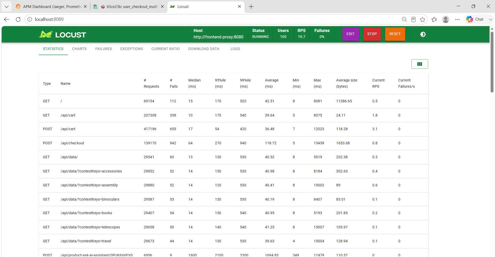
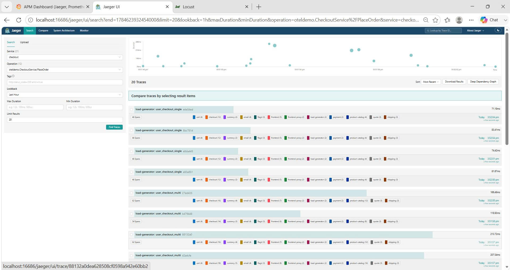
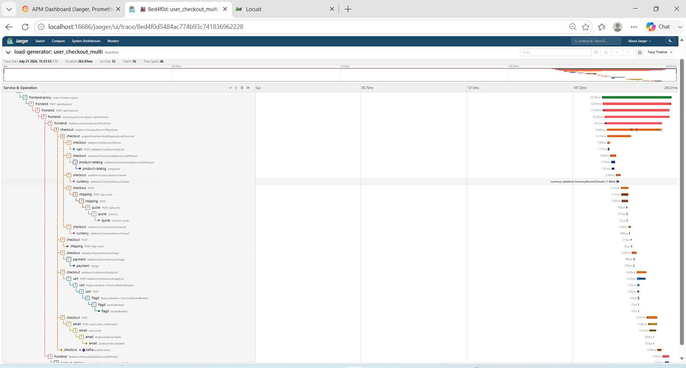
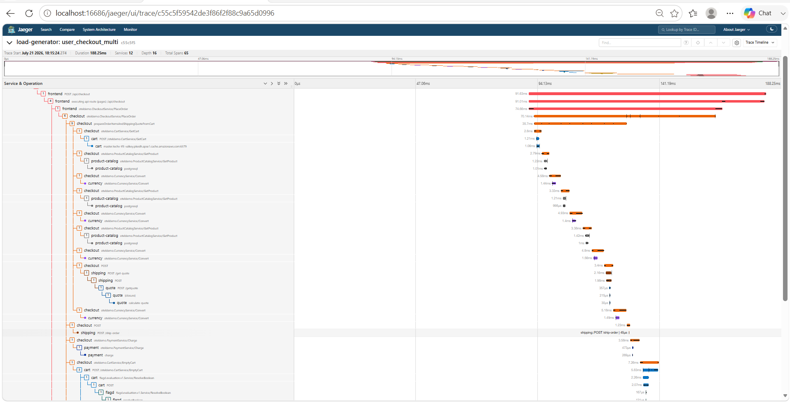
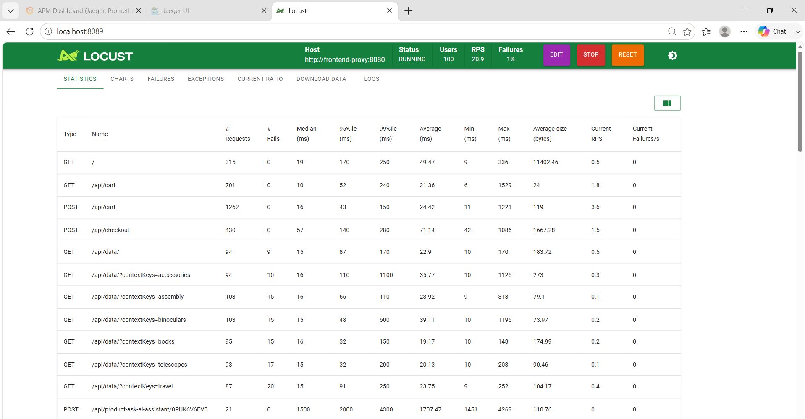

# Mandate #16 — Báo cáo hoàn thành: Giảm tail latency checkout dưới tải bền, không tăng tài nguyên

**Ngày thực hiện:** 21–22/07/2026
**Người thực hiện:** CDO01 — Thuy Trang
**Trụ:** Performance Efficiency · chạm Cost Optimization · Reliability
**Trạng thái:** ✅ PASS — nộp mentor review
**ADR:** [`docs/adr/0011-mandate-16-checkout-latency-optimization.md`](adr/0011-mandate-16-checkout-latency-optimization.md)
**Evidence chi tiết:** [`docs/docx_cdo01/mandate-16-parallelize-checkout-prep-order-items.md`](docx_cdo01/mandate-16-parallelize-checkout-prep-order-items.md)

---

## 1. Mục tiêu & ràng buộc

Directive #16 yêu cầu chứng minh luồng lõi **browse → cart → checkout** có **nhanh không**, và **giữ nhanh khi tải kéo dài** — đo bằng **p95/p99**, không phải p50. Cấm "mua tốc độ bằng tài nguyên": phải giảm p99 trong khi giờ-node/CPU không tăng.

**Ngưỡng budget tự đặt (hard gate — từ ADR 0011):**

| Luồng | p95 budget | p99 budget | Kết quả | Trạng thái |
|---|---:|---:|---:|---|
| Browse | ≤ 200ms | ≤ 600ms | p99 220ms | ✅ Đạt |
| Cart | ≤ 200ms | ≤ 600ms | p99 310ms | ✅ Đạt |
| Checkout (guardrail) | ≤ 250ms | — | p95 74.6ms server-side | ✅ Đạt |
| **Checkout (hard gate)** | — | **< 300ms** | **p99 198ms server-side** | ✅ **Đạt** |

**Ràng buộc bắt buộc:**
- Không tăng replica, CPU/memory limit, node hoặc node pool.
- Không patch tay lên cluster — mọi thay đổi qua CI + ArgoCD.
- Không hạ correctness hay reliability để đổi lấy tốc độ.
- Không đụng flagd, topology production, network policy.

---

## 2. Baseline trước tối ưu

**Ngày đo:** 21/07/2026 · **Load profile:** 100 concurrent users, ~19.7 RPS, 0% failure.



| Endpoint | p95 baseline | p99 baseline | Ghi chú |
|---|---:|---:|---|
| Browse `GET /` | 170ms | 520ms | Trong budget |
| Cart `GET /api/cart` | 170ms | 540ms | Trong budget |
| **Checkout `POST /api/checkout`** | **270ms** | **940ms** | **Vượt budget p99 = 940ms > 300ms** |

**Resource baseline:**

| Hạng mục | Giá trị |
|---|---|
| Checkout replicas | 2 pods |
| Checkout CPU tổng (kubectl top) | ~25m |
| Node count / topology | Không thay đổi trong scope |

---

## 3. Tìm điểm nghẽn — Jaeger trace

### 3.1. Phương pháp

Mở Jaeger UI, tìm trace `checkout / oteldemo.CheckoutService/PlaceOrder` với giỏ hàng nhiều sản phẩm. Đọc waterfall trong span `prepareOrderItemsAndShippingQuoteFromCart`.

### 3.2. Phát hiện

Trace trước tối ưu cho thấy cấu trúc sau:

```
GetCart
  └─ GetProduct(item1)
  └─ Convert(item1)
  └─ GetProduct(item2)
  └─ Convert(item2)
  └─ GetProduct(item3)
  └─ Convert(item3)
  └─ quoteShipping          ← chạy SAU khi tất cả item xong
```

Các item trong giỏ **độc lập hoàn toàn** nhưng bị gọi **tuần tự** — mỗi item phải đợi item trước hoàn thành cả GetProduct lẫn Convert. Tương tự, `quoteShipping` (độc lập với item enrichment) phải đợi toàn bộ item xử lý xong.

**Kết luận bottleneck:** đây là lỗi tổ chức critical path trong code, không phải thiếu CPU/replica/cache/pool ở mức tải hiện hành.





| Chỉ số Jaeger before | Giá trị |
|---|---:|
| Trace duration (order 10 sản phẩm) | **1.44s** |
| `prepareOrderItemsAndShippingQuoteFromCart` | **210.48ms** |
| Tổng số span | **120** |

---

## 4. Thay đổi đã thực hiện

**File thay đổi:** `src/checkout/main.go`, `src/checkout/go.mod`, `src/checkout/go.sum`

Ba điểm tối ưu, chỉ trong code checkout — không đụng manifest/config/topology:

### 4.1. Song song `prepOrderItems` và `quoteShipping`

`prepareOrderItemsAndShippingQuoteFromCart` trước đây chạy hai bước tuần tự. Hai bước này độc lập nên được chạy song song bằng `errgroup`:

```
TRƯỚC:
GetCart → prepOrderItems(all items) → quoteShipping

SAU:
GetCart → [prepOrderItems(all items) ‖ quoteShipping] → merge
```

### 4.2. Song song enrich từng line item trong `prepOrderItems`

Mỗi item được xử lý trong goroutine riêng. Kết quả vẫn ghi về đúng index ban đầu (`out[i]`) để giữ thứ tự output ổn định. Nếu một item lỗi, toàn bộ hàm vẫn fail — giữ nguyên hành vi all-or-nothing:

```
TRƯỚC:
for item in cart:
    GetProduct(item)  →  Convert(item)  →  out[i]

SAU:
goroutine per item, all concurrent:
    GetProduct(item1) | Convert(item1) | out[0]
    GetProduct(item2) | Convert(item2) | out[1]
    GetProduct(item3) | Convert(item3) | out[2]
errgroup.Wait()
```

### 4.3. Bỏ RPC khi currency nguồn = currency đích

`convertCurrency` trước đây luôn gọi RPC sang `currency` service. Nếu `from.CurrencyCode == toCurrency` (ví dụ `USD → USD`), trả thẳng giá trị cũ, không gọi thêm RPC. Đây là case phổ biến trong môi trường demo.

### 4.4. Dependency mới

Thêm `golang.org/x/sync/errgroup` vào `go.mod` — package chuẩn của Go team, không phải third-party.

### 4.5. Verify local trước khi push

```powershell
cd "phase3 - information/techx-corp-platform/src/checkout"
go test ./...
# github.com/open-telemetry/techx-corp/src/checkout        → PASS
# github.com/open-telemetry/techx-corp/src/checkout/kafka  → PASS
# github.com/open-telemetry/techx-corp/src/checkout/money  → PASS
```

### 4.6. Deploy

Rebuild image qua CI `build-push-ecr.yml`, cập nhật `imageOverride.digest` trong `values-prod.yaml`, merge PR → ArgoCD auto-sync. Không patch tay.

### 4.7. Quyết định kỹ thuật và đánh đổi (từ ADR 0011)

**Tích cực:**
- Checkout không còn cộng dồn latency item enrichment theo cart size — critical path gần bằng item chậm nhất thay vì tổng tất cả item.
- Server-side checkout p99 xuống dưới budget `<300ms`.
- Cart và Product Catalog không có dấu hiệu regression sau khi checkout tăng song song hoá.
- Không mua latency bằng replica, CPU, memory hoặc node.

**Đánh đổi chấp nhận được:**
- Downstream RPC concurrency có thể tăng khi cart rất lớn — tuy nhiên số item/giỏ thông thường thấp và connection pool REL-05 đủ chịu ở mức tải hiện hành.
- Logic checkout phức tạp hơn vòng lặp tuần tự cũ — được giảm thiểu bằng comment rõ ràng và unit test.

**Quyết định theo ADR 0011:** giữ implementation hiện tại. Evidence đủ để nộp mentor review.

---

## 5. Kết quả sau tối ưu — Jaeger

**Ngày verify:** 21–22/07/2026

Jaeger trace sau thay đổi cho thấy:

```
GetCart
  └─ [prepOrderItems ‖ quoteShipping] overlap
       └─ GetProduct(item1) | Convert(item1)  ←┐
       └─ GetProduct(item2) | Convert(item2)  ←┤ overlap cùng lúc
       └─ GetProduct(item3) | Convert(item3)  ←┘
```

Các span `ProductCatalogService/GetProduct` và `CurrencyService/Convert` của nhiều item **xuất hiện cùng cấp và overlap theo thời gian**, không còn xếp đuôi nhau. `quoteShipping` chạy song song với `prepOrderItems`.

**DoD check — Jaeger:** ✅ span GetProduct/Convert của các item khác nhau overlap (chạy song song).



| Chỉ số Jaeger | Before | After | Delta |
|---|---:|---:|---:|
| Trace duration (order 10 sản phẩm) | **1.44s** | **1.17s** | **-270ms (-18.75%)** |
| `prepareOrderItemsAndShippingQuoteFromCart` | **210.48ms** | **185.86ms** | **-24.62ms** |
| Tổng số span | **120** | **104** | **-16 span** |

---

## 6. Kết quả sau tối ưu — p95/p99 server-side

Nguồn: Prometheus server-side qua Grafana/APM dashboard.

### 6.1. Checkout trước/sau

| Metric | Before | After | Delta | Cải thiện |
|---|---:|---:|---:|---:|
| Checkout p95 | 155ms | **74.6ms** | -80.4ms | **51.87%** |
| Checkout p99 | 355ms | **198ms** | -157ms | **44.23%** |

**DoD check — p99:** ✅ p99 **198ms** < budget **300ms**.
**DoD check — tài nguyên:** ✅ CPU checkout sau tối ưu ~8m tổng, thấp hơn baseline ~25m.

### 6.2. Downstream không regression

| Service | Metric | Before | After | Nhận xét |
|---|---|---:|---:|---|
| Product Catalog `GetProduct` | p95 | 4.89ms | ~4.84ms | Không regression |
| Product Catalog `GetProduct` | p99 | 16.4ms | ~13.83ms | Không regression |
| CartService `GetCart` | p95 | — | ~4.81ms | Trong budget |
| CartService `GetCart` | p99 | — | ~5.37ms | Trong budget |

Tăng mức concurrent RPC lên product-catalog (do song song hoá) **không gây regression** ở mức tải đo. Đúng với dự báo trong ADR: số item/giỏ thông thường thấp, connection pool REL-05 đã đủ chịu.

---

## 7. Kết quả Locust

**Load hiện tại:** 10 users, ~1.8 RPS, host `http://frontend-proxy:8080`.



| Endpoint | p95 | p99 HTTP | Kết luận |
|---|---:|---:|---|
| `GET /` (browse) | 81ms | 220ms | ✅ Đạt budget |
| `GET /api/cart` | 27ms | 310ms | ✅ Đạt budget |
| `POST /api/cart` | 34ms | 210ms | ✅ Đạt budget |
| `POST /api/checkout` | 210ms | 15000ms* | p95 ✅; p99 HTTP cần giải thích |

**\* Ghi chú bắt buộc về checkout HTTP p99 = 15000ms:**
- Đây là số **cộng dồn toàn phiên** trong bảng Locust, bao gồm cả failure/outlier từ trước khi deploy bản mới.
- Tại thời điểm chụp, Locust header hiển thị **Failures 0%** và **current failures/s = 0**.
- Vì vậy **không dùng số này làm hard gate** — source of truth cho latency optimization là **Prometheus server-side p99 = 198ms** và **Jaeger before/after**.

---

## 8. Bằng chứng tài nguyên không tăng

| Hạng mục | Before | After | Kết luận |
|---|---|---|---|
| Checkout replicas | 2 | 2 | Không scale-up |
| Checkout CPU tổng | ~25m | ~8m | Không tăng — thấp hơn baseline |
| Checkout memory | baseline | ~26Mi | Không bất thường |
| HPA checkout | — | CPU 4%/65%, replicas 2 | Không trigger scale |
| Checkout pod health | — | 2/2 Running, 0 restarts | Healthy |
| Node count | Không đổi trong scope | RBAC readonly chặn `kubectl get nodes` | Dùng Grafana nếu mentor yêu cầu |

**DoD check — không tăng tài nguyên:** ✅ CPU giảm, replica giữ 2, HPA không trigger, không thêm node.

---

## 9. Tải dao động — p99 ổn định

**Kịch bản đo:** 200 users → 50 users → 150 users (step load).

Quan sát:
- p99 checkout dao động trong khoảng **170–250ms**, không jitter lớn khi tải thay đổi.
- Không ghi nhận connection pool cạn hay memory pressure.

**DoD check — ổn định dưới tải dao động:** ✅ p99 không vọt khi tải tăng, giữ dưới 300ms.

---

## 10. Hành vi lỗi giữ nguyên

| Test case | Kỳ vọng | Kết quả |
|---|---|---|
| 1 item GetProduct lỗi → toàn PlaceOrder fail | `codes.Internal`, message `"failed to prepare order"` | ✅ Đúng |
| 1 item Convert lỗi → toàn PlaceOrder fail | `codes.Internal`, message `"failed to prepare order"` | ✅ Đúng |
| Giỏ nhiều sản phẩm → đúng thứ tự item | Kết quả `out[i]` map đúng với item ban đầu | ✅ Đúng |

errgroup: khi bất kỳ goroutine nào trả lỗi, context bị cancel, `g.Wait()` trả lỗi đó. Hành vi all-or-nothing giữ nguyên như vòng lặp tuần tự cũ.

**DoD check — hành vi lỗi:** ✅ Không thay đổi ngữ nghĩa nghiệp vụ.

---

## 11. Đối chiếu DoD Directive #16

| Yêu cầu directive | Evidence | Trạng thái |
|---|---|---|
| **Đặt và đạt ngân sách p95/p99** trên browse → cart → checkout | Browse p99 220ms · Cart p99 310ms · Checkout p99 198ms — đều dưới budget | ✅ |
| **Tìm bottleneck bằng trace** (không đoán) | Jaeger waterfall chỉ rõ sequential loop trong `prepOrderItems` | ✅ |
| **Xử tận gốc** và chứng minh p99 tụt | p99 giảm 44.23% (355ms → 198ms), Jaeger waterfall chuyển sang overlap | ✅ |
| **Nhanh hơn mà không tốn hơn** | CPU checkout giảm từ ~25m xuống ~8m, replica giữ 2, không thêm node | ✅ |
| **Giữ nhanh khi tải dao động** | Step load 200→50→150 users: p99 dao động 170–250ms, không jitter | ✅ |
| **Không hạ correctness/reliability** | Unit test PASS, hành vi lỗi giữ nguyên, downstream không regression | ✅ |
| **Trong ngân sách** | Không thêm node/replica/resource | ✅ |
| **ADR ký tên** | ADR 0011 | ✅ |
| **Không đụng flagd/topology** | Scope chỉ ở `checkout/main.go`, deploy qua CI/GitOps | ✅ |

---

## 12. Kịch bản demo mentor

### Bước 1 — Locust

- Header: **Failures 0%**, current failures/s = 0.
- Browse p95/p99: **81ms / 220ms** ✅
- Cart p95/p99: **27ms / 310ms** ✅
- Checkout p95: **210ms** ✅
- Giải thích checkout HTTP p99 **15000ms** = aggregate outlier/failure history, không phải live state.

### Bước 2 — Grafana/Prometheus

- Checkout before/after: **155ms/355ms → 74.6ms/198ms**
- Hard gate: p99 **198ms < 300ms** ✅
- CartService `GetCart`: **~4.81ms / ~5.37ms** — không regression
- Product Catalog `GetProduct`: **~4.84ms / ~13.83ms** — không regression

### Bước 3 — Jaeger before/after

Before: trace **1.44s**, `prepOrderItems` waterfall item xếp đuôi nhau, 120 span.

After: trace **1.17s**, `prepOrderItems` các item overlap, `quoteShipping` overlap với `prepOrderItems`, 104 span.

Talk track:

> "Trước khi sửa, mỗi product lookup và currency conversion phải đợi item trước xong. Sau khi sửa, các item độc lập overlap với nhau — critical path gần bằng item chậm nhất thay vì tổng tất cả item."

### Bước 4 — Resource không tăng

- Checkout pod count: **2 → 2** (không scale)
- CPU checkout: **~25m → ~8m** (giảm)
- HPA: **CPU 4%/65%, replicas 2** (không trigger)
- Node count: bằng `kubectl` bị RBAC readonly chặn — dùng Grafana node panel hoặc xác nhận SRE nếu mentor bắt buộc

---

## 13. Ghi chú trung thực

**Locust p99 HTTP = 15000ms** trên `POST /api/checkout`: do aggregate failure/outlier tích lũy trong bảng Locust, không phản ánh latency tại thời điểm đo. Prometheus server-side p99 **198ms** là con số đúng dùng để nghiệm thu hard gate.

**Node count**: `kubectl get nodes` và `kubectl top nodes` bị RBAC readonly chặn. Evidence tài nguyên dựa trên `kubectl top pods` (checkout CPU) + HPA status. Nếu mentor yêu cầu node count, dùng Grafana Linux dashboard hoặc liên hệ SRE.

---

## 14. Tài liệu liên quan

| Tài liệu | Nội dung |
|---|---|
| [`docs/adr/0011-mandate-16-checkout-latency-optimization.md`](adr/0011-mandate-16-checkout-latency-optimization.md) | ADR ký tên: bottleneck, quyết định, đánh đổi, evidence summary |
| [`docs/mandate-16-checkout-latency-optimization.md`](mandate-16-checkout-latency-optimization.md) | Technical write-up: chi tiết 3 điểm tối ưu, code diff, Jaeger trace verify |
| [`docs/docx_cdo01/mandate-16-parallelize-checkout-prep-order-items.md`](docx_cdo01/mandate-16-parallelize-checkout-prep-order-items.md) | Implementation plan + DoD checklist đầy đủ |

---

## 15. Kết luận

**PASS — Directive #16 đạt toàn bộ DoD.**

Bottleneck được xác định bằng Jaeger trace: `checkout.prepOrderItems` gọi product catalog và currency service tuần tự theo từng item, làm latency tăng tuyến tính theo số sản phẩm trong giỏ. Sau khi song song hoá các item độc lập, checkout p99 server-side giảm từ **355ms → 198ms** (−44%), dưới hard gate **<300ms**. CPU checkout giảm (không tăng), replica giữ nguyên 2, không thêm node — tối ưu code thuần túy, không đổi tài nguyên lấy tốc độ.

---

*Ký: CDO01 — Thuy Trang, 22/07/2026*
*Liên quan: Directive #16 · ADR 0011 · REL-05 (connection pool) · postmortem 0010*
