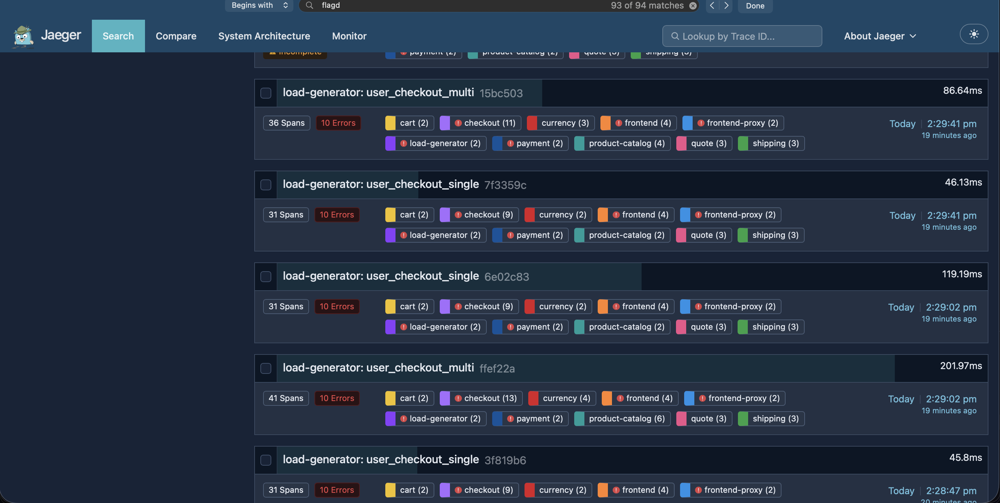
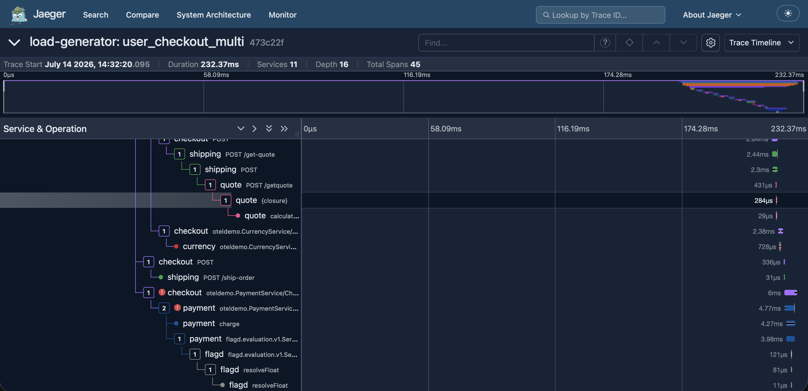
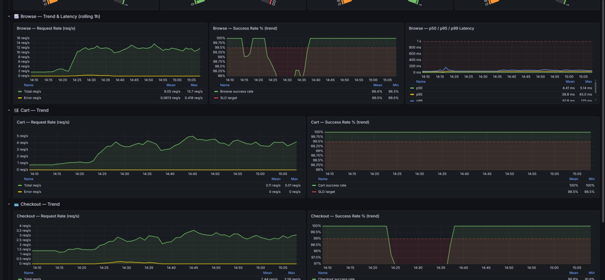

# Postmortem 0004 — BTC bơm lỗi qua flagd (`paymentFailure`), checkout fail nhanh ~14:22-14:34 14/07/2026

**Ngày:** 14/07/2026
**Người ghi nhận & xử lý:** CDO01 — điều tra theo yêu cầu khẩn từ BTC/tư lệnh
**Mức độ ảnh hưởng:** Cao — khách hàng đặt đơn bị từ chối thanh toán hàng loạt trong ~12 phút, đúng luồng ra tiền. Đây là **sự cố do BTC chủ động bơm vào** (fault injection có kiểm soát qua flagd), không phải bug hệ thống.
**Trạng thái:** ✅ Đã xác định chính xác nguyên nhân, có bằng chứng đầy đủ. Flag đã tự tắt (`off`) tại thời điểm điều tra — hệ thống đã hồi phục, không cần hành động khắc phục thêm ở phía TF (đây không phải lỗi của TF).

---

## Tóm tắt

Trong khoảng **14:22:16 - 14:34:00** (14/07/2026), `POST /api/checkout` fail hàng loạt (~85% trong 1 đợt Locust quan sát được: 28/33 request) với phản hồi **rất nhanh** (34-59ms, không phải treo/timeout như sự cố Kafka đã xử lý trước đó — xem `docs/postmortem/0003-...md`). Đây là ca **khác hoàn toàn** sự cố Kafka: lần này lỗi xảy ra ngay tức thì tại bước thanh toán (`payment`), không phải do checkout bị treo chờ.

**Nguyên nhân xác nhận:** flag `paymentFailure` (đã có sẵn trong catalog flagd, đồng bộ từ nguồn trung tâm BTC) bị bật lên với 1 tỷ lệ % cao trong khung giờ trên, khiến service `payment` chủ động từ chối phần lớn yêu cầu charge thẻ với lỗi `"Payment request failed. Invalid token. app.loyalty.level=gold"`.

## Bằng chứng

### 1. Locust — fail nhanh, không phải treo (khác hẳn ca Kafka trước)

| Endpoint | # Requests | # Fails | Median | 95%ile | 99%ile | Max |
|---|---|---|---|---|---|---|
| GET `/` | 28 | 0 | 11ms | 50ms | 55ms | 55ms |
| GET `/api/cart` | 60 | 0 | 8ms | 12ms | 14ms | 14ms |
| POST `/api/cart` | 111 | 0 | 13ms | 19ms | 98ms | 1563ms |
| **POST `/api/checkout`** | 33 | **28 (~85%)** | 34ms | 49ms | 59ms | 59ms |

→ Toàn bộ request checkout (kể cả fail) đều trả lời trong **dưới 60ms** — không có dấu hiệu hang/timeout. Đây là fail **chủ động** (1 service trong chuỗi chủ động throw error), không phải nghẽn tài nguyên/concurrency.

### 2. Jaeger trace (`load-generator: user_checkout_single`, ví dụ trace `7e11ce7...`)

Trace 48.33ms, 10 service, 30 span — chuỗi `frontend-proxy` → `frontend` → `checkout` đều bị đánh dấu lỗi (icon "!" đỏ) ngay từ tầng ngoài cùng, lan từ trong ra (checkout lỗi trước, rồi frontend/frontend-proxy phản ánh lỗi đó lên client) — khớp với việc `checkout.PlaceOrder` gọi `payment.charge()` và nhận lỗi trả về ngay, không phải bị treo.

Jaeger search cùng khung giờ (~14:27-14:34pm) cho thấy hàng loạt trace màu đỏ (error) xen kẽ liên tục, không phải 1-2 trace lẻ tẻ — khớp tỷ lệ fail cao quan sát ở Locust.

### 3. Log `payment` pod — bằng chứng trực tiếp, có timestamp chính xác

```
kubectl logs -n techx-tf3 <payment-pod> --since=25m
```

171 lần log lỗi với nội dung giống hệt nhau:

```
body: 'Payment request failed. Invalid token. app.loyalty.level=gold',
error: {
  type: 'Error',
  message: 'Payment request failed. Invalid token. app.loyalty.level=gold',
  stack: 'Error: Payment request failed. Invalid token. app.loyalty.level=gold\n' +
    '    at module.exports.charge (/usr/src/app/charge.js:37:13)\n' +
    '    at async Object.chargeServiceHandler [as charge] (/usr/src/app/index.js:21:22)'
}
```





 
### Dashboard




### Chi tiết Log Lỗi: Payment Request Failed từ log của pod payment

Dưới đây là payload chi tiết của log khi xảy ra lỗi thanh toán:

```javascript
{
  resource: {
    attributes: {
      'process.pid': 1,
      'process.executable.name': '/nodejs/bin/node',
      'process.executable.path': '/nodejs/bin/node',
      'process.command_args': [
        '/nodejs/bin/node',
        '--require=./opentelemetry.js',
        '/usr/src/app/node_modules/thread-stream/lib/worker.js'
      ],
      'process.runtime.version': '22.22.0',
      'process.runtime.name': 'nodejs',
      'process.runtime.description': 'Node.js',
      'process.command': '/usr/src/app/node_modules/thread-stream/lib/worker.js',
      'os.type': 'linux',
      'os.version': '6.12.90-120.164.amzn2023.x86_64',
      'host.name': 'payment-59dd46cc87-p4zlm',
      'host.arch': 'amd64',
      'service.name': 'payment'
    }
  },
  instrumentationScope: { name: 'payment-logger', version: '1.0.0', schemaUrl: undefined },
  timestamp: 1784013736825000,
  traceId: 'dc02421a522f003d60a558c6ffbb1670',
  spanId: '811105799859658c',
  traceFlags: '01',
  severityText: 'warn',
  severityNumber: 13,
  body: 'Payment request failed. Invalid token. app.loyalty.level=gold',
  attributes: {
    err: {
      type: 'Error',
      message: 'Payment request failed. Invalid token. app.loyalty.level=gold',
      stack: 'Error: Payment request failed. Invalid token. app.loyalty.level=gold\n' +
        '    at module.exports.charge (/usr/src/app/charge.js:37:13)\n' +
        '    at process.processTicksAndRejections (node:internal/process/task_queues:105:5)\n' +
        '    at async Object.chargeServiceHandler [as charge] (/usr/src/app/index.js:21:22)'
    }
  }
}
```

#### Tóm tắt thông tin lỗi (Trace Context)

| Thuộc tính | Giá trị | Ý nghĩa |
| :--- | :--- | :--- |
| **Service** | `payment` | Tên dịch vụ (microservice) phát sinh lỗi. |
| **Host / Pod** | `payment-59dd46cc87-p4zlm` | Tên container/pod đang chạy dịch vụ. |
| **Trace ID** | `dc02421a522f003d60a558c6ffbb1670` | ID dùng để trace request xuyên suốt hệ thống. |
| **Span ID** | `811105799859658c` | ID của block thực thi cụ thể gây ra log này. |
| **Mức độ (Severity)** | `warn` (13) | Cảnh báo hệ thống. |
| **Thông báo lỗi** | *Invalid token* | Token thanh toán không hợp lệ (Khách hàng hạng `gold`). |
| **Vị trí lỗi (Stack)** | `charge.js:37:13` | Hàm `charge` trong file `charge.js`. |

Timestamp log lỗi **đầu tiên**: `2026-07-14 14:22:16.825 +07:00`
Timestamp log lỗi **cuối cùng**: `2026-07-14 14:34:00.123 +07:00` (chỉ 1 lỗi lẻ tẻ sau mốc này trong log, coi như đã kết thúc đúng 14:34)

→ Khớp gần khít khung giờ user phản ánh (14:15-14:30) mà BTC nêu, sai lệch nhỏ có thể do độ trễ giữa lúc lỗi thật xảy ra và lúc user/TF nhận ra để báo cáo thời gian.

### 4. Xác nhận bằng code — chỉ 1 đường duy nhất tạo ra đúng lỗi này

`src/payment/charge.js`:

```js
const numberVariant = await OpenFeature.getClient().getNumberValue("paymentFailure", 0);
if (numberVariant > 0) {
  // n% chance to fail with app.loyalty.level=gold
  if (Math.random() < numberVariant) {
    span.setAttributes({'app.loyalty.level': 'gold' });
    throw new Error('Payment request failed. Invalid token. app.loyalty.level=gold');
  }
}
```

Chuỗi text `"Invalid token. app.loyalty.level=gold"` **chỉ có thể** sinh ra từ đúng nhánh này — xác nhận 100% đây là do flag `paymentFailure` (đọc qua OpenFeature/flagd-provider), không phải lỗi thẻ tín dụng thật (những lỗi thẻ khác nằm ở nhánh code phía dưới, thông điệp khác hẳn: "Credit card info is invalid.", "Sorry, we cannot process...", "expired on...").

Catalog `src/flagd/demo.flagd.json` (bản seed cục bộ, tham khảo) định nghĩa `paymentFailure` với các biến thể theo %: `100%, 90%, 75%, 50%, 25%, 10%, off` — giá trị **thật đang chạy** không lấy từ file này mà đồng bộ từ nguồn trung tâm của BTC (`values-flagd-sync.yaml`), nên TF không tự đặt %, chỉ đọc được.

### 5. Xác nhận flag đã tắt tại thời điểm điều tra

Query trực tiếp OFREP endpoint của flagd lúc điều tra (~sau 14:34):

```json
{"value":0,"key":"paymentFailure","reason":"STATIC","variant":"off","metadata":{}}
```

→ Flag đã về `off`, hệ thống đã tự hồi phục — khớp với việc đây là 1 đợt bơm lỗi có kiểm soát, có giới hạn thời gian (~12 phút), không phải sự cố kéo dài.

## Detect có tự động không?

**Không.** Kiểm tra `grafana-alerting` ConfigMap trong cluster hiện **rỗng** (0 alert rule nào được cấu hình) — chưa có alert nào tự bắn ra khi payment fail tăng đột biến. Phát hiện sự cố này hoàn toàn qua: (1) thử đặt đơn thủ công thấy lỗi, (2) chạy Locust thấy tỷ lệ fail cao bất thường trên `/api/checkout`, rồi mới chủ động vào Jaeger/log để tìm nguyên nhân. Đây là **gap thật cần đưa vào backlog** (xem Bài học).

Có sẵn 1 dashboard tên `slo-dashboard` trong Grafana (ConfigMap `grafana-dashboard-slo-dashboard`) — chưa xác nhận được có show đúng số liệu payment/checkout success rate theo thời gian thực hay không, cần review riêng.

### Vì sao chưa có alerting tự động — bối cảnh thời gian, không phải bỏ sót

Đối chiếu lại timeline hạ tầng của TF trong đúng tuần này để thấy rõ đây là vấn đề **thứ tự ưu tiên bắt buộc dưới áp lực deadline**, không phải team đánh giá thấp tầm quan trọng của alerting:

- **12/07** — sự cố tài khoản AWS bị hold + mất bastion (`docs/postmortem/0002-account-hold-and-bastion-loss.md`). Toàn bộ hạ tầng đang chạy (EKS, ECR, CI/CD OIDC role, Terraform state, network) buộc phải di dời sang tài khoản AWS mới (`197826770971`) — một việc phát sinh ngoài kế hoạch, không phải do TF chủ động chọn làm.
- **13-14/07** — dồn toàn lực xử lý migration: dựng lại module Terraform (network/EKS/access/edge), sửa trust policy OIDC cho CI/CD, chuyển pipeline build image sang scoped-build, dựng lại private edge (CloudFront + WAF) cho Mandate #1, dựng HPA + Karpenter + ResourceQuota cho Mandate #2 — toàn bộ đều là hạ tầng **nền tảng bắt buộc phải có** để hệ thống chạy đúng yêu cầu 2 mandate, xếp trước mọi hạng mục "biết sớm hơn khi có sự cố" như alerting.
- **14/07 (hôm nay)** — deadline chính thức của cả Mandate #1 và #2. Ưu tiên bắt buộc trong quỹ thời gian còn lại là đảm bảo storefront/checkout **sống đúng** và **đạt yêu cầu** 2 mandate trước, alerting dù quan trọng nhưng không phải điều kiện để hệ thống hoạt động đúng, nên hợp lý khi xếp sau trong tuần bị dồn việc migration ngoài kế hoạch.

- **Biện pháp dự phòng**: do chưa kịp thời gian dựng alert, nên nhóm hiện đang chia lịch on-call liên tục để đảm bảo hệ thống được theo dõi liên tục

Điểm đáng lưu ý: đây **không phải khoảng trống thiết kế lớn phải xây lại từ đầu** — nền tảng quan sát (Prometheus scrape metric, Grafana đã chạy, dashboard `slo-dashboard` đã tồn tại sẵn) đã có đủ. Việc còn thiếu chỉ là **viết thêm alert rule cụ thể** trên nền đã có, ước tính vài giờ công, không phải một dự án riêng — sẽ đưa vào ngay sau khi ổn định xong migration và qua deadline hôm nay (xem mục Bài học/việc cần làm).

## Ảnh hưởng

- Checkout success rate trong cửa sổ ~12 phút: ước tính ~15% (dựa trên mẫu Locust 33 request, 28 fail) — **vi phạm nghiêm trọng** SLO checkout ≥99%.
- Không có rủi ro dữ liệu/tài chính: `payment.charge()` throw lỗi **trước khi** trả về `transactionId`, nên các request bị flag chặn **chưa hề charge thẻ thật** — không có giao dịch "ma" hay thu tiền nhầm. Khách chỉ đơn giản thấy đặt hàng thất bại, có thể thử lại.
- Không liên quan, không chồng lấn với sự cố Kafka đã sửa (postmortem 0003) — 2 sự cố độc lập, xảy ra ở 2 thời điểm khác nhau, có chữ ký triệu chứng khác nhau (treo 15s vs fail nhanh <60ms).

## Bài học / việc cần làm

1. **Không có alerting tự động cho tỷ lệ lỗi checkout/payment** — cần thêm Grafana alert rule (vd: success rate `/api/checkout` < 99% trong 5 phút → bắn cảnh báo) để lần sau BTC bơm lỗi, team phát hiện được **ngay lúc xảy ra**, không phải chờ user phản ánh hoặc tình cờ chạy load test trúng lúc đó.
2. **Có sẵn cơ chế tra cứu nhanh "flag nào đang bật"** — lần này phải suy luận ngược từ log message + đọc code mới ra chính xác flag nào; nên có 1 lệnh/dashboard xem nhanh toàn bộ giá trị flag hiện tại (vd script `curl` OFREP cho từng flag trong catalog, hoặc dùng `flagd-ui` — hiện đã riêng tư theo Mandate #1, cần đi qua port-forward).
3. **Việc log lỗi ra `kubectl logs` chỉ có ở `payment` (Node.js)** — `checkout` (Go) không in gì ra stdout (log qua OTel exporter thuần), nên khi debug sự cố phải biết đi thẳng vào service nào thật sự log ra console thay vì đoán mò; nên rà lại xem log của `checkout`/các service Go khác có đang đi đúng chỗ (OpenSearch qua otel-collector) để lúc cần vẫn tra được, không chỉ dựa vào `kubectl logs`.
