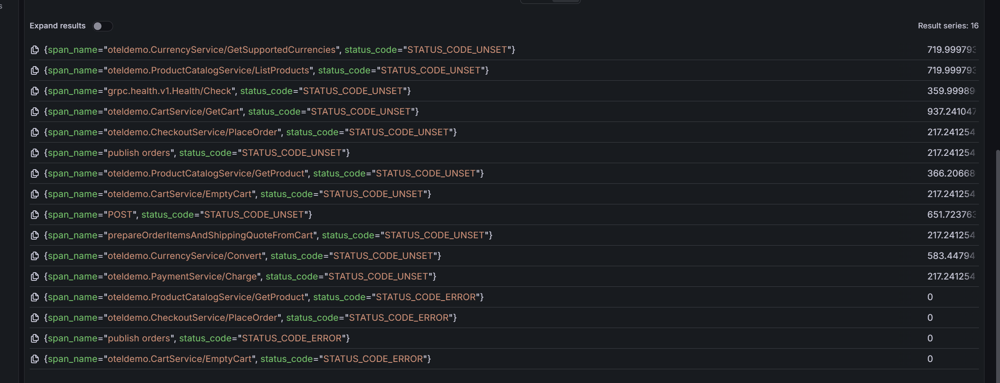
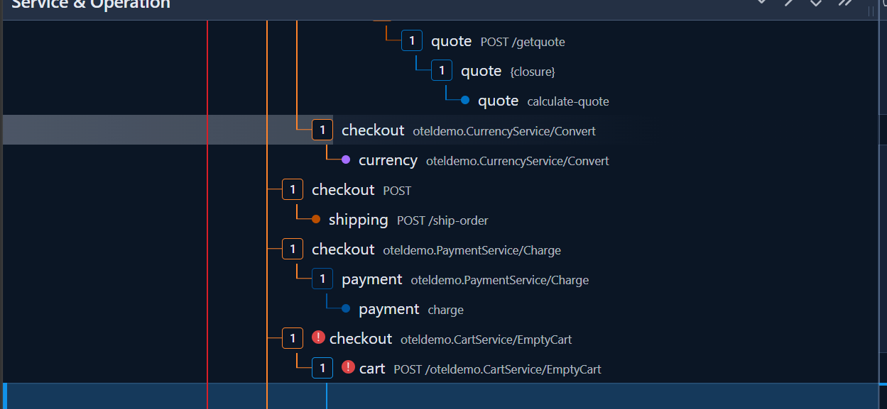

# Postmortem 0005 — BTC bơm lỗi qua flagd (`cartFailure`), "checkout success rate" tụt dưới SLO ~18:48-19:02 15/07/2026

**Ngày:** 15/07/2026
**Người ghi nhận & xử lý:** CDO02 — điều tra theo cảnh báo "checkout success rate dưới SLO"
**Mức độ ảnh hưởng:** **Thấp về nghiệp vụ, cao về chỉ số.** Panel *Checkout — Success Rate* trên SLO dashboard tụt dưới ngưỡng 99% trong ~14 phút, nhưng **không có đơn hàng nào thật sự thất bại** — khách vẫn đặt được hàng, thẻ vẫn charge, đơn vẫn ship. Đây là **sự cố do BTC chủ động bơm vào** (fault injection có kiểm soát qua flagd `cartFailure`), không phải bug hệ thống, và nhờ code checkout đã chủ động nuốt lỗi EmptyCart nên luồng ra tiền **không bị chặn**.
**Trạng thái:** ✅ Đã xác định chính xác nguyên nhân, có bằng chứng metric + log + code đầy đủ. Flag đã tự tắt (`off`) tại thời điểm điều tra — hệ thống đã hồi phục, không cần hành động khắc phục hậu quả ở phía TF (đây không phải lỗi của TF). BTC đã thông báo kết thúc flag.

---

## When — Khi nào

**18:48:38 → 19:02:44 (+07) 15/07/2026 (tương đương 11:48:38 → 12:02:44 UTC), kéo dài ~14 phút.**

- Log lỗi đầu tiên tại `cart`: `2026-07-15T11:48:38.508Z` (UTC).
- Log lỗi cuối tại `cart`: `2026-07-15T12:02:44.617Z` (UTC).
- Kiểm tra lúc điều tra (~12:08 UTC): 0 lỗi trong 5 phút gần nhất trên cả 2 pod `cart` → đã hồi phục.
- Query trực tiếp OFREP endpoint của flagd lúc điều tra:
  ```json
  {"value":false,"key":"cartFailure","reason":"STATIC","variant":"off","metadata":{}}
  ```
  → Flag đã về `off`. Toàn bộ 15 flag khác cũng `off`/0 (kể cả `paymentFailure`, `paymentUnreachable`, `kafkaQueueProblems`) — xác nhận đây là **1 đợt bơm lỗi có kiểm soát, giới hạn thời gian**, đúng một flag `cartFailure`.




Panel *Checkout — Request Rate (req/s)* cùng khung giờ — đường **error rate (đỏ)** nhô lên đúng cửa sổ, trong khi **request rate tổng vẫn ổn định** (không sập lưu lượng, chỉ là span bị đánh error).

## Where — Ở đâu

- **Service phát sinh lỗi:** `cart` — hàm `EmptyCartAsync()`, file `src/cart/src/cartstore/ValkeyCartStore.cs:194` → ném lỗi tại `ValkeyCartStore.cs:101`.
- **Điểm flag rẽ nhánh:** `src/cart/src/services/CartService.cs:83` — khi `cartFailure=true`, RPC `EmptyCart` bị route sang `_badCartStore` (cửa hàng "hỏng" cố tình throw). **Chỉ RPC `EmptyCart` bị ảnh hưởng**; `GetCart` và `AddItem` vẫn dùng store thật, chạy bình thường (log cùng thời điểm vẫn có `GetCartAsync`/`AddItemAsync` thành công).
- **Lan tới chỉ số:** `checkout` gọi `cart.EmptyCart` ở cuối `PlaceOrder` → client-span của lời gọi này bị đánh `STATUS_CODE_ERROR` → gộp vào metric `traces_span_metrics_calls_total{service_name="checkout"}` → kéo tụt panel *Checkout Success Rate*.
- **KHÔNG lan tới khách hàng:** `checkout/main.go:401` **cố tình bỏ qua** lỗi EmptyCart (`_ = cs.emptyUserCart(...)`), nên `PlaceOrder` vẫn trả về thành công.
- **Datastore thật (`valkey-cart`):** **không hề down** — pod `valkey-cart-5f94b79995-q4g4q` Running, **0 restart**, uptime 20h, log sạch suốt cửa sổ. Xác nhận lỗi là **giả lập qua flag**, không phải mất Valkey.
- **Pod cụ thể có log:** `cart-8bfd746fb-9l59x`.

## What — Chuyện gì đã xảy ra

Panel *Checkout — Success Rate* tụt dưới SLO 99%. Nhưng khi tách metric theo từng span, hoá ra **không đơn hàng nào fail** — toàn bộ error đến từ span `EmptyCart` mà checkout đã chủ động bỏ qua.

### Bằng chứng 1 — Prometheus: PlaceOrder 0 lỗi, chỉ EmptyCart lỗi

Query `sum by (span_name, status_code) (increase(traces_span_metrics_calls_total{service_name="checkout"}[30m]))` (cửa sổ 30 phút phủ sự cố):

| Span (thuộc service `checkout`) | STATUS_CODE_ERROR | Ý nghĩa |
|---|---:|---|
| `oteldemo.CheckoutService/PlaceOrder` | **0** | **Không đơn nào thất bại** |
| `oteldemo.CartService/EmptyCart` (client span) | **~1050** | Lỗi bị checkout nuốt (`_ =`) |
| `oteldemo.PaymentService/Charge` (client span) | 0 | Thanh toán không lỗi |
| `oteldemo.ProductCatalogService/GetProduct` | 0 | — |
| `publish orders` (Kafka) | 0 | Đơn vẫn phát ra Kafka |

Đối chiếu span thành công (`STATUS_CODE_UNSET`): `PlaceOrder` ~1532, `Charge` ~1532, `publish orders` ~1532 — **số đơn charge = số đơn ship = số đơn publish = số PlaceOrder thành công**, khớp nhau. `EmptyCart` thành công ~480 / lỗi ~1050 → phần lớn EmptyCart lỗi trong cửa sổ, nhưng **không kéo theo bất kỳ PlaceOrder nào lỗi**.

→ **Metric *Checkout Success Rate* trong dashboard đo "tỷ lệ span error trên TỔNG span do service checkout phát ra", không phải "tỷ lệ đơn đặt thành công".** Vì client-span `EmptyCart` cũng mang `service_name="checkout"`, error của nó làm tụt panel dù đơn hàng thật 100% thành công.


### Bằng chứng 2 — Jaeger trace: PlaceOrder xanh, chỉ child-span EmptyCart đỏ

Mở 1 trace `oteldemo.CheckoutService/PlaceOrder` trong cửa sổ sự cố: span cha `PlaceOrder` **OK (không lỗi)**, các child `GetCart` / `Charge` / `ShipOrder` / `publish orders` **OK**, **chỉ** child-span `oteldemo.CartService/EmptyCart` mang cờ lỗi (icon "!" đỏ) — nằm **sau** bước charge/ship, và không làm hỏng span cha. Tương phản trực tiếp với postmortem 0004 (payment): ở 0004 lỗi lan **từ trong ra** làm hỏng cả `PlaceOrder`; ở đây lỗi **cụt tại EmptyCart**, không lan lên.





Đơn vẫn thành công, chỉ bước xoá giỏ lỗi

### Bằng chứng 3 — Log `cart` pod: chữ ký lỗi Valkey giả

```
kubectl -n techx-tf3 logs cart-8bfd746fb-9l59x --since=60m --timestamps
```

~1946 dòng lỗi (≈ 970 lần EmptyCart fail) trong khung 11:48-12:02 UTC, nội dung:

```
Wasn't able to connect to redis
info: Grpc.AspNetCore.Server.ServerCallHandler[7]
  Error status code 'FailedPrecondition' with detail 'Can't access cart storage.
  System.ApplicationException: Wasn't able to connect to redis
     at cart.cartstore.ValkeyCartStore.EnsureRedisConnected() in /usr/src/app/src/cartstore/ValkeyCartStore.cs:line 101
     at cart.cartstore.ValkeyCartStore.EmptyCartAsync(String userId) in /usr/src/app/src/cartstore/ValkeyCartStore.cs:line 194' raised.
```

Ngay các dòng kế tiếp là `AddItemAsync`/`GetCartAsync` **thành công** cho cùng user → khẳng định chỉ `EmptyCart` bị flag đánh, các thao tác giỏ khác vẫn chạy trên Valkey thật.


### Ảnh hưởng

- **Đơn hàng:** 0 đơn thất bại (PlaceOrder error = 0). Khách **vẫn mua được hàng bình thường** trong toàn bộ cửa sổ.
- **Tài chính/dữ liệu:** Không rủi ro. Thẻ được charge đúng, đơn được ship, xác nhận gửi đi, sự kiện đơn phát ra Kafka đầy đủ.
- **Side-effect thật duy nhất:** Trong ~14 phút, **giỏ hàng không được xoá sau khi đặt đơn** (bước `EmptyCart` fail bị bỏ qua). Hệ quả: khách có thể thấy sản phẩm vừa mua **còn sót trong giỏ** → UX nhỏ, tự khỏi ở lần `EmptyCart` thành công kế tiếp hoặc khi khách tự sửa giỏ. Không ảnh hưởng tính đúng của đơn đã đặt.
- **Chỉ số/SLO:** Panel *Checkout Success Rate* và error-budget checkout bị tiêu hao **ảo** trong cửa sổ, do metric đếm cả error-span EmptyCart. Đây là điểm cần tinh chỉnh (xem How to fix mục 1).

## Why — Vì sao

**Nguyên nhân xác nhận:** flag `cartFailure` (có sẵn trong catalog flagd, đồng bộ từ nguồn trung tâm BTC) bị bật `on` trong khung giờ trên, khiến RPC `EmptyCart` của service `cart` chủ động ném lỗi.

`src/cart/src/services/CartService.cs` (EmptyCart):

```csharp
if (await _featureFlagHelper.GetBooleanValueAsync("cartFailure", false))
{
    await _badCartStore.EmptyCartAsync(request.UserId);   // store "hỏng" -> throw
}
else
{
    await _cartStore.EmptyCartAsync(request.UserId);      // Valkey thật
}
```

`src/cart/src/cartstore/ValkeyCartStore.cs:98-101`:

```csharp
_logger.LogError("Wasn't able to connect to redis");
...
throw new ApplicationException("Wasn't able to connect to redis");
```

Chuỗi `"Wasn't able to connect to redis"` phát ra từ `EmptyCartAsync` **chỉ có thể** đến từ nhánh flag này (Valkey thật khoẻ suốt, 0 restart) — xác nhận 100% là do flag `cartFailure`, không phải mất kết nối Valkey thật.

Catalog `src/flagd/demo.flagd.json` định nghĩa `cartFailure` (`"description": "Fail cart service"`, biến thể `on:true / off:false`). Giá trị **thật đang chạy** đồng bộ từ nguồn trung tâm BTC (`values-flagd-sync.yaml`), TF chỉ đọc được, không tự đặt.

**Vì sao đơn không fail:** `checkout/main.go:401` gọi `_ = cs.emptyUserCart(ctx, req.UserId)` — bỏ qua giá trị lỗi trả về (hàm `emptyUserCart` tại dòng 551-556 vẫn trả `error`, nhưng caller vứt đi). Xoá giỏ là bước "dọn dẹp sau đơn", không phải điều kiện để đơn thành công, nên fail ở đây không chặn `PlaceOrder`. Đây là hành vi **đúng** (resilience: không để một bước phụ làm hỏng đơn đã charge+ship).

## How to fix — Khắc phục & phòng ngừa

**Không có gì cần dọn dẹp hậu quả cho lần vừa rồi** — fault injection có chủ đích của BTC, flag đã `off`, hệ thống tự hồi phục, 0 đơn hỏng, không thiệt hại dữ liệu/tài chính. Giỏ sót (nếu có) tự khỏi. Việc cần làm là đóng các khoảng trống **phát hiện/đo lường** mà lần này để lộ:

1. **Metric *Checkout Success Rate* đang đo sai tầng — cần scope về đúng `PlaceOrder`.**
   Query hiện tại (`slo-dashboard.json`, panel *Checkout — Success Rate*):
   ```
   1 - sum(rate(traces_span_metrics_calls_total{service_name="checkout", status_code="STATUS_CODE_ERROR"}[..]))
       / sum(rate(traces_span_metrics_calls_total{service_name="checkout"}[..]))
   ```
   gộp **mọi span** service checkout phát ra (kể cả client-span `EmptyCart` mà nghiệp vụ đã cố tình nuốt). Hệ quả: một lỗi ở bước **không quyết định** đơn hàng vẫn làm tụt SLO và đốt error-budget **ảo**.
   **Sửa đúng (KHÔNG phải để giấu lỗi thật):** scope metric về đúng span quyết định đơn — `span_name="oteldemo.CheckoutService/PlaceOrder"` (và/hoặc server-span `POST /api/checkout` ở frontend). Khi đó SLO phản ánh **"khách có đặt được đơn không"** — đúng định nghĩa SLO checkout ≥99%. Lưu ý ranh giới: đây là **đo đúng bản chất**, khác hoàn toàn việc đổi 5xx→4xx để "làm đẹp số" (đã bác ở postmortem 0004 mục 4). Nếu sau này `PlaceOrder` thật sự fail (vd `paymentFailure`), metric mới **vẫn bắt được** vì span cha sẽ error.
   **Kèm theo:** giữ một panel phụ *"checkout downstream span errors by span_name"* để vẫn nhìn thấy các lỗi phụ (như EmptyCart) mà không nhầm chúng vào SLO đơn hàng.

2. **Thiếu alert phân biệt "span error phụ" vs "đơn fail thật".**
   Lần này phát hiện qua panel tụt + điều tra tay. Nên thêm 2 alert tách bạch: (a) `PlaceOrder` error-rate >1% trong 5' (đơn fail thật — nghiêm trọng), (b) tỷ lệ error client-span downstream (EmptyCart/…) tăng đột biến (tín hiệu có fault injection/hạ tầng, mức cảnh báo nhẹ). Dựa trên `grafana-alerting` đã có (nối tiếp việc dựng alert từ postmortem 0004 mục 1).

3. **(Cân nhắc) Log/observability của việc EmptyCart bị nuốt.**
   `checkout/main.go:401` nuốt lỗi **im lặng** (`_ =`), không log. Đúng về resilience nhưng khi điều tra thì "vô hình" ở tầng checkout — phải suy ngược từ span. Cân nhắc đổi thành log mức `Warn` (không đổi luồng): `if err := cs.emptyUserCart(...); err != nil { logger.Warn(...) }` để lần sau lỗi này để lại dấu vết rõ trong log checkout, dễ tra hơn. Thay đổi nhỏ, cần rebuild image checkout.

4. **Không có gì phải làm với `cartFailure` như một "bug".**
   Đây là cơ chế BTC bơm lỗi qua flagd — **tuyệt đối không gỡ/vô hiệu hoá việc cart đọc flag** (vi phạm luật là disqualify). Cách chống đỡ đúng đã **có sẵn** trong code (nuốt lỗi EmptyCart) và đã chứng minh hiệu quả: đơn hàng không bị chặn. Không cần thêm retry cho EmptyCart — vì `cartFailure` là flag boolean (fail liên tục khi bật, không xác suất từng call), retry trong 1 request không giúp; mà cũng không cần, do lỗi đã được nuốt an toàn.

---

### Phụ lục — lệnh điều tra đã dùng (tham chiếu)

```sh
export AWS_PROFILE=techx-new
# 1. Trạng thái pod luồng doanh thu (0 restart -> không phải crash)
kubectl -n techx-tf3 get pods -l 'opentelemetry.io/name in (checkout,payment,cart,valkey-cart)' -o wide
# 2. Đọc toàn bộ flag (read-only, KHÔNG gỡ flagd)
kubectl -n techx-tf3 run flagcheck --rm -i --restart=Never --image=curlimages/curl:8.11.1 --command -- \
  curl -s -X POST http://flagd:8016/ofrep/v1/evaluate/flags -H "Content-Type: application/json" -d '{"context":{}}'
# 3. Chữ ký lỗi ở cart
kubectl -n techx-tf3 logs cart-8bfd746fb-9l59x --since=60m --timestamps | grep "Wasn't able to connect to redis"
# 4. Tách span checkout theo status (Prometheus) -> PlaceOrder error=0, EmptyCart error>0
#    query: sum by (span_name,status_code)(increase(traces_span_metrics_calls_total{service_name="checkout"}[30m]))
```
