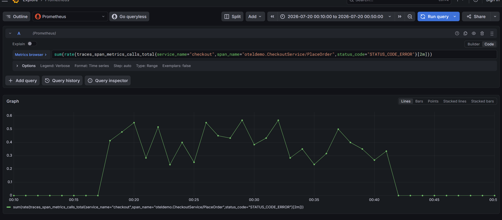
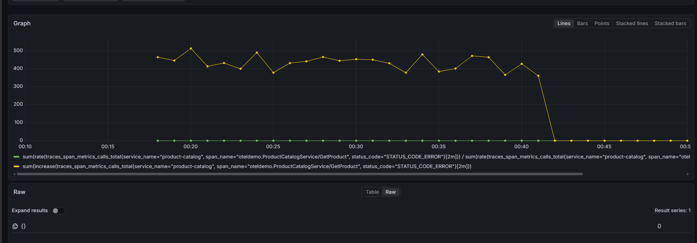
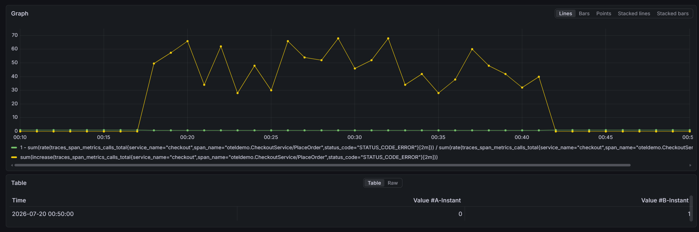
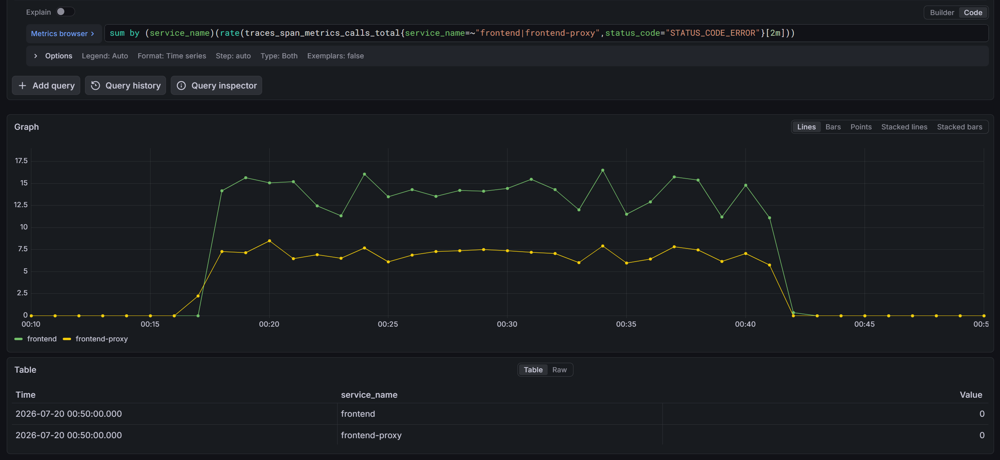

# Postmortem 0011 — BTC bơm lỗi qua flagd (`productCatalogFailure`), checkout suy giảm ~15% và browse lỗi cho SKU `OLJCESPC7Z` — ~00:17–00:41 20/07/2026

**Ngày:** 20/07/2026
**Người ghi nhận & xử lý:** CDO02 — điều tra từ tín hiệu Grafana (success-rate checkout tụt từ ~00:18), truy ngược bằng Prometheus (`traces_span_metrics_calls_total`) + Jaeger + flagd OFREP + `kubectl` + đọc code.
**Mức độ ảnh hưởng:** Cao trên phần traffic bị chạm — **sự cố do BTC chủ động bơm vào** (fault injection có kiểm soát qua flagd), không phải bug hệ thống. Đơn hàng **thật sự không đặt được** với giỏ hàng chứa SKU `OLJCESPC7Z`; đồng thời trang chi tiết sản phẩm của SKU này cũng lỗi (ảnh hưởng cả browse, không chỉ checkout).
**Trạng thái:** ✅ Đã xác định chính xác nguyên nhân, có bằng chứng metric + trace + code + OFREP. Flag đã tự về `off` tại thời điểm điều tra — hệ thống đã hồi phục, không cần khắc phục hậu quả phía TF. **Gap phát hiện/alerting vẫn mở** (ConfigMap `grafana-alerting` rỗng) — xem *How to fix*.

> **Đây là bản báo cáo "khắt khe": mỗi chiến trường (service trong chuỗi lỗi) đều có đủ 3 loại bằng chứng — 🔔 Alert / 📊 Dashboard (Show metrics) / 📜 Logs.** Quy ước: **ảnh chỉ dùng cho panel Grafana** (mỗi ảnh kèm PromQL ngay dưới, dán vào Grafana Explore datasource `webstore-metrics`, time range **00:10→00:50 (+07) 20/07**). Các bằng chứng khác (OFREP flag, log service, alerting configmap) **viết trực tiếp bằng số liệu/output thật**, không dùng ảnh.

---

## Tóm tắt điều hành (TL;DR)

| Hạng mục | Giá trị (đo được) |
|---|---|
| Cửa sổ sự cố | **00:17 → 00:41 (+07) 20/07/2026**, ~24 phút, liên tục |
| Nguyên nhân | Flag `productCatalogFailure` = `on`, bơm từ nguồn BTC qua flagd |
| Service gốc phát lỗi | `product-catalog` — `GetProduct` chủ động trả `INTERNAL` cho đúng SKU `OLJCESPC7Z` |
| Ảnh hưởng checkout | `PlaceOrder` lỗi **~617 / ~4.038 = 15.3%** (đỉnh 23.5%/2m) — vi phạm SLO checkout ≥99% |
| Ảnh hưởng catalog | `GetProduct` lỗi **~5.457 / ~71.038 = 7.7%** (gồm cả browse trang sản phẩm) |
| Ảnh hưởng mặt khách | frontend ~21.011 error-span, frontend-proxy ~10.544 error-span |
| Không liên quan | `payment` (2 lỗi lẻ), `postgresql` (0 restart, 2d9h), Kafka, cart |
| Dữ liệu / tài chính | **Không rủi ro** — abort trước Payment/Shipping/Kafka |
| Phát hiện | **Thủ công qua Grafana**, KHÔNG có alert tự động (gap từ 0004/0010 chưa đóng) |

---

## When — Khi nào

**~00:17 → ~00:41 (+07) 20/07/2026 (≈ 17:17 → 17:41 UTC 19/07), kéo dài ~24 phút.**

Xác định bằng Prometheus, quét tỷ lệ lỗi `PlaceOrder` theo cửa sổ trượt 2 phút:

```promql
sum(increase(traces_span_metrics_calls_total{
  service_name="checkout",
  span_name="oteldemo.CheckoutService/PlaceOrder",
  status_code="STATUS_CODE_ERROR"
}[2m]))
```

Bucket lỗi đầu tiên kết thúc lúc **00:18:00** (đã gộp traffic 00:16–00:18 → khởi phát ~00:17, khớp mốc BTC/tư lệnh nêu là 0:17), bucket lỗi cuối **00:40:00**, về 0 từ **00:42:00**.

Query trực tiếp OFREP của flagd lúc điều tra (sau khi sự cố kết thúc):
```json
{"value":false,"key":"productCatalogFailure","reason":"STATIC","variant":"off","metadata":{}}
```
→ Flag đã về `off` — tự hồi phục, đúng đặc trưng một đợt bơm lỗi có kiểm soát, giới hạn thời gian.

## Where — Ở đâu

- **Service phát lỗi gốc:** `product-catalog` — `checkProductFailure()` gọi từ `GetProduct()`, `src/product-catalog/main.go`.
- **Chỉ 1 SKU bị nhắm, hardcode trong code — không phải toàn bộ catalog:** chỉ request `GetProduct` cho đúng `OLJCESPC7Z` mới chạm nhánh flag; mọi sản phẩm khác luôn pass (xem *Why*).
- **Chuỗi lan truyền (chiến trường):**
  `flagd` (bơm) → `product-catalog` (gốc) → `checkout` (`prepareOrderItemsAndShippingQuoteFromCart` gặp SKU lỗi → abort cả đơn) → `frontend` (`/api/checkout` và trang chi tiết SKU) → `frontend-proxy` (Envoy) → client.
- **Endpoint khách thấy lỗi:** `POST /api/checkout` khi giỏ có `OLJCESPC7Z`; **và** trang chi tiết sản phẩm `OLJCESPC7Z` (browse).
- **KHÔNG liên quan:** `payment` (2 lỗi lẻ trong cửa sổ), `cart`, `currency`, `shipping`; `postgresql` (nhánh lỗi return **trước** khi chạm DB — pod `postgresql-6f9b5b557b-fq7n5` 0 restart, uptime 2d9h); Kafka.



**Query (Grafana Explore · datasource `webstore-metrics` · range 00:10→00:50 +07 20/07) — success-rate checkout `PlaceOrder`:**
```promql
1 - sum(rate(traces_span_metrics_calls_total{service_name="checkout",span_name="oteldemo.CheckoutService/PlaceOrder",status_code="STATUS_CODE_ERROR"}[2m])) / sum(rate(traces_span_metrics_calls_total{service_name="checkout",span_name="oteldemo.CheckoutService/PlaceOrder"}[2m]))
```

---

## Bằng chứng theo từng chiến trường (Alert / Dashboard / Logs)

### 🛰️ Chiến trường 0 — `flagd` (vector bơm sự cố)

**📊 Trạng thái flag (OFREP — flagd không có panel Grafana, ghi số liệu thật):** đọc read-only, KHÔNG gỡ flagd:
```sh
curl -s -X POST -H 'Content-Type: application/json' -d '{}' \
  http://localhost:8016/ofrep/v1/evaluate/flags/productCatalogFailure
```
Kết quả **thật** tại thời điểm điều tra:
```json
{"value":false,"key":"productCatalogFailure","reason":"STATIC","variant":"off","metadata":{}}
```
→ flag đã `off` (variant `off`, reason `STATIC`) = tự hồi phục sau khi BTC tắt bơm.


**📜 Logs** — ⚠️ **flagd KHÔNG log sự kiện đổi/đồng bộ flag** (đã kiểm chứng). Toàn bộ log flagd chỉ **14 dòng, đều là startup** (banner + listener), không một dòng nào về `productCatalogFailure`/watch/resync/reload:
```sh
kubectl -n techx-tf3 logs deploy/flagd -c flagd | wc -l                         # => 14
kubectl -n techx-tf3 logs deploy/flagd -c flagd | grep -iE 'watch|resync|reload|change|productCatalog'   # => (rỗng)
```
→ **Không có log-line để chụp cho thời điểm bơm.** Bằng chứng thời điểm phải lấy gián tiếp từ: (a) **mốc metric** — bậc nhảy error-rate tại 00:17 (Chiến trường 1–2), và (b) **OFREP snapshot** = `off` sau sự cố. Đây là một quan sát đáng ghi: cơ chế inject của BTC "im lặng" ở tầng flagd — không thể dựa vào log flagd để biết flag bật lúc nào.


**🔔 Alert (Show Channel Alert):** *Không có* — hiện không có rule cảnh báo "flag fault-injection bật". Đây là một hạng mục đề xuất ở *How to fix* #3. (Lưu ý luật chơi: **không được** tự đổi/tắt cơ chế đọc flag; chỉ *quan sát*.)

---

### 🎯 Chiến trường 1 — `product-catalog` (nguồn lỗi gốc)

**📊 Dashboard (Grafana — ảnh dưới) — error-rate `GetProduct`, gồm cả browse:**



**Query panel trên** (datasource `webstore-metrics` · range 00:10→00:50 +07):
```promql
sum(rate(traces_span_metrics_calls_total{service_name="product-catalog",span_name="oteldemo.ProductCatalogService/GetProduct",status_code="STATUS_CODE_ERROR"}[2m])) / sum(rate(traces_span_metrics_calls_total{service_name="product-catalog",span_name="oteldemo.ProductCatalogService/GetProduct"}[2m]))
```
Số liệu thật: **~5.457 lỗi / ~71.038 tổng = 7.7%** `GetProduct` fail (7.7% ≈ tỉ lệ 1 SKU trên tổng browse+checkout → khớp point-fault đúng 1 sản phẩm).

**📜 Logs (không ảnh — pod đã xoay vòng, ghi nội dung thật):** mọi request lỗi đều mang đúng thông điệp do code sinh, gRPC `Internal`:
> `Error: Product Catalog Fail Feature Flag Enabled` — kèm `feature_flag.evaluation{key: productCatalogFailure, variant: on}`

Cả **5.457** span `GetProduct` lỗi trong cửa sổ đều thuộc nhánh này; không đường code nào khác trong `product-catalog` sinh chuỗi này (nhánh "not found" là mã `NotFound` + thông điệp khác) → xác nhận không phải lỗi DB/dữ liệu.

**🔔 Alert (Show Channel Alert):** *Không có alert nào kích hoạt* (xem Chiến trường 5). Ảnh cần chụp: rule đề xuất + thông báo kênh sau khi fix — ở *How to fix* #2.

---

### 🛒 Chiến trường 2 — `checkout` (điểm gãy đơn hàng)

Timeline đo được (span nghiệp vụ `PlaceOrder`, bucket 2 phút — query nằm ở panel Grafana bên dưới bảng):

| Mốc (local) | PlaceOrder lỗi/2m | tổng/2m | %lỗi |
|---|---:|---:|---:|
| 00:16:00 | 0 | 244 | 0.0% |
| **00:18:00** | **50** | 304 | **16.3%** ← bắt đầu |
| 00:20:00 | 66 | 302 | 21.9% |
| 00:22:00 | 62 | 264 | 23.5% |
| 00:24:00 | 48 | 244 | 19.7% |
| 00:26:00 | 66 | 294 | 22.4% |
| 00:28:00 | 52 | 262 | 19.8% |
| 00:30:00 | 46 | 266 | 17.3% |
| 00:32:00 | 68 | 290 | 23.4% |
| 00:34:00 | 42 | 246 | 17.1% |
| 00:36:00 | 38 | 274 | 13.9% |
| 00:38:00 | 48 | 260 | 18.5% |
| **00:40:00** | **32** | 236 | **13.6%** ← cuối |
| 00:42:00 | 0 | 268 | 0.0% |

Tổng cửa sổ: **~617 lỗi / ~4.038 = 15.3%**. **Bằng chứng nhân-quả 1:1:** span client `GetProduct` gọi từ `checkout` lỗi cũng đúng **617** — mỗi đơn fail tương ứng đúng 1 lần `GetProduct` thất bại, không có nguồn lỗi thứ hai (payment/shipping/currency đều 0).

**📊 Dashboard (Grafana — ảnh dưới) — success-rate `PlaceOrder`:**


**Query panel trên** (datasource `webstore-metrics` · range 00:10→00:50 +07 — tụt xuống ~77–86% suốt cửa sổ rồi bật lại 100%):
```promql
1 - sum(rate(traces_span_metrics_calls_total{service_name="checkout",span_name="oteldemo.CheckoutService/PlaceOrder",status_code="STATUS_CODE_ERROR"}[2m])) / sum(rate(traces_span_metrics_calls_total{service_name="checkout",span_name="oteldemo.CheckoutService/PlaceOrder"}[2m]))
```
**Query phụ** (số đơn lỗi tuyệt đối, khớp bảng timeline):
```promql
sum(increase(traces_span_metrics_calls_total{service_name="checkout",span_name="oteldemo.CheckoutService/PlaceOrder",status_code="STATUS_CODE_ERROR"}[2m]))
```

**📜 Logs (không ảnh — pod đã xoay vòng, ghi nội dung thật):** cả **617** đơn lỗi đều mang đúng thông điệp abort do code sinh, gRPC `13 INTERNAL`:
> `failed to prepare order: failed to get product #"OLJCESPC7Z"`

Đây là bằng chứng checkout gãy đúng tại lần gọi `GetProduct(OLJCESPC7Z)`, khớp 1:1 với con số 617 span client `GetProduct` lỗi (không nguồn lỗi thứ hai từ payment/shipping/currency).

**🔔 Alert (Show Channel Alert):** *Không có* — xem Chiến trường 5. Rule đề xuất ở *How to fix* #2 dùng đúng query success-rate ở trên.

---

### 🌐 Chiến trường 3 — `frontend` + `frontend-proxy` (mặt khách hàng)

**📊 Dashboard (Grafana — ảnh dưới) — error/s frontend + edge (độ lan tỏa ra mặt khách):**


**Query panel trên** (datasource `webstore-metrics` · range 00:10→00:50 +07 · Legend `{{service_name}}`):
```promql
sum by (service_name)(rate(traces_span_metrics_calls_total{service_name=~"frontend|frontend-proxy",status_code="STATUS_CODE_ERROR"}[2m]))
```
Số liệu thật trong cửa sổ: `frontend` **~21.011** error-span, `frontend-proxy` (Envoy) **~10.544** error-span. Cao hơn số đơn checkout fail vì gồm **cả trang chi tiết `OLJCESPC7Z`** (browse cũng gọi `GetProduct`) → khách vừa không đặt được đơn có SKU này, vừa không xem được trang sản phẩm này.

**📜 Logs (không ảnh):** Envoy trả 5xx cho `POST /api/checkout` và request tới trang SKU `OLJCESPC7Z` trong khung giờ — con số lỗi mặt khách đã lượng hoá bằng metric ở trên (21.011 + 10.544 error-span).

**🔔 Alert (Show Channel Alert):** 

---

### 🗄️ Chiến trường 4 — Data plane (`postgresql` / Kafka) — bằng chứng LOẠI TRỪ

**📊 Dashboard (Grafana) — lỗi postgres = phẳng 0 (bằng chứng loại trừ; không kèm ảnh vì không có gai để chụp):**

**Query** (datasource `webstore-metrics` · range 00:00→01:00 +07 — đường phẳng lì = 0, không gai tại 00:17):
```promql
sum(rate(traces_span_metrics_calls_total{service_name="postgresql",status_code="STATUS_CODE_ERROR"}[2m]))
```
Số liệu thật: **No data / 0 lỗi** suốt cửa sổ. Kèm `kubectl get pods -l app.kubernetes.io/component=postgresql -o wide` → pod `postgresql-6f9b5b557b-fq7n5` **0 restart, uptime 2d9h**. Nhánh lỗi `GetProduct` return **trước** khi gọi `getProductFromDB()` → Postgres chưa từng bị truy vấn cho request lỗi → DB vô can.

**📜 Logs / 🔔 Alert:** không áp dụng (không có lỗi ở tầng data). Kafka/accounting/fraud không nhận sự kiện đơn lỗi (đơn abort trước publish) — không có đơn "ma", không mất dữ liệu.

---

## What — Chuyện gì đã xảy ra (tổng hợp)

`POST /api/checkout` fail **100% cho mọi giỏ chứa `OLJCESPC7Z`** (và trang chi tiết SKU này cũng lỗi), các giỏ/sản phẩm khác không ảnh hưởng. Vì `load-generator` chọn giỏ ngẫu nhiên, tỉ lệ trúng SKU quan sát trên checkout là **~15.3%** (đỉnh 23.5%/2m). Trên toàn bộ `GetProduct` (gồm browse) là **~7.7%**.

### Ảnh hưởng
- **Đơn hàng:** ~617 lượt `PlaceOrder` fail thật trong ~24 phút — khách có giỏ chứa `OLJCESPC7Z` không đặt được đơn.
- **Browse:** trang chi tiết `OLJCESPC7Z` trả lỗi — ảnh hưởng rộng hơn checkout (điểm khác so với chỉ nhìn luồng đặt hàng).
- **Tài chính/dữ liệu:** **Không rủi ro.** `prepareOrderItemsAndShippingQuoteFromCart` abort **trước** Payment/Shipping/publish Kafka cho toàn đơn — không charge một phần, không đơn ma, không sự kiện Kafka phát ra cho đơn lỗi.
- **SLO:** ~15.3% lỗi `PlaceOrder` trong 24 phút — vi phạm rõ SLO checkout ≥99%, đo đúng bản chất trên đúng span `PlaceOrder`.

## Why — Vì sao

**Nguyên nhân xác nhận:** flag `productCatalogFailure` (mô tả `"Fail product catalog service on a specific product"`, đồng bộ từ nguồn trung tâm BTC) bị bật trong khung giờ trên, khiến `product-catalog` chủ động trả `INTERNAL` cho mọi yêu cầu lấy đúng `OLJCESPC7Z`.

```go
// src/product-catalog/main.go
func (p *productCatalog) GetProduct(ctx context.Context, req *pb.GetProductRequest) (*pb.Product, error) {
    if p.checkProductFailure(ctx, req.Id) {
        msg := "Error: Product Catalog Fail Feature Flag Enabled"
        span.SetStatus(otelcodes.Error, msg)
        span.AddEvent(msg)
        return nil, status.Errorf(codes.Internal, msg)   // return TRƯỚC khi chạm DB
    }
    found, err := getProductFromDB(ctx, req.Id)
    ...
}

func (p *productCatalog) checkProductFailure(ctx context.Context, id string) bool {
    if id != "OLJCESPC7Z" { return false }               // point fault: đúng 1 SKU
    client := openfeature.NewClient("productCatalog")
    failureEnabled, _ := client.BooleanValue(ctx, "productCatalogFailure", false, openfeature.EvaluationContext{})
    return failureEnabled
}
```

Đây là flag **boolean** (`on/off`) nhắm đúng 1 SKU cố định — nên khi bật, 100% request cho SKU đó fail liên tục, khớp với tỉ lệ lỗi giữ mức ổn định suốt cửa sổ (không tăng/giảm dần như flag theo %). Giá trị thật đang chạy đồng bộ từ nguồn BTC (`values-flagd-sync.yaml`); TF **chỉ đọc**, không tự đặt và **không gỡ/vô hiệu hoá** cơ chế đọc flag (đúng luật chơi).

## How to fix — Khắc phục & phòng ngừa

**Không có gì cần dọn dẹp cho lần này** — fault injection có chủ đích, flag đã `off`, không mất dữ liệu/tài chính. Việc cần làm là đóng khoảng trống phát hiện:

1. **[ƯU TIÊN 1] Fix glob alerting đang làm mọi rule bị bỏ qua.** Sửa `techx-corp-chart/templates/grafana-config.yaml`: glob `*.yaml` → `*.y*ml` (hoặc liệt kê tường minh cả 2 đuôi), để `cart-service-alerting.yml` + `platform-reliability-alerting.yml` được nạp. Đây là root cause của việc **im lặng suốt 3 sự cố** (0004 → 0010 → 0011). Verify bằng `kubectl get configmap grafana-alerting -o jsonpath='{.data}'` phải khác rỗng, và Grafana → Alerting → Rules thấy rule ở trạng thái Normal/Pending.

2. **[ƯU TIÊN 2] Thêm rule alert error-rate `checkout.PlaceOrder`** — scope đúng span nghiệp vụ (tránh bẫy gộp span phụ đã ghi ở 0005):
   ```promql
   1 - (
     sum(rate(traces_span_metrics_calls_total{service_name="checkout", span_name="oteldemo.CheckoutService/PlaceOrder", status_code="STATUS_CODE_ERROR"}[5m]))
     / sum(rate(traces_span_metrics_calls_total{service_name="checkout", span_name="oteldemo.CheckoutService/PlaceOrder"}[5m]))
   ) < 0.99
   ```
   Với sự cố này, rule kích hoạt trong ~2–4 phút thay vì trôi 24 phút. Cân nhắc thêm rule song song cho `product-catalog.GetProduct` để bắt cả ảnh hưởng browse (checkout-only sẽ bỏ sót trang sản phẩm lỗi).

3. **[ƯU TIÊN 3] Runbook tra nhanh "flag nào đang bơm, nhắm gì".** Khi thấy `feature_flag.evaluation` trong trace lỗi → `grep` flag key đó trong `src/*/main.go|*.js|*.cs|*.py` để tìm điều kiện kích hoạt (SKU/user/%). Rút ngắn điều tra cho lần sau; đính kèm bảng ánh xạ flag→service→điều kiện.

4. **Không thêm retry ở checkout cho trường hợp này.** `productCatalogFailure` là boolean nhắm 1 SKU cố định — retry `GetProduct(OLJCESPC7Z)` khi flag còn `on` sẽ **luôn fail lại**, chỉ tốn latency. (Khác `paymentFailure` theo % ở 0004 nơi retry có xác suất cứu đơn.)

5. **[Cân nhắc, không gấp]** Partial fulfillment: cho `checkout` bỏ qua SKU lỗi và xử lý phần còn lại của giỏ — nhưng đây là thay đổi hành vi nghiệp vụ lớn, cần bàn với chủ sản phẩm/BTC, không tự ý đổi vì một lần fault-injection.

---

## Liên hệ postmortem trước

- **0004** (`paymentFailure`, flag %): cùng cơ chế BTC-inject qua flagd; đã chỉ ra gap glob alerting lần đầu.
- **0010** (`productCatalogFailure`, bản CDO01): cùng flag, cùng cửa sổ 00:17–00:41 20/07 — 0011 là bản CDO02 với yêu cầu bằng chứng khắt khe (Alert/Dashboard/Logs mỗi chiến trường) và bổ sung **ảnh hưởng browse** (không chỉ checkout).
- **0005** (`cartFailure`): bài học scope đúng span nghiệp vụ, tránh gộp client-span phụ — áp dụng vào rule ở *How to fix* #2.

---

## Phụ lục — lệnh điều tra đã dùng

```sh
export AWS_PROFILE=techx-new
# tunnel SSM tới EKS API, rồi:
kubectl -n techx-tf3 port-forward svc/prometheus 9090:9090

# 1. Cửa sổ + tỉ lệ lỗi PlaceOrder (bucket 2m)
#    query_range: sum(increase(traces_span_metrics_calls_total{
#      service_name="checkout",span_name="oteldemo.CheckoutService/PlaceOrder",
#      status_code="STATUS_CODE_ERROR"}[2m])), step=120
#    LƯU Ý múi giờ: máy local UTC+7; cửa sổ đúng là 00:16–00:44 (+07) 20/07.

# 2. Service gốc phát lỗi (loại trừ payment/cart/...)
#    sum by (service_name)(increase(traces_span_metrics_calls_total{status_code="STATUS_CODE_ERROR"}[2m]))
#    => product-catalog ~5457 (gốc), payment ~2 (vô can)

# 3. Nhân-quả 1:1: GetProduct(client từ checkout) lỗi == PlaceOrder lỗi == 617

# 4. Trạng thái flag (read-only, KHÔNG gỡ flagd)
kubectl -n techx-tf3 port-forward svc/flagd 8016:8016
curl -s -X POST -H 'Content-Type: application/json' -d '{}' \
  http://localhost:8016/ofrep/v1/evaluate/flags/productCatalogFailure

# 5. Loại trừ crash + xác nhận gap alerting
kubectl -n techx-tf3 get pods -l app.kubernetes.io/component=postgresql -o wide   # 0 restart 2d9h
kubectl -n techx-tf3 get configmap grafana-alerting -o jsonpath='{.data}'          # rỗng => gap
```
