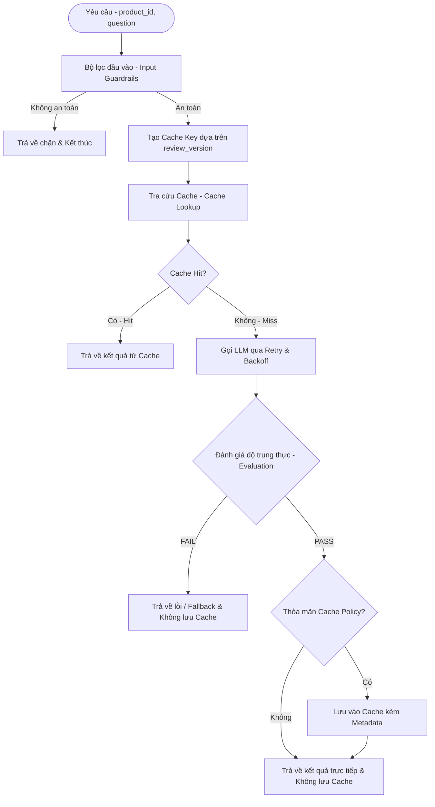

# Thiết Kế Cơ Chế Caching Cho Hệ Thống LLM (AIE1 Task Force)

Tài liệu này mô tả chi tiết giải pháp thiết kế bộ nhớ đệm (Caching) được nâng cấp thành **Runtime Cache Layer** cho dịch vụ AI Assistant của TechX Corp Platform. Thiết kế này tích hợp chặt chẽ với các cơ chế bảo mật (Guardrails), xử lý lỗi (Fallback), và kiểm định chất lượng (Evaluation) nhằm tối ưu hóa chi phí token và giảm thiểu tối đa độ trễ (Latency).

---

## 1. Lý Do Cần Triển Khai Caching (Runtime Cache Layer)

1. **Tối ưu hóa Chi phí (Cost Optimization)**: Tránh các cuộc gọi trùng lặp đến AWS Bedrock hoặc OpenAI, tiết kiệm lượng token tiêu thụ.
2. **Tối ưu hóa Hiệu năng (Latency Reduction)**:
   - Thời gian gọi LLM + Guardrails trung bình mất **~1.6 giây**.
   - Đọc trực tiếp từ Cache (PostgreSQL/Redis) mất **< 10 mili-giây** (nhanh hơn gấp 160 lần).
3. **Độ tin cậy & Fallback**: Đóng vai trò là nguồn dữ liệu dự phòng tin cậy khi các nhà cung cấp mô hình gặp sự cố hoặc bị Rate Limit.

---

## 2. 5 Điểm Cải Tiến Cốt Lõi Của Runtime Cache Layer

Hệ thống bộ đệm được nâng cấp từ một lớp "lưu kết quả đơn thuần" thành một **tầng trung gian thời gian chạy (Runtime Cache Layer)** thông qua 5 cải tiến lớn:

### 2.1. Đặt Cache Lookup Trước Retry và Lời Gọi LLM (Cache-First)
Cache đóng vai trò là "tuyến phòng thủ đầu tiên" ngay sau bộ lọc bảo mật đầu vào. Nếu Cache Hit, hệ thống sẽ trả kết quả trực tiếp cho người dùng, loại bỏ hoàn toàn việc thực thi Retry/Backoff, không gọi LLM và không tốn token.

```
                      Yêu cầu từ Client
                             │
                             ▼
                     Input Guardrails
                             │
                             ▼
                      [Cache Lookup]
                       /          \
               (Cache Hit)      (Cache Miss)
                    /                \
          Trả kết quả từ Cache    Retry & Backoff
            (Latency < 10ms)          │
                                 Gọi LLM (Bedrock/OpenAI)
                                      │
                                  Evaluation
                                      │
                                 [Ghi Cache]
                                      │
                              Trả kết quả mới
```

### 2.2. Cấu Trúc Siêu Dữ Liệu Đầy Đủ (Cache Metadata)
Không chỉ lưu văn bản câu trả lời đơn thuần, bản ghi Cache được cấu trúc hóa dưới dạng JSON Object chứa đầy đủ thông tin hỗ trợ kiểm toán (auditing) và gỡ lỗi (debugging):

```json
{
  "answer": "Sản phẩm A được đánh giá cao nhờ thiết kế nhỏ gọn, tuy lượng pin chưa ấn tượng...",
  "provider": "bedrock",
  "model": "amazon.nova-lite-v1:0",
  "created_at": 1783935288,
  "ttl": 86400,
  "review_version": "57f59d57a922",
  "token_usage": {
    "input_tokens": 1250,
    "output_tokens": 240
  }
}
```

### 2.3. Cơ Chế Invalidation Dựa Trên Phiên Bản (Version-Based Invalidation)
Thay vì thực hiện các lệnh xóa cache thủ công (`DELETE`) vốn tốn tài nguyên và dễ gây lỗi khi có review mới, hệ thống áp dụng cơ chế khóa cache động dựa trên phiên bản dữ liệu:
- Mỗi sản phẩm duy trì một mã băm phiên bản review (`review_version`), được tính toán nhanh chóng dựa trên số lượng review, mã băm nội dung hoặc timestamp của review mới nhất.
- Khóa Cache (Cache Key) được tính theo công thức:
  $$\text{Cache Key} = \text{SHA256}(\text{product\_id} + \text{review\_version} + \text{normalize}(\text{question}))$$
- Khi có review mới $\rightarrow$ `review_version` thay đổi $\rightarrow$ Khóa Cache tự động đổi $\rightarrow$ Tự động gây ra **Cache Miss** và kích hoạt việc sinh dữ liệu mới. Các cache cũ của phiên bản trước sẽ tự hết hạn dựa trên cơ chế TTL mà không cần xóa thủ công.

### 2.4. Chỉ Ghi Cache Khi Đạt Kiểm Định Chất Lượng (Cache on Evaluation PASS)
Vì hệ thống đã triển khai bộ đánh giá độ trung thực (Fidelity Judge) trực tuyến để phát hiện ảo giác (Hallucination):
- Chỉ khi kết quả tóm tắt đạt kiểm định và được phê duyệt (`approved == True`), hệ thống mới ghi đè vào Cache.
- Nếu kiểm định thất bại (mô hình bị ảo giác), kết quả bị hủy bỏ và không được lưu vào cache, tránh trường hợp lưu trữ một câu trả lời sai lệch khiến các khách hàng tiếp theo nhận cùng một nội dung lỗi.

### 2.5. Chính Sách Chọn Lọc Cache (Cache Policy)
Hệ thống sử dụng bộ quy tắc lọc đầu vào `should_cache(question, response)` để tối ưu hóa tài nguyên:
- **Không Cache**: Các câu hỏi lạc đề (`OUT_OF_SCOPE`), thiếu thông tin (`NO_INFO`), hoặc khi tham số mô hình yêu cầu tính sáng tạo ngẫu nhiên (như `temperature > 0`).
- **Cho phép Cache**: Các yêu cầu tóm tắt mặc định của sản phẩm hoặc câu hỏi Q&A chính xác về sản phẩm có `temperature == 0`.

---

## 3. Kiến Trúc Luồng Hoạt Động (Mermaid Sequence)



---

## 4. Lựa Chọn Hạ Tầng Lưu Trữ: PostgreSQL vs Redis (Trade-off Analysis)

Dưới đây là bảng phân tích trade-off chi tiết giữa hai lựa chọn hạ tầng lưu trữ phục vụ cho tầng Cache:

| Tiêu chí                                                          | PostgreSQL (Database Quan Hệ)                                                                                                                                                                                                                                                 | Redis (In-Memory Key-Value)                                                                                                                                                                                                                                                                                                                                                                                                      | Đánh giá & Rationale                                                                                                                                                         |
| :---------------------------------------------------------------- | :---------------------------------------------------------------------------------------------------------------------------------------------------------------------------------------------------------------------------------------------------------------------------- | :------------------------------------------------------------------------------------------------------------------------------------------------------------------------------------------------------------------------------------------------------------------------------------------------------------------------------------------------------------------------------------------------------------------------------- | :--------------------------------------------------------------------------------------------------------------------------------------------------------------------------- |
| **Độ trễ & Hiệu năng (Latency & Throughput)**                     | **~5-15 ms**<br>- Phải xử lý SQL parser, lập chỉ mục (Indexes) và truy xuất ổ đĩa (Disk I/O) nếu dữ liệu không nằm trên RAM.                                                                                                                                                  | **< 1 ms**<br>- Lưu hoàn toàn trên bộ nhớ RAM (In-Memory).<br>- Phản hồi tức thì với throughput cực cao (hàng trăm ngàn ops/giây).                                                                                                                                                                                                                                                                                               | **Redis Thắng**:<br>- Phù hợp với các hệ thống có lưu lượng lớn hoặc yêu cầu độ trễ phản hồi thời gian thực.                                                                 |
| **Quản lý vòng đời Cache (TTL & Eviction)**                       | **Phức tạp (Manual)**<br>- Phải tự định nghĩa cột `expire_at`. Code ứng dụng phải tự kiểm tra hạn sử dụng khi truy vấn.<br>- Cần cài đặt Cronjob / Daemon để định kỳ chạy lệnh `DELETE` dọn dẹp RAM/Disk.                                                                     | **Tự động & Tối ưu**<br>- Hỗ trợ TTL tự nhiên ở cấp độ key thông qua lệnh `SETEX` / `EXPIRE`. Dữ liệu tự động biến mất khi hết hạn.<br>- Hỗ trợ các cơ chế loại bỏ tự động (Eviction Policies) như LRU (Least Recently Used) khi đầy bộ nhớ.                                                                                                                                                                                     | **Redis Thắng**:<br>- Việc tự động quản lý vòng đời giúp code ứng dụng sạch hơn và tối ưu hóa bộ nhớ RAM tự động.                                                            |
| **Chi phí Hạ tầng & Tài nguyên (Cost & Resources)**               | **Rất Thấp (Tối ưu)**<br>- **Local**: $0 (Tận dụng Postgres sẵn có).<br>- **AWS**: Không phát sinh thêm chi phí phần cứng (chỉ sử dụng chung instance RDS/Aurora hiện tại).<br>- **Lưu trữ**: Lưu trên ổ đĩa SSD (EBS GP3 có giá rất rẻ, chỉ khoảng **~$0.08 / GB / tháng**). | **Cao hơn**<br>- **Local**: Tốn thêm RAM để chạy container Redis riêng biệt (~50-100MB RAM).<br>- **AWS (ElastiCache)**: Tốn thêm chi phí tạo cluster Redis. Một instance `cache.t4g.medium` (3GB RAM) có giá khoảng **~$30 / tháng**. Nếu chạy dạng High-Availability (Primary-Replica) sẽ là **~$60 / tháng**.<br>- **Lưu trữ**: RAM có chi phí đắt gấp **~50 - 90 lần** so với SSD per GB (khoảng **~$5 - $7 / GB / tháng**). | **PostgreSQL Thắng hoàn toàn về mặt chi phí**:<br>- Tiết kiệm đáng kể ngân sách ban đầu và tài nguyên phần cứng, đặc biệt phù hợp khi kích thước tập cache chưa quá lớn.     |
| **Tính Nhất Quán & Khả năng Phục Hồi (Consistency & Durability)** | **Rất Cao (ACID)**<br>- Đảm bảo tính toàn vẹn dữ liệu cực tốt nhờ cơ chế ACID.<br>- Dữ liệu ghi xuống Disk ngay lập tức, không lo bị mất mát khi server mất điện hoặc restart.                                                                                                | **Trung bình**<br>- Mặc định tối ưu hóa cho tốc độ. Cơ chế ghi đĩa bất đồng bộ (RDB/AOF Snapshotting) có thể gây mất mát dữ liệu nhỏ nếu hệ thống sập đột ngột.<br>- Tuy nhiên, vì đây chỉ là dữ liệu **Cache** (có thể tái sinh từ LLM), việc mất mát nhỏ không gây ảnh hưởng lớn đến tính đúng đắn hệ thống.                                                                                                                   | **PostgreSQL Thắng**:<br>- Nhưng đối với bài toán Caching, tính chất Durability không quá khắt khe như Database chính, do đó yếu tố này không phải là rào cản lớn với Redis. |
| **Triển khai ở môi trường Local & Docker**                        | **Đơn giản tối đa**<br>- Chỉ cần viết thêm script khởi tạo Schema cho bảng cache trên DB PostgreSQL đang có sẵn. Không cần sửa đổi file `docker-compose.yaml`.                                                                                                                | **Cần thêm cấu hình**<br>- Cần thêm service Redis vào file `docker-compose.yaml` (thêm container mới).<br>- Code Python phải import thư viện `redis` (thêm vào `requirements.txt`).                                                                                                                                                                                                                                              | **PostgreSQL Thắng**:<br>- Giúp giữ cho môi trường Local cực kỳ tinh gọn, ít thành phần phụ thuộc.                                                                           |
| **Deploy & Vận hành trên AWS Cloud**                              | **Amazon RDS / Aurora Serverless**<br>- Tái sử dụng Instance RDS hiện tại, chỉ tăng nhẹ tải đọc/ghi. Vận hành tập trung trên một DB duy nhất.                                                                                                                                 | **Amazon ElastiCache / MemoryDB**<br>- Cần quản lý thêm một dịch vụ chuyên biệt (ElastiCache). Có cơ chế Cluster / Replication tự động phân mảnh và sao lưu.<br>- Giảm tải hoàn toàn truy vấn đọc/ghi cache cho PostgreSQL chính để dành tài nguyên cho các nghiệp vụ ACID quan trọng khác.                                                                                                                                      | **Redis Thắng về mặt kiến trúc**:<br>- Giúp tách biệt rõ ràng lớp lưu trữ chính (Database) và lớp bộ đệm (Caching), tăng độ bền vững và khả năng scale cho hệ thống lớn.     |

### Kết luận Trade-off:
- **Chọn PostgreSQL** khi: Dự án đang ở giai đoạn Prototype, muốn **tối giản hóa hạ tầng**, tiết kiệm chi phí, không muốn quản lý thêm container/dịch vụ ngoài PostgreSQL và tải lượng truy cập không quá lớn.
- **Chọn Redis** khi: Hệ thống phục vụ lượng người dùng lớn ở môi trường **Production**, yêu cầu **độ trễ siêu thấp (< 1ms)**, cần cơ chế quản lý TTL tự động mà không làm ảnh hưởng đến hiệu năng ghi/đọc của cơ sở dữ liệu quan hệ chính.

### Đánh giá Mức độ Tương thích với Mandate-06:
Để lựa chọn hạ tầng phù hợp nhất với các chỉ thị trong [MANDATE-06-ai-trust-safety.md](file:///C:/Users/ASUS/OneDrive/Obsidian%20Vault/XBrain-Phase3/AIE1/mandates/MANDATE-06-ai-trust-safety.md), hai hạ tầng được đánh giá theo 3 lăng kính ràng buộc cốt lõi:

1. **Tiêu chí Độ bền bỉ chống treo trang (Resilience & Fallback - Yêu cầu số 1)**:
   - **Redis Thắng**: Bằng cách lưu cache trên RAM độc lập, Redis cô lập hoàn toàn truy vấn cache khỏi PostgreSQL nghiệp vụ chính (nơi đang gánh dữ liệu catalog, reviews). Khi chịu tải cao, điều này ngăn chặn hiện tượng nghẽn cổ chai cơ sở dữ liệu chính, đáp ứng tốt nhất yêu cầu *"không để treo trang sản phẩm"*.
2. **Tiêu chí Khả năng kiểm toán hệ thống (Auditability - Yêu cầu số 4)**:
   - **PostgreSQL Thắng**: Kiểu dữ liệu `JSONB` của Postgres hỗ trợ truy vấn SQL phân tích cấu trúc phức tạp cực tốt. Dễ dàng thống kê: *Bao nhiêu request bị Fidelity Judge từ chối? Tổng số token tiêu tốn là bao nhiêu?* Điều này giúp việc báo cáo số đo kiểm định chất lượng (Eval) cho Mentor hoặc Ban giám khảo trực quan và khả thi hơn rất nhiều so với cơ chế Key-Value của Redis.
3. **Tiêu chí Ràng buộc về ngân sách (Budget & Resources)**:
   - **PostgreSQL Thắng**: Tiết kiệm hoàn toàn chi phí hạ tầng bổ sung (chi phí cho AWS ElastiCache tốn thêm khoảng **$30 - $60 / tháng**), tối ưu hóa ngân sách hiện tại của Task Force.

* **Hướng tiếp cận Hybrid đề xuất**: Kết hợp dùng **Redis** để phục vụ cache đáp ứng thời gian thực < 1ms (đáp ứng Resilience) và đồng thời ghi log kiểm toán, số đo eval cấu trúc vào **PostgreSQL** (đáp ứng Auditability).

---

## 5. Minh Họa Logic Mã Nguồn Python Cải Tiến

Dưới đây là cấu trúc code minh họa áp dụng 5 cải tiến trên:

```python
import hashlib
import json
import time

FALLBACK_SUMMARY_MESSAGE = "The AI is busy right now. Please try again later."
UNVERIFIED_SUMMARY_MESSAGE = "The summary cannot be verified. Please try again later."
OUT_OF_SCOPE_MESSAGE = "This question is out of scope. I only answer questions related to the product."
NO_INFO_MESSAGE = "No information in reviews."

def generate_cache_key(product_id: str, review_version: str, question: str) -> str:
    # Chuẩn hóa câu hỏi (viết thường, loại bỏ khoảng trắng thừa)
    normalized_q = " ".join(question.lower().strip().split())
    raw_key = f"{product_id}:{review_version}:{normalized_q}"
    return hashlib.sha256(raw_key.encode('utf-8')).hexdigest()

def should_cache(question: str, response_text: str, eval_passed: bool) -> bool:
    # 1. Chỉ cache khi Evaluation PASS
    if not eval_passed:
        return False
    
    # 2. Không cache các thông báo lỗi, thông báo fallback hoặc lạc đề
    ignored_responses = {
        FALLBACK_SUMMARY_MESSAGE,
        UNVERIFIED_SUMMARY_MESSAGE,
        OUT_OF_SCOPE_MESSAGE,
        NO_INFO_MESSAGE
    }
    if response_text in ignored_responses:
        return False
        
    return True

def get_cached_response(cache_key: str) -> dict:
    """
    Thực hiện truy vấn lấy dữ liệu cache từ DB hoặc Redis.
    Trả về dict metadata nếu Hit, hoặc None nếu Miss.
    """
    # SELECT metadata FROM ai_response_cache WHERE cache_key = %s
    # Trả về dữ liệu đã parse JSON
    pass

def save_to_cache(
    cache_key: str, 
    product_id: str, 
    answer: str, 
    provider: str, 
    model: str, 
    review_version: str, 
    input_tokens: int, 
    output_tokens: int,
    ttl_seconds: int = 86400
):
    # Lưu trữ phong phú thông tin (Cache Metadata)
    cache_data = {
        "answer": answer,
        "provider": provider,
        "model": model,
        "created_at": int(time.time()),
        "ttl": ttl_seconds,
        "review_version": review_version,
        "token_usage": {
            "input_tokens": input_tokens,
            "output_tokens": output_tokens
        }
    }
    
    # Thực hiện lưu vào DB/Redis
    # PostgreSQL: INSERT INTO ai_response_cache (cache_key, product_id, metadata) VALUES (%s, %s, %s)
    # Redis: SETEX cache_key ttl_seconds json.dumps(cache_data)
    pass
```

---

## 6. Lộ Trình Triển Khai Thực Tế Theo Hướng Redis (Implementation Roadmap)

Nếu thống nhất sử dụng Redis cho môi trường Production và Local, các thay đổi kỹ thuật cần thực hiện bao gồm:

### 6.1. Thêm Thư Viện Dependency (`requirements.txt`)
Thêm dòng sau vào file [requirements.txt](file:///C:/Users/ASUS/OneDrive/Obsidian%20Vault/XBrain-Phase3/AIE1/techx-corp-platform/src/product-reviews/requirements.txt):
```text
redis>=5.0.0
```

### 6.2. Cấu Hình Môi Trường Local (`docker-compose.yaml`)
Thêm service Redis vào file `docker-compose.yaml` tại thư mục `AIE1/techx-corp-platform/` để hỗ trợ phát triển local:
```yaml
services:
  redis:
    image: redis:7-alpine
    container_name: redis-cache
    ports:
      - "6379:6379"
    # Giới hạn cứng bộ nhớ RAM và tự động xóa key cũ để chống OOM
    command: redis-server --maxmemory 256mb --maxmemory-policy allkeys-lru
    restart: always

  product-reviews:
    # ...
    depends_on:
      - redis
    environment:
      - REDIS_HOST=redis
      - REDIS_PORT=6379
      - CACHE_TYPE=redis
```

### 6.3. Tích Hợp Kết Nối Và Luồng Xử Lý (`product_reviews_server.py`)
Trong file [product_reviews_server.py](file:///C:/Users/ASUS/OneDrive/Obsidian%20Vault/XBrain-Phase3/AIE1/techx-corp-platform/src/product-reviews/product_reviews_server.py):
- **Khởi tạo Client kết nối**:
  ```python
  import redis
  redis_client = redis.Redis(
      host=os.environ.get('REDIS_HOST', 'localhost'),
      port=int(os.environ.get('REDIS_PORT', 6379)),
      decode_responses=True
  )
  ```
- **Triển khai Cache Lookup & Write**:
  - Thực hiện đọc cache trước cuộc gọi LLM bằng lệnh: `redis_client.get(cache_key)`.
  - Thực hiện ghi cache sau khi Fidelity Judge thông qua (Evaluation PASS) bằng lệnh: `redis_client.setex(cache_key, TTL_SECONDS, json.dumps(cache_data))`.

### 6.4. Cấu Hợp Deploy Môi Môi Trường Production (`values-aio-llm.yaml`)
Bổ sung các biến môi trường cấu hình kết nối Redis vào file cấu hình Helm values để CDO deploy:
```yaml
env:
  - name: REDIS_HOST
    value: "redis-service.default.svc.cluster.local"
  - name: REDIS_PORT
    value: "6379"
  - name: CACHE_TYPE
    value: "redis"
```
