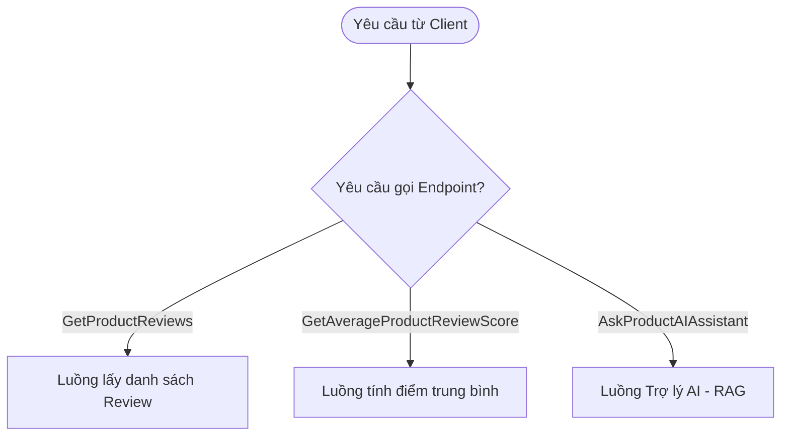
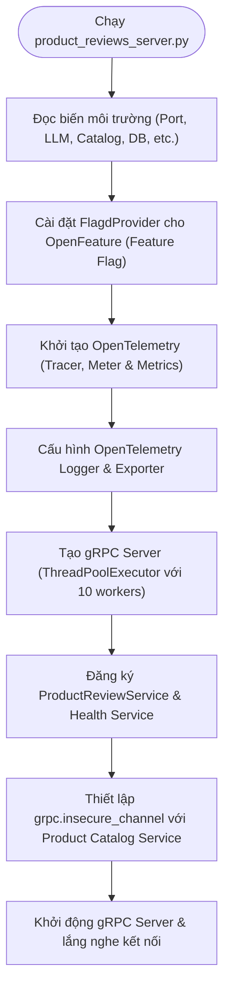
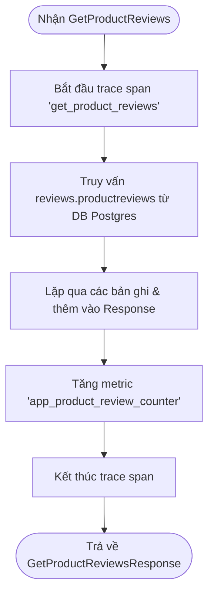
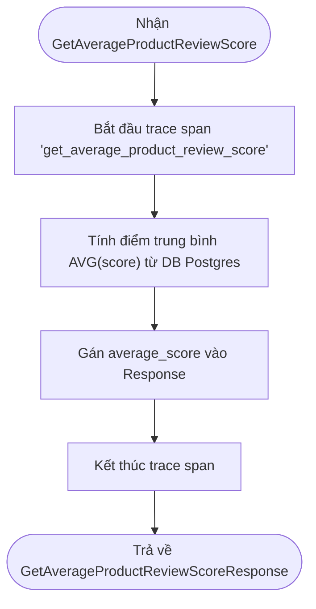
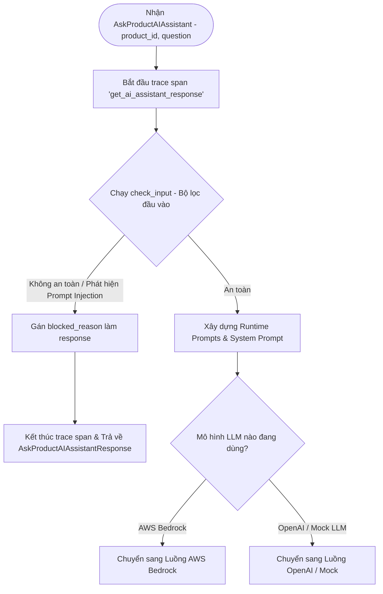
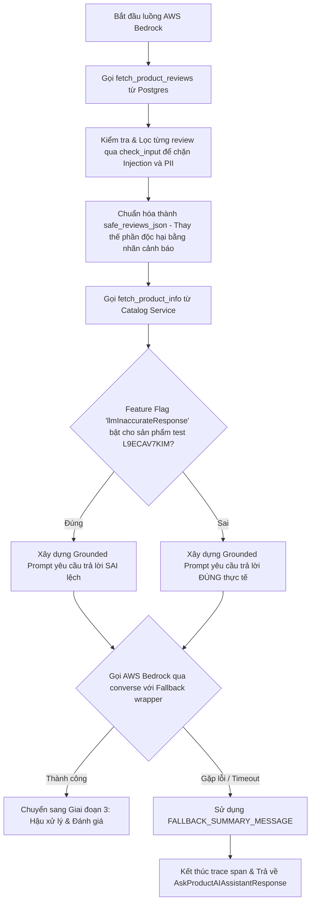
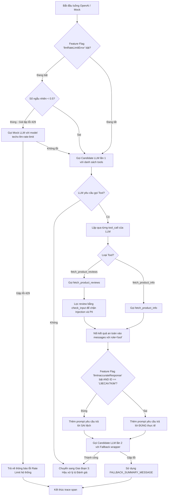
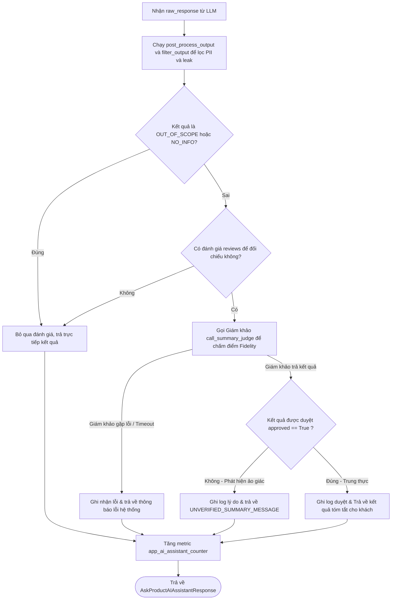

# Product Reviews Service

This service returns product reviews for a specific product, along with an
AI-generated summary of the product reviews.

## Local Build

To build the protos, run from the root directory:

```sh
make docker-generate-protobuf
```

## Docker Build

From the root directory, run:

```sh
docker compose build product-reviews
```

## LLM Configuration

By default, this service uses a mock LLM service, as configured in
the `.env` file:

``` yaml
LLM_BASE_URL=http://${LLM_HOST}:${LLM_PORT}/v1
LLM_MODEL=techx-llm
OPENAI_API_KEY=dummy
```

If desired, the configuration can be changed to point to a real, OpenAI API
compatible LLM in the file `.env.override`. For example, the following
configuration can be used to utilize OpenAI's gpt-4o-mini model:

``` yaml
LLM_BASE_URL=https://api.openai.com/v1
LLM_MODEL=gpt-4o-mini
OPENAI_API_KEY=<replace with API key>
```

---

## Sơ đồ luồng hoạt động chi tiết (Detailed Code Flowcharts)

Để đảm bảo khả năng hiển thị tốt nhất trên các ứng dụng như Obsidian và GitHub, sơ đồ luồng hoạt động của dịch vụ Product Reviews (`product_reviews_server.py`) được chia nhỏ thành 4 sơ đồ thành phần dưới đây:

### 1. Tổng quan các Endpoint gRPC (Service Endpoints Overview)
Sơ đồ này biểu diễn các entry-point gRPC chính được dịch vụ hỗ trợ:



### 2. Luồng Khởi tạo Dịch vụ (Initialization Flow)
Quy trình khởi tạo gRPC server và thiết lập OpenTelemetry telemetry/logging khi khởi động service:



### 3. Luồng Database Queries (GetProductReviews & GetAverageProductReviewScore)
Cách thức xử lý các truy vấn trực tiếp vào PostgreSQL database được chia làm 2 luồng độc lập để hiển thị rõ ràng nhất:

#### 3.1. Luồng xử lý GetProductReviews


#### 3.2. Luồng xử lý GetAverageProductReviewScore


### 4. Luồng xử lý AskProductAIAssistant (RAG Pipeline)
Quy trình của trợ lý AI được thiết kế đa tầng để bảo vệ an toàn (Guardrails), xử lý lỗi linh hoạt (Fallback) và tự động đánh giá độ trung thực (Evaluation). Dưới đây là sơ đồ chi tiết được chia thành 4 giai đoạn chính:

#### 4.1. Giai đoạn 1: Nhận Yêu cầu & Bộ lọc Đầu vào (Input Guardrail)


#### 4.2. Giai đoạn 2A: Luồng Xử lý AWS Bedrock (Grounded Bedrock Pipeline)


#### 4.3. Giai đoạn 2B: Luồng Xử lý OpenAI / Mock và gọi Tool (OpenAI Tool-Use Pipeline)


#### 4.4. Giai đoạn 3: Hậu xử lý, Bộ lọc Đầu ra & Đánh giá Độ trung thực (Output Guardrail & Fidelity Evaluation)


## Chi tiết các luồng xử lý chính

### 1. Luồng Lấy Đánh Giá & Điểm Số
* **`GetProductReviews`**: Truy vấn danh sách đánh giá từ cơ sở dữ liệu Postgres bằng hàm `fetch_product_reviews_from_db`, ghi nhận số lượng review nhận được vào OpenTelemetry metric `app_product_review_counter`, sau đó trả về danh sách dưới định dạng protobuf.
* **`GetAverageProductReviewScore`**: Truy vấn điểm đánh giá trung bình từ database và trả về.

### 2. Luồng Trợ lý AI (`AskProductAIAssistant`)
* **Bước 1: Bộ lọc đầu vào (Input Guardrail)**
  * Chạy `check_input` để kiểm tra câu hỏi từ khách hàng. Nếu phát hiện Prompt Injection hoặc nội dung không an toàn, hệ thống sẽ chặn ngay lập tức và trả về lý do chặn.
* **Bước 2: Xử lý nguồn dữ liệu & Lọc độc hại (Data Fetching & Review Filter)**
  * Khi truy vấn review từ cơ sở dữ liệu (cả ở luồng Bedrock hoặc OpenAI Tool), hệ thống sẽ duyệt qua từng review và chạy `check_input` để lọc các nội dung độc hại (như prompt injection chèn trong review) hoặc thông tin cá nhân nhạy cảm (PII). Nếu phát hiện, nội dung review sẽ được thay thế bằng thông báo cảnh báo an toàn.
* **Bước 3: Chống chịu sự cố & Mô hình hóa (Fault Tolerance & LLM Execution)**
  * Nếu dùng luồng OpenAI và Feature Flag `llmRateLimitError` được kích hoạt, hệ thống giả lập lỗi Rate Limit (429) với tỷ lệ 50% để kích hoạt cơ chế fallback.
  * Việc gọi mô hình Candidate (cả Bedrock và OpenAI) được bọc trong bộ xử lý lỗi `@with_fallback`. Nếu mô hình chính gặp sự cố hoặc quá tải, hệ thống sẽ tự động trả về `FALLBACK_SUMMARY_MESSAGE` thay vì bị treo hoặc crash.
* **Bước 4: Bộ lọc đầu ra (Output Guardrail)**
  * Kết quả trả về từ mô hình được xử lý thông qua hàm `post_process_output` và `filter_output` để lọc bỏ các từ khóa nhạy cảm, ngăn rò rỉ System Prompt hoặc phơi bày thông tin cá nhân.
* **Bước 5: Đánh giá độ trung thực (Fidelity Evaluation & Hallucination Guard)**
  * Đối với các tóm tắt thông thường (không phải trường hợp lạc đề hoặc thiếu thông tin), hệ thống sẽ kích hoạt một mô hình Giám khảo (`call_summary_judge`) để đối chiếu câu trả lời với các review nguồn gốc.
  * Nếu Giám khảo phát hiện câu trả lời chứa thông tin tự bịa (Hallucination) hoặc mâu thuẫn dữ liệu thật và từ chối (`approved = False`), hệ thống sẽ giấu nội dung này và trả về `UNVERIFIED_SUMMARY_MESSAGE` nhằm bảo vệ trải nghiệm của khách hàng.
